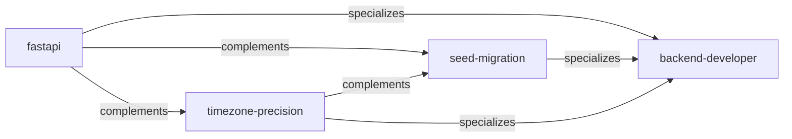
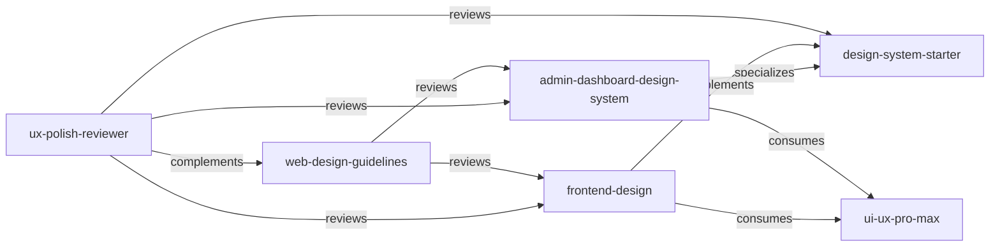
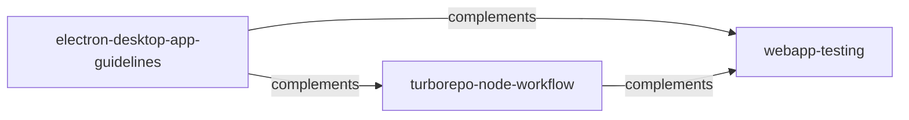
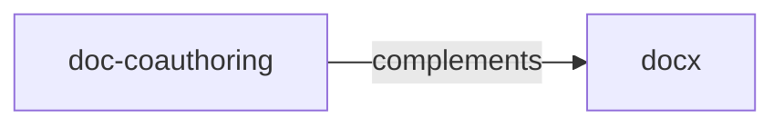
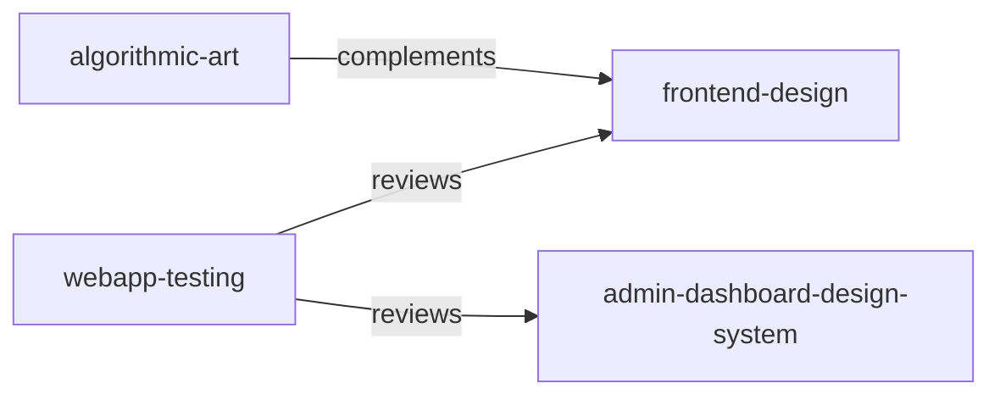

# Skills Relationship Map

> Auto-generated relationship map. Last updated: 2026-06-22.

## Relationship Types

| Type | Direction | Meaning |
|------|-----------|---------|
| **generalizes** | A generalizes B | B is the upstream general-purpose methodology for A's domain |
| **specializes** | A specializes B | A is a more specific version of B |
| **complements** | A ↔ B | A and B work together for a broader capability |
| **consumes** | A consumes B | A uses B's data or output as input |
| **reviews** | A reviews B | A evaluates/audits the output of B |

---

## backend

### Relationships

| From | To | Type | Notes |
|------|----|------|-------|
| fastapi | backend-developer | specializes | FastAPI-specific conventions within general backend methodology |
| seed-migration | backend-developer | specializes | Alembic seed data within general backend methodology |
| timezone-precision | backend-developer | specializes | Datetime handling within general backend methodology |
| fastapi | timezone-precision | complements | FastAPI uses timezone rules for datetime fields |
| fastapi | seed-migration | complements | FastAPI endpoints consume seed data |
| timezone-precision | seed-migration | complements | Seed migration time columns follow timezone rules |

---

## design-ui

### Relationships

| From | To | Type | Notes |
|------|----|------|-------|
| admin-dashboard-design-system | design-system-starter | specializes | Dashboard-specific design system |
| frontend-design | design-system-starter | complements | Aesthetics + architecture |
| frontend-design | ui-ux-pro-max | consumes | Queries style/palette/font data |
| admin-dashboard-design-system | ui-ux-pro-max | consumes | Queries dashboard-specific data |
| ux-polish-reviewer | frontend-design | reviews | UX review of frontend output |
| ux-polish-reviewer | admin-dashboard-design-system | reviews | UX review of dashboard output |
| ux-polish-reviewer | design-system-starter | reviews | UX review of design system |
| web-design-guidelines | frontend-design | reviews | Compliance audit of frontend output |
| web-design-guidelines | admin-dashboard-design-system | reviews | Compliance audit of dashboards |
| ux-polish-reviewer | web-design-guidelines | complements | Heuristic review vs compliance audit |

---

## platform

### Relationships

| From | To | Type | Notes |
|------|----|------|-------|
| electron-desktop-app-guidelines | turborepo-node-workflow | complements | Electron apps use Node/monorepo build workflows |
| electron-desktop-app-guidelines | webapp-testing | complements | Playwright tests validate Electron renderer |
| turborepo-node-workflow | webapp-testing | complements | Node workflows invoke test suites |

---

## content

### Relationships

| From | To | Type | Notes |
|------|----|------|-------|
| doc-coauthoring | docx | complements | Process (co-authoring workflow) vs format (.docx production) |

---

## Cross-Category Relationships

| From | To | Type | Notes |
|------|----|------|-------|
| algorithmic-art | frontend-design | complements | Art vs interface (both produce visual output) |
| webapp-testing | frontend-design | reviews | Playwright tests validate frontend output |
| webapp-testing | admin-dashboard-design-system | reviews | Playwright tests validate dashboard output |

---

## meta

`goal-mode` is a meta-level execution mode that can be combined with any skill.
