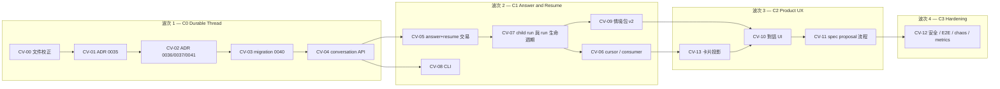

# 00 — 執行總控（`alpha.2` Ticket-native Agent Conversation）

Ticket 前綴 `CV-`。上游規劃：[`research/03/02-phase-c1-ticket-conversation.md`](../../research/03/02-phase-c1-ticket-conversation.md)。

> **本期是「一句話怎麼保證只被做一次」這個問題的落地階段。**
> 而「只被做一次」的驗收方式是**「同一個 answer 送十次，資料庫裡有一則訊息、一個 turn」**，
> 不是「我們有加 retry 保護」（[`08`](./08-verification-and-exit.md) §4）。

## 0. 待裁決項目

**這一節是開工前唯一要讀的東西。** 每一項都寫了「不同意的話會怎樣」。

### 0.1 A 類 — 擋開工（4 項）

> **☑ 四項全部於 2026-08-16 裁決，全部採納計畫的答案。**
> 以下保留原文（含「不同意的話會怎樣」），因為那是**為什麼這樣決定**的紀錄——
> 三個月後沒有人會想知道選了什麼，但每個人都會想知道當時放棄了什麼。

---

**☑ D44 — `alpha.2` 動不動 contract**（自 [`research/03`](../../research/03/01-architecture-decisions.md) 繼承）
**·（2026-08-16 裁決：不動）**

> **計畫的答案：不動。continuation 走既有 `runner.poll` → `run.offer` → `run.accept`，
> 對話內容用 run token 走 HTTPS 拉。**

讀完 daemon 之後這一項比規劃層寫的更清楚：`internal/protocol/codec.go` 對每一個
central→node 訊息型別逐一 `case`，落到 `default:` 就是解碼失敗；而 1.13.0 的 changelog
已經記錄過那個失敗長什麼樣——「**產生不了任何回覆**——卡片被認領、offer 消失、
租約過期、卡片重試到耗盡然後 blocked，而任何地方都不會提到相容性」。

而 `runner.poll` 預設 **5 秒**一次（`config.go:335` `DefaultRunnerPollInterval = 5`）。
把 continuation 建模成 child run 之後，它就是一個普通的 queued run，
走的是**已經存在、已經測過、已經有租約與重排**的那條路。

**不同意的話**：contract 升 1.14.0、`runner.register.features` 加宣告、`agentd` 升 0.13.0
的節點半邊、並且要有一組「未宣告 feature 的節點收不到新訊息型別」的 fixture。
本期從「Central-only」變成「三邊都動」，波次 2 至少多一輪。

**要一起接受的代價**：使用者按下「回覆並繼續」到 Agent 開始回應，
中位數約 3–8 秒（poll 5s ＋ 認領 ＋ 啟動），而不是 2 秒。效能目標寫成 **P95 < 10s**。

---

**☑ D59 — Agent 的 process 結束時，run 怎麼收**
**·（2026-08-16 裁決：採用 Central 推導）**

> **計畫的答案：Central 在 `finish()` 裡推導。若這個 run 有 open question，
> `run.complete` 收成 `status='succeeded'`、`result='awaiting_input'`；
> 「等待」搬到 `task_questions` 上，不再掛在 run 狀態上。**

這是本期唯一一個**改變既有終結語意**的決定，所以它擋開工。

現況（`services/runs.py:1003-1012`）：`finish()` 無條件 `run.status = "succeeded"`。
daemon（`run_handlers.go:503-522`）在子行程結束後就送 `run.complete`。
**所以今天 Agent 想維持對話，唯一的辦法是不要結束**——`ask` 送出後繼續輪詢
`cliora task messages`，讓 run 停在 `waiting_for_input`、佔住租約與 `max_waiting` 名額，
最長 24 小時。

計畫的做法讓那個 process 可以安全結束：

| | 現況 | 之後 |
|---|---|---|
| Agent 問完就 exit | run `succeeded`，**對話結束** | run `succeeded` / `result='awaiting_input'`，**對話還在** |
| 誰記得「在等人」 | `task_runs.status='waiting_for_input'` ＋ `waiting_since` | **`task_questions.state='open'`** ＋ `created_at` |
| 24 小時逾時掃描 | 掃 run 狀態 | 掃 **open question**（run 還活著的那種一併處理） |
| 卡片上的「等待你的回覆」 | 從 run 狀態推 | 從 **`tasks.waiting_for_actor`** 投影（`CV-13`） |
| 租約與 compute | 被佔住最長 24h | **釋放** |
| run token | 保持有效 | **`finish()` 已經會撤銷**，不必改 |

**不同意的話（維持 process 必須活著）**：出口條件「Agent process 結束或 daemon 重啟後，
conversation 可從 DB 恢復」做不到，而那是本期存在的理由。
替代方案只剩「daemon 送一個新的 `run.pause` 訊息」——那就回到 D44 要動 contract。

**要一起接受的代價**：`run.result` 多一個 Central 端產生的值（**不是** payload 帶進來的），
`ACTIVE_STATUSES` 的語意從「這張卡有事在跑」變成「這張卡有 run 在跑」，
而「這張卡在等人」變成另一個問題。[`04`](./04-answer-resume-and-turns.md) §2 逐項處理。

---

**☑ D42 — 放不放寬「一個 run 一次一個未答問題」**（繼承）
**·（2026-08-16 裁決：不放寬）**

> **計畫的答案：不放寬。**

理由不是省事：它讓 answer→resume 的 CAS 是**單列**——
`UPDATE task_questions SET state='answered' WHERE id=? AND state='open'`，
影響 0 列就是 409，影響 1 列就建 continuation。多問題會讓「三題答了兩題要不要續跑」
變成一個產品問題，而**那個問題現在沒有使用者資料可以回答**。

**不同意的話**：`CV-05` 的交易變成多列 CAS ＋ 一條「續跑條件」規則，
`07-…md` 的 composer 要能逐題回答，`CV-03` 的 backfill 也要換規則。

---

**☑ D61 — 既有訊息怎麼 backfill 成 `task_questions`**
**·（2026-08-16 裁決：用現行規則）**

> **計畫的答案：對每一則歷史 `kind='question'` 建一列；
> 用**現行規則**（同卡片、時間在後、`author_kind='user'` 的任一則訊息）判定它是否已答；
> 判定為已答的填 `state='answered'` ＋ 那則訊息的 id；否則 `state='open'`。**

現行規則就寫在 `runs.py:1331-1365` 的 docstring 裡，而且它明說了三個判斷各自的理由。
Backfill 用同一條規則，才不會讓一張卡在升級前後對「這題答了沒」給出不同答案。

**一個一定要處理的邊界**：一則使用者訊息可能同時「回答」了兩個歷史問題
（現行規則下這是可能的）。backfill 時**每個 question 各自指向那則訊息**，
`answered_message_id` 允許重複——`task_questions` 沒有 `UNIQUE(answered_message_id)`。

**不同意的話（不 backfill，只對新問題建列）**：升級後既有卡片上的未答問題
在新 UI 上會顯示成「沒有未決問題」，而 Agent 那邊 409 仍然擋著。
兩邊不一致，且無法從畫面上看出原因。

---

### 0.2 B 類 — 改變某一節但不擋開工（4 項）

---

**☐ D60 — continuation run 的分支名沿用 root run 的 seq**

`run_branch()`（`runs.py:1431-1456`）用 `f"cliora/{task.card_ref}-{run.seq}"`。
一張 `delivery: pull_request` 的卡如果中途問了問題，
continuation 是一個新 run、有新的 `seq`，於是它會 push 到 `cliora/TK-142-3`，
而第一輪推的分支是 `-2`，PR 開在 `-2` 上。**兩輪的成果分在兩條分支上，沒有人會發現。**

計畫的答案：`run_branch()` 對 `parent_run_id is not null` 的 run 沿用 root run 的 seq。
[`04`](./04-answer-resume-and-turns.md) §5 有實作與測試。

**不同意的話**：本期只允許 `delivery in (none, artifact)` 的卡做 continuation，
其餘在 resume 時回 `409`。那也是一個合理的第一版，但要寫進 known limitations。

---

**☐ D65 — continuation 情境包放哪，以及 `GATE-RQ-CONTEXT-DISPATCH` 怎麼改**

`_context_for()` 是「情境包只在一處決定」的那一處，
`scripts/rq/gate_context_dispatch.py` 用 AST 斷言三個 renderer 的呼叫者只有它。

計畫的答案：**新增第四個 renderer `render_continuation_context`，加進 gate 的
`RENDERERS` 集合，chooser 仍是 `_context_for`。** gate 的形狀不變，只是多守一個。

**不同意的話（在既有 renderer 裡加 flag）**：那正是 gate 的 docstring 說不要做的事
——「兩個 renderer 而不是一個帶 flag 的，理由相同：flag 的第一個漏掉的分支，
就是那句謊」。

---

**☐ D66 — 兩種等待都保留**

D59 之後會有兩種「在等人」：

| 情境 | run 狀態 | 誰在等 |
|---|---|---|
| Agent 問完**繼續輪詢**（現行行為，仍然合法） | `waiting_for_input` | run 還活著 |
| Agent 問完**結束 process** | `succeeded` / `awaiting_input` | 只有 question |

計畫的答案：**兩種都保留**（不強迫既有 Agent 改行為），
但**只有一個投影**：`tasks.waiting_for_actor` 與 `tasks.open_question_count`
由 question 狀態推導，兩種情境給出同一個答案。

**不同意的話（只留一種）**：要嘛強制所有 Agent 立刻結束 process（既有 prompt 與
`render_run_context` 的說明文字都要改，而那是 `alpha.1` 已經在跑的東西），
要嘛 D59 不做。

---

**☐ D51 — 訊息的保留、附件與大小**（繼承）

計畫的答案在 [`01`](./01-decisions-and-governance.md) §3.5：
**message 永久保留**（它是產品資料，run log 才是診斷資料）；
**本期不新增附件路徑**（沿用既有 artifact 上傳，訊息以 `message_id` 關聯，已經存在）；
body 上限維持 20000 字元，但**從 Pydantic 的 422 改成帶 machine code 的 400**。

---

## 1. 四個波次



**波次 1 可以在 D59 未定的情況下開工**——它只碰資料層與讀寫 API，
不改任何 run 的終結語意。但 D42 與 D61 會改變 `CV-03` 的 backfill，那兩項要先定。

## 2. 十四張 ticket

| ID | 工作 | 主要落點 | 依賴 | 規模 |
|---|---|---|---|---|
| `CV-00` | 文件校正：`plan/19/README.md` 的過期狀態句；`alpha.1` known limitations 六條 | `plan/19/`、release note | — | XS |
| `CV-01` | **ADR 0035** Ticket／Conversation／Run／Turn 邊界；PRD 增訂；`FR-CONV-001`…`-010` 註冊 | `docs/adr/`、`research/prd.md`、`traceability/` | — | S |
| `CV-02` | **ADR 0036**（傳遞語意）、**0037**（actor 邊界）、**0041**（保留）；`contracts/CHANGELOG.md` 明寫「本期不動及理由」 | `docs/adr/`、`contracts/` | `CV-01` | S |
| `CV-03` | **Migration `0040`** ＋ model：`task_questions`、`conversation_consumers`、三張表 14 欄、backfill、索引 | `db/migrations/versions/`、`db/models.py` | `CV-02` | **L** |
| `CV-04` | Conversation query 與冪等 mutation：cursor 分頁、六種 kind、`reply_to`、九個 machine code | `services/runs.py`（`MessageService`）、`api/http/agents.py`、`schemas.py` | `CV-03` | **L** |
| `CV-05` | **Answer ＋ resume 單一交易**：question CAS、continuation 建立、live-run 分支 | `services/conversation.py`（新）、`api/http/agents.py` | `CV-04` | **L** |
| `CV-06` | Cursor catch-up 與 consumer 追蹤：`last_delivered_seq`／`last_acked_seq`、`/conversation/input`、`/conversation/ack` | `services/conversation.py`、`api/http/agents.py` | `CV-05` | M |
| `CV-07` | **Child run 與 run 生命週期**：`finish()` 推導 `awaiting_input`、`enqueue_continuation`、分支繼承、reaper 改掃 question | `services/runs.py`、`services/run_reaper.py` | `CV-05` | **L** |
| `CV-08` | CLI：`messages --after`／`wait`／`say --reply-to`／`propose-spec`；`--since` deprecation | `daemon/internal/cli/` | `CV-04` | M |
| `CV-09` | 情境包 v2 ＋ `render_continuation_context` ＋ gate 修改 | `services/context_projection.py`、`services/runs.py`、`scripts/rq/gate_context_dispatch.py` | `CV-07` | M |
| `CV-10` | 對話 UI：訊息串、question card、兩個動作、delivery state、composer draft | `frontend/src/components/project/` | `CV-04`、`CV-13` | **L** |
| `CV-11` | Spec proposal ／ 人工接受流程 | `frontend/`、`api/http/requirements.py` | `CV-10` | M |
| `CV-12` | 安全、E2E、chaos、observability、七個 gate | `backend/tests/`、`scripts/cv/` | 全部 | **L** |
| `CV-13` | 卡片投影：`open_question_count`／`waiting_for_actor`／`conversation_last_seq` 的維護與 DTO | `services/runs.py`、`services/tasks.py`、`schemas.py` | `CV-05` | M |

## 3. 禁區清單（`GATE-CV-TOUCH-LIST` 會檢查）

本期**不得**修改的東西。動了會過所有測試，但改變的是別的階段的承諾：

```text
contracts/                                 全樹 sha256 與基線相同（D44）
daemon/internal/protocol/                  節點半邊的協定解碼
daemon/internal/runner/                    隔離目錄、git、機密、驗證
daemon/internal/connection/run_handlers.go run 的執行流程
daemon/internal/workspace/ gitfetch/       V1 與 V2.3 的邊界
backend/app/services/agent_auth.py:70      RUN_TOKEN_SCOPES 這一行
backend/app/services/rbac.py               24 個動作，一個都不加
backend/app/services/secrets.py            機密下放
backend/app/services/deliveries.py         交付與 PR
runs.py 的 claim() 函式本體                  GATE-AR-SINGLE-CLAIM 的對象
```

**`agent_auth.py:81-83` 的 `AGENT_FORBIDDEN_FIELDS` 是例外**——本期要往裡面加東西，
理由在 [`01`](./01-decisions-and-governance.md) §3.3。

## 4. 版本節奏

| 元件 | 從 | 到 | 理由 |
|---|---|---|---|
| contract | 1.13.0 | **1.13.0** | D44：不動。`GATE-CV-CONTRACT-FROZEN` 斷言 |
| `agentd` | 0.12.0 | **0.13.0** | 只有 `internal/cli/`：四個子命令的新旗標。**節點半邊零 diff** |
| migration | 0039 | **0040** | 一個 migration，全部 additive |
| ADR | 0034 | **0037 ＋ 0041** | 0035／0036／0037／0041 四份 |
| RBAC | 24 | **24** | 不新增動作（[`research/03`](../../research/03/01-architecture-decisions.md) D53） |
| requirements | 168 | **178** | `FR-CONV-001`…`-010` |

## 5. 執行慣例

沿用既有：每個波次開一個背景 tmux 承載長時間工作。

```bash
tmux new-session -d -s cliora-cv1 -c /home/ubuntu/workspace/cliora
tmux send-keys -t cliora-cv1 'make check' C-m
tmux attach -t cliora-cv1
```

命名 `cliora-cv1`…`cliora-cv4`。這也是 dogfooding：這一期做的正是「不必守在終端前面」。
