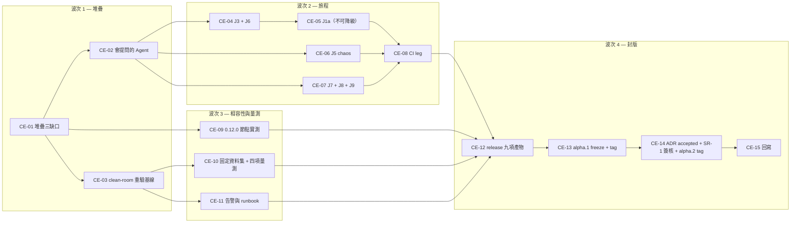

# 00 — 執行總控（`alpha.2` 封版）

Ticket 前綴 `CE-`。上游規劃：[`research/03/02`](../../research/03/02-phase-c1-ticket-conversation.md)、
[`research/03/10`](../../research/03/10-verification-and-exit.md)。實作紀錄：[`plan/23/10`](../23/10-implementation-status.md)。

> **本期是「已經做到了，怎麼證明」這個問題的落地階段。**
> 而「證明」的驗收方式是**一條旅程在真的堆疊上從頭跑到尾**，
> 不是「我們有一條斷言同樣性質的整合測試」（[`08`](./08-verification-and-exit.md) §2）。

## 0. 待裁決項目

**這一節是開工前唯一要讀的東西。** 每一項都寫了「不同意的話會怎樣」，全文在 [`01`](./01-decisions-and-governance.md)。

### 0.1 A 類 — 擋開工（3 項）

> **☑ 三項全部於 2026-08-21 裁決，全部採納計畫的答案——所以本期可以開工。**
> 以下保留原文（含「不同意的話會怎樣」），沿用 `plan/23/00` §0.1 的體例：
> 那是**為什麼這樣決定**的紀錄。

| ☑ | 決策 | 計畫的答案 | 裁決 | 擋住什麼 |
|---|---|---|---|---|
| ☑ | **D68** 本期能不能改產品程式 | **不能。** `backend/app/` 與 `frontend/src/` 零 diff，例外要具名 waiver | **不能**（2026-08-21） | 全部——它定義了本期是什麼 |
| ☑ | **D72** `v2.0.0-alpha.1` 要不要先打 tag | **要，target `f91d9c4`**，且在 `alpha.2` 之前 | **要**（2026-08-21） | `CE-13`、`CE-14`；也決定 release note 的措辭 |
| ☑ | **D74** ADR 0035／0036／0037／0041 何時 accepted | **證據齊備之後、tag 之前，與 SR-1 同一次簽核** | **同一次**（2026-08-21） | `CE-14`；ADR 0035 自己寫著「未 accepted 前不得動 `backend/`」 |

**D74 有一個必須說出口的事實**：ADR 0035 第 2–4 行寫的是
「`Status: proposed` — 未經人核准前，`CV-03` 之後不得修改 `backend/`、`frontend/`、`daemon/`」。
**那件事已經發生了**（`e777674`、`4a9a016`）。本期不假裝它沒發生：
`CE-14` 的簽核要同時追認這一段，理由寫在 [`01`](./01-decisions-and-governance.md) D74。

### 0.2 B 類 — 改變某一節但不擋開工（6 項）

> **☑ 六項亦於 2026-08-21 一併裁決，全部採納計畫的答案。**
> 它們本來只需在各自的 ticket 開工前定；一次定完的代價是零，
> 好處是波次 2 與波次 3 可以同時開工而不必等某一項。

| ☑ | 決策 | 計畫的答案（＝裁決） | 影響 |
|---|---|---|---|
| ☑ | **D69** 旅程寫在哪一層 | 三條走瀏覽器（J1a／J3／J7），四條走 API 腳本（J5／J6／J8／J9） | [`03`](./03-journeys.md) 全篇 |
| ☑ | **D70** fakecli 怎麼變成「會提問的 Agent」 | **讀對話決定這一輪做什麼**，不用計數器檔 | [`02`](./02-e2e-harness.md) §4 |
| ☑ | **D71** 0.12.0 的 binary 從哪來 | `git worktree` 出 `f91d9c4` 現地建 | [`04`](./04-compatibility-0120.md) §2 |
| ☑ | **D73** gate 與旅程進不進 CI | **進**，加在 `v2-projects.yml` 的第三條 leg | `CE-08` |
| ☑ | **D75** chaos 怎麼殺 daemon | **SIGKILL 整個 process group**，不是 SIGTERM | [`03`](./03-journeys.md) §4 |
| ☑ | **D76** 固定資料集進不進版本控制 | **不進**，用固定 seed 的種子腳本 | [`05`](./05-performance-and-dataset.md) §1 |

### 0.3 從 `plan/23` 繼承而仍未結案的兩項

| ☐ | 決策 | 狀態 |
|---|---|---|
| ☑ | **D51** 保留／附件／大小 | **確認為已裁決**（2026-08-21）：實作時已落地（永久保留、不新增附件路徑、20000 ＋ `MESSAGE_TOO_LARGE`）。`research/03/CHECKLIST` §1 仍列為未裁決——**由 `CE-15` 回寫**，不重新討論 |
| — | **D46** provider sync 落在哪一版 | 屬 `alpha.3`／`beta.2` 的範圍，**確認不擋本期**（2026-08-21）。`CE-15` 只確認 CHECKLIST 沒有把它記成 `alpha.2` 的阻塞 |

## 1. 四個波次



**波次 3 與波次 2 可以並行**——它們共用堆疊但不共用檔案。
**波次 4 是嚴格序列的**：`alpha.1` 的 tag 不存在時，`alpha.2` 的 release note
沒有可以指的前一版（[`07`](./07-release-artifacts.md) §1）。

## 2. 十五張 ticket

| ID | 工作 | 主要落點 | 依賴 | 規模 |
|---|---|---|---|---|
| `CE-01` | 堆疊三缺口：run 內 `cliora` 在 `PATH` 上、daemon 可被重啟、fakecli 可失敗 | `scripts/e2e/run-stack.sh`、`daemon/cmd/fakecli/main.go` | — | M |
| `CE-02` | 會提問的 Agent：依對話狀態決定這一輪做什麼的腳本 | `scripts/cv/agent/` | `CE-01` | M |
| `CE-03` | **clean-room 重驗**：乾淨資料庫 ＋ 乾淨 checkout 重跑 `make check`、三套測試、八個 gate，產出可引用的輸出 | `scripts/cv/evidence.sh`、`artifacts/cv/local/` | — | M |
| `CE-04` | **J3**（提問 → 卡片說「等待你的回覆」）＋ **J6**（20 則 comment 不喚醒） | `frontend/tests/e2e/conversation.spec.ts`、`scripts/cv/journeys/` | `CE-02` | M |
| `CE-05` | **J1a**：三輪釐清 ＋ proposal ＋ 要求修改 ＋ 接受，全程不進 Terminal | `frontend/tests/e2e/conversation.spec.ts` | `CE-04` | **L** |
| `CE-06` | **J5 chaos**：answer commit 後 SIGKILL daemon → 重啟 → 恰好一個 turn | `scripts/cv/journeys/j5-chaos.py` | `CE-02` | **L** |
| `CE-07` | **J7**（失敗 → 顯示原因 → 再派工，對話保留）＋ **J8**（兩人同時回答）＋ **J9**（Agent 送 decision → 403 ＋ audit） | `scripts/cv/journeys/`、`conversation.spec.ts` | `CE-02` | **L** |
| `CE-08` | CI：`v2-projects.yml` 加第三條 leg（`E2E_RUNNER=1` ＋ 旅程 ＋ 八個 gate）；`GATE-CE-JOURNEY-COVERAGE` | `.github/workflows/v2-projects.yml`、`scripts/cv/gates.sh` | `CE-04`…`CE-07` | M |
| `CE-09` | **未升級 0.12.0 節點實測**：worktree 建舊 binary、第二個節點、完整生命週期 ＋ continuation | `scripts/cv/compat-0120.sh` | `CE-01` | **L** |
| `CE-10` | 固定資料集 ＋ 其餘四項效能量測（commit／reopen／cursor／20 併發） | `scripts/cv/seed-dataset.py`、`scripts/cv/measure-conversation.py` | `CE-03` | M |
| `CE-11` | 告警規則 ＋ runbook：`duplicate_turn > 0`、`question_expired` 的異常率 | `deploy/prometheus/alerts.yml`、`docs/runbooks/conversation-duplicate-turn.md` | `CE-03` | S |
| `CE-12` | Release 九項產物：compatibility manifest、flag matrix、retention delta、rollback note、evidence pack | `docs/release-note-ticket-conversation.md`、`docs/` | 波次 2、3 | M |
| `CE-13` | `alpha.1` freeze checklist 十項 ＋ **`v2.0.0-alpha.1` annotated tag**（人工） | 流程、`docs/` | `CE-12` | M |
| `CE-14` | ADR 四份 → `accepted`；**SR-1 簽核**；出口條件 28 項；**`v2.0.0-alpha.2` tag ＋ GitHub pre-release**（人工） | `docs/adr/`、`docs/security-review-v2c1.md` | `CE-13` | S |
| `CE-15` | 回寫：`plan/23/10` §7／§8、`research/03/CHECKLIST` §1／§2、`research/03/02`、本目錄 [`10`](./10-implementation-status.md) | `plan/`、`research/` | `CE-14` | S |

## 3. 禁區清單（`GATE-CE-NO-PRODUCT-DRIFT` ＋ `GATE-CV-TOUCH-LIST` 會檢查）

本期**不得**修改的東西。與 `plan/23` 的禁區相比多了一整層——因為本期不是實作期：

```text
backend/app/                    ★ 新增：整個目錄零 diff（D68）
frontend/src/                   ★ 新增：整個目錄零 diff（D68）
contracts/v1/                   sha256 與基線相同（D44，沿用）
daemon/internal/protocol/       節點半邊的協定解碼（沿用）
daemon/internal/runner/         隔離目錄、git、機密、驗證（沿用）
daemon/internal/connection/     run 的執行流程（沿用）
daemon/internal/workspace/ gitfetch/   V1 與 V2.3 的邊界（沿用）
db/migrations/versions/0040_*   已經跑過 downgrade→upgrade 的 migration，不再動
```

**可以動的東西，全部列在這裡**——本期的 diff 應該只落在這幾處：

```text
scripts/e2e/run-stack.sh        堆疊（CE-01）
scripts/cv/                     gate、旅程、量測、種子、證據（CE-02…CE-11）
daemon/cmd/fakecli/main.go      stand-in 的失敗路徑（CE-01；不在任何禁區清單上）
frontend/tests/e2e/             瀏覽器旅程（CE-04、CE-05、CE-07）
.github/workflows/v2-projects.yml   CI leg（CE-08）
deploy/prometheus/alerts.yml    告警（CE-11）
docs/                           runbook、release note、ADR 狀態、SR-1 簽核
plan/24/ research/03/           計畫與回寫
```

`daemon/cmd/fakecli/` 值得特別說一句：它**不在**任何禁區清單上，
而這不是疏漏——它是 stand-in，不是產品。改它不會改變任何節點的行為，
`GATE-CV-TOUCH-LIST` 也因此不列它。

## 4. 版本節奏

| 元件 | 從 | 到 | 理由 |
|---|---|---|---|
| contract | 1.13.0 | **1.13.0** | 本期一行都不動 |
| `agentd` | 0.13.0 | **0.13.0** | `internal/` 不動；`cmd/fakecli` 不是 `agentd` 的一部分 |
| migration | 0040 | **0040** | 本期沒有 schema 變更 |
| ADR | 0037 ＋ 0041 | **不新增**，四份改 `accepted` | 本期的決策是流程決策，記在本目錄 [`01`](./01-decisions-and-governance.md) |
| RBAC | 27（`len(ALL_ACTIONS)`） | **27** | 不新增。**注意這個數字**：計畫文件長年寫「24」，是文件錯不是程式錯（`plan/23/10` §9.4） |
| requirements | 178 | **178** | 不新增；FR-CONV 的 lifecycle 也不動（[`09`](./09-open-measurements.md) §2） |
| product tag | 無 | **`v2.0.0-alpha.1`、`v2.0.0-alpha.2`** | 本期產出兩個 tag，順序不可顛倒 |

## 5. 執行慣例

沿用既有：每個波次開一個背景 tmux 承載長時間工作。

```bash
tmux new-session -d -s cliora-ce1 -c /home/ubuntu/workspace/cliora
tmux send-keys -t cliora-ce1 'scripts/cv/evidence.sh' C-m
tmux attach -t cliora-ce1
```

命名 `cliora-ce1`…`cliora-ce4`。**本期特別需要它**：一次 e2e 堆疊啟動加一輪旅程
是分鐘級的，而 `CE-09` 的相容性驗證要同時跑兩個節點。

## 6. 一個貫穿本期的判準

每完成一張 ticket，問一次：

> **這件事現在有沒有辦法在一台乾淨的機器上，由另一個人重跑出同樣的結論？**

不能的話，缺的是腳本或那份輸出的落點，而不是「再跑一次就好」。
`plan/23/10` §5 記過一次教訓：第一次量效能出現 29.9 秒的樣本，
原因是同一個資料庫裡上一輪的 run 還佔著 `max_concurrent`——
**那個數字若被印出來，就會被引用**。本期每一份輸出都要能說出自己是在什麼狀態下產生的。
