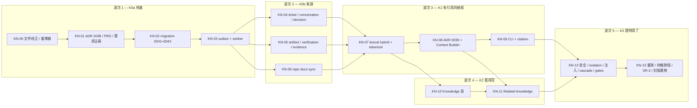

# 00 — 執行總控（`alpha.3` Project Memory）

Ticket 前綴 `KN-`。上游規劃：[`research/03/03-phase-k1-project-knowledge.md`](../../research/03/03-phase-k1-project-knowledge.md)。

> **本期是「Agent 讀到的東西說得出來源」這個問題的落地階段。**
> 而它的驗收方式是**「打開一個 turn 的 context manifest，逐條點回原始來源」**，
> 不是「我們有做 retrieval」（[`09`](./09-verification-and-exit.md) §6）。

## 0. 待裁決項目

**這一節是開工前唯一要讀的東西。** 每一項都寫了「不同意的話會怎樣」，
全文在 [`01`](./01-decisions-and-governance.md)。

### 0.1 A 類 — 擋開工（5 項）

> **☑ 五項全部於 2026-08-22 裁決，全部採納計畫的答案。**
> 以下保留原文（含「不同意的話會怎樣」），因為那是**為什麼這樣決定**的紀錄——
> 三個月後沒有人會想知道選了什麼，但每個人都會想知道當時放棄了什麼。
> **五項全綠，波次 1 至 3 皆可開工。**

---

**☑ D77 — repo 內容怎麼進 Central**（**2026-08-22 裁決：採納**）

> **計畫的答案：從 run 裡面推上來。** `cliora knowledge sync` 在 run 的隔離工作目錄裡
> 走檔案樹，先送 manifest（path、sha256、size），Central 回「這些我沒有」，
> 再上傳缺的內容。**Central 永遠不主動去拉 repo。**

這一項擋開工，因為它決定 `KN-06` 是「daemon 加一個子命令」還是「Central 加一條 egress」。

讀完程式碼之後只剩這一個答案：

| 候選路徑 | 為什麼不行 |
|---|---|
| Central 自己 clone | 要 git 二進位、要憑證解密、要對外連線。`SCOPE-013` 明文限定對外只能從 `services/providers.py` 一個模組出去，而 `backend/pyproject.toml` 只有 `httpx` 一個對外套件。這條路等於把本期從「零新增 egress」變成「新增一條把 Project 內容送進 subprocess 的路」 |
| 用既有的 `filesystem.read` relay | `FileRelayService._resolve()` 需要一個 `terminal_sessions` 列**與**一個 `User` actor（`authz.authorize_file_browse`）。背景 worker 兩個都沒有。改成不需要 = 新開一條未經 `plan/04` 審查的檔案通道 |
| daemon 新增一個 `knowledge.scan` 控制訊息 | contract 升版、`agentd` 節點半邊要改、未升級節點要驗證。而 1.13.0 的 changelog 已經記錄過「未升級節點收到未知型別會靜默解碼失敗」 |
| **run 裡的 `cliora` 推上來** | ✅ 只動 `internal/cli/`，節點半邊零 diff、contract 零 diff、憑證用既有 run token、內容用既有 HTTPS。**而且 run 的工作目錄裡就是那個 commit 的乾淨 checkout** |

**要一起接受的代價**：一個從來沒跑過 Agent 的 Project **沒有 repo knowledge**，
而 repo 的新鮮度上限是「上一次 run 的 commit」。這件事必須出現在 Source health 面板上
（[`08`](./08-frontend.md) §4），因為一個看不出自己是空的知識庫比沒有知識庫更糟。

**不同意的話**：`KN-06` 變成「Central 端的 git 客戶端 ＋ 憑證使用 ＋ egress 審查」，
SR-2 的「Central 未新增對外連線」那一項直接不成立，本期的安全審查範圍上升一級，
時程至少多一個波次。

---

**☑ D78 — 五層 context pack 走哪條線交付**（**2026-08-22 裁決：採納**）

> **計畫的答案：offer 只帶第 1 層（Project policy digest，硬上限 1.5 KiB，永不裁切）
> ＋ 一行「完整記憶在 `cliora knowledge context`」；完整五層由 run token 走 HTTPS 拉，
> `context_packs` 在**拉取時**寫入。**

這一項擋開工，因為它決定 `KN-08` 的交付物是什麼形狀，也決定本期動不動 contract。

`daemon/internal/protocol/codec.go:962`：

```go
// 32 KiB from contract 1.12.0. The old ceiling was the whole 64 KiB control frame,
// so one field could consume the entire budget — and it now shares it with secrets.
if spec.Context == "" || len(spec.Context) > 32768 {
    return false
}
```

`validRunSpec` 回 `false` 就是解碼失敗，而**解碼失敗在這條線上沒有錯誤訊息**——
contract 1.13.0 的 changelog 已經記錄過它長什麼樣：「產生不了任何回覆——卡片被認領、
offer 消失、租約過期、卡片重試到耗盡然後 blocked，而任何地方都不會提到相容性」。

現況的預算是 `CONTEXT_BUDGET_BYTES = 6 KiB`（實作包）與 `CONTINUATION_BUDGET_BYTES = 16 KiB`
（續跑包），兩者都遠低於 32 KiB。**問題不是現在會不會爆，是「retrieved 層的大小由查詢結果決定」**——
一個資料多的 Project 加上八段引用就會逼近上限，而它會在某一張卡上突然發生。

計畫的做法把「必讀」與「可查」分開：

```text
run.offer.context   ≤ 6 KiB（不變）＋ policy digest ≤ 1.5 KiB ＋ 一行指標
                    → 總計仍 < 8 KiB，離 32 KiB 的硬牆有四倍餘裕
GET /api/cli/runs/context-pack   完整五層 ＋ citations，上限 64 KiB，可分頁
                    → 由 run token 拉，寫一列 context_packs
```

這與 `alpha.2` 的做法是同一個模式：contract changelog 自己寫著
「新的對話內容由 agent 用 run token 走 HTTPS 取得」。**本期沿用，不發明第二種。**

**要一起接受的代價**：Agent 必須真的去呼叫那個命令。這正是 M2 假設
（`services/context_projection.py` 的 module docstring：「M2 — whether agents actually
use the CLI — is the assumption the whole internalised design rests on」），
所以 offer 裡那一行的位置是**第 1 層之後、其他一切之前**，
而 `KN-13` 的旅程 J11 就是在量「Agent 有沒有去拉」。

**不同意的話（整包塞進 offer）**：要先把 `CONTEXT_BUDGET_BYTES` 的分層預算重寫成
「retrieved 層拿到剩下的」，並且要有一組「retrieved 層剛好把總長推過 32768」的 fixture
（daemon 端拒收、Central 端要能自己先發現）。本期多一個 gate、多一組 e2e，
而且 Knowledge 的價值上限被 wire 的 32 KiB 綁死。

---

**☑ D79 — 中文怎麼被搜到**（**2026-08-22 裁決：採納**）

> **計畫的答案：`search_document` 由 Python 端一個純函式產生，
> 該函式輸出 ASCII 詞（含 identifier 切分）＋ **CJK bigram**；
> 查詢端用**同一個函式**組 `tsquery`。`GATE-KN-ONE-TOKENIZER` 用 AST 斷言只有它。**

這一項擋開工，因為它決定 `KN-07` 是「接上 tsvector」還是「寫一個分詞器」。

上游規劃寫「full-text（tsvector，title 權重 A／body 權重 B）擅長一般語句」。
**在這個 repo 裡不成立**：卡片標題、對話、決策幾乎全是繁體中文，而
`to_tsvector('simple', '租約過期時要怎麼處理')` 在沒有 CJK parser 的 PostgreSQL 上
產生**一個** lexeme——整串。於是「一般語句」這個通道對本產品的主要語言等於不存在，
而 trigram 會被迫承擔全部工作（它做得到，但它不會做權重、不會做 phrase）。

計畫的做法：

```text
tokenize("租約過期時 lease_expires_at 到期")
  → CJK bigram:  租約 約過 過期 期時
  → ASCII:       lease_expires_at lease expires at
  → 合併後以空白 join，交給 to_tsvector('simple', …)
```

三個性質：**純函式**（沒有 I/O、可單測）、**index 與 query 用同一個**
（不同就是永遠查不到，且沒有錯誤）、**在 Python 端算**
（`to_tsvector` 是 STABLE 不是 IMMUTABLE，PostgreSQL 拒絕把它放進 GENERATED 欄位；
而寫成觸發器會讓「索引怎麼算出來的」分裂成 Python 與 PL/pgSQL 兩處）。

**要一起接受的代價**：bigram 讓 `search_document` 比原文長約 1.6–2 倍，
GIN 索引跟著大。這是 [`10`](./10-open-measurements.md) 第 2 項要量的東西。

**不同意的話（只用 trigram，不做 tsvector）**：可以，而且會少一個檔案。
但失去 title 權重 A／body 權重 B 的分級（`ts_rank_cd` 沒有替代品），
於是「標題就叫這個名字」與「內文提過一次」在排序上無法區分——
而 [`09`](./09-verification-and-exit.md) 的固定查詢集裡有三條正是在測這件事。

---

**☑ D80 — outbox 的入列點與 job 的語意**（**2026-08-22 裁決：採納**）

> **計畫的答案：入列點只有一個——`ActivityService.record()` 裡的
> `kind → (source_type, entity_id)` 映射表。job 存的是**實體鍵，不是內容**；
> worker 領到之後**重讀那個實體的現況**再 upsert。領取用
> `SELECT … FOR UPDATE SKIP LOCKED`，**不用游標**。**

這一項擋開工，因為它決定 `KN-03` 的形狀，而 `KN-04`／`KN-05`／`KN-06` 全都掛在上面。

三個候選與各自為什麼不行／行：

| 候選 | 判斷 |
|---|---|
| 在八個服務各自 `enqueue()` | 八個新呼叫點，而**漏掉一個是靜默的**：那種來源就是永遠不更新，畫面上看起來只是「這張卡沒有新知識」 |
| 游標追 `activity_events` | ❌ **不安全**。`ActivityEvent.id` 是 `uuid4`（無序），`occurred_at` 是 `server_default=func.now()`＝交易開始時間。兩個交易交錯提交時，後處理的游標會跳過先開始、後提交的那一列。加一個 `BIGSERIAL` 也不救：序號的洞同樣會被跳過 |
| **在 `ActivityService.record()` 裡入列** | ✅ 一個呼叫點、已經在 27 處被呼叫、**已經在同一個交易裡**（它的 docstring 明寫「Does not commit」），而 `kind` 是封閉詞彙表所以映射表可以被測試斷言覆蓋 |

**job 是提示不是事實**，這一點是整個 `KN-03` 的核心：

```text
knowledge_jobs 一列 = 「(project, source_type, entity_id) 這個實體可能變了，去看一下」
worker            = 重讀實體 → 算 chunks → ON CONFLICT upsert → tombstone 不見的
```

於是 retry 免費、重複入列免費、reconciliation 與手動 resync **走同一條程式碼**，
而「內容在 job 裡過期了」這個 bug 類別不存在。

**要一起接受的代價**：`ActivityService.record()` 從「寫一列」變成「寫一列 ＋ 可能寫一列」，
而它是全 repo 被呼叫最多的服務之一。所以映射表要是 O(1) dict、
`knowledge_enabled=false` 時**在映射之前就 return**（[`03`](./03-ingestion-and-outbox.md) §2.3）。

**不同意的話**：改成八個呼叫點，`KN-04`／`KN-05`／`KN-06` 各自多一段 enqueue，
並且要有一個 gate 斷言「每個 ingestable 來源的寫入路徑都呼叫了 enqueue」——
而那個 gate 寫不出精確的形式，只能寫成一份人工維護的清單。

---

**☑ D81 — knowledge 的保留、匯出與刪除寫在哪**（**2026-08-22 裁決：採納**）

> **計畫的答案：寫進 **ADR 0038 的一節**（`KN-01`）。
> `ADR 0041` 已經 accepted 且只答了 conversation 那一半，**不改它的內容**，
> 只加一行「knowledge 的對應決定見 ADR 0038 §6」。**

這一項擋開工，因為 `KN-02` 的 migration 要知道 `deleted_at` 與 `active` 的語意，
而 `KN-12` 的 cascade 測試要有一份可對照的政策。

D51 的四個問題裡，`alpha.2` 只答了前兩個（message 永久保留、不新增附件路徑）。
剩下兩個是本期的：

| 問題 | 計畫的答案 |
|---|---|
| Project 刪除時 knowledge 的 tombstone 範圍 | 全部 CASCADE：`knowledge_sources`／`chunks`／`links`／`jobs`／`context_packs` 都以 `project_id` FK `ON DELETE CASCADE`。**`projects` 目前沒有 delete 路徑**（只有 archived），所以測試用直接 DELETE 驗證約束，並在 ADR 寫明「這是為了未來有 delete 的那一天預先成立」 |
| 是否提供匯出 | **本期不做**，延到 `beta.2`。理由：匯出是一條新的資料外流路徑，需要自己的配額、格式與權限，而它不是任何出口條件的前置 |
| `knowledge_enabled` 從 true 關成 false | 既有 source 標 `active=false`，**不刪**；刪除是獨立動作、要求二次確認、寫 audit（D58 已定） |
| source 的個別保留期 | **沒有**。knowledge 的內容全部衍生自已經永久保留的產品資料（卡片、對話、artifact metadata、verification），所以它自己不需要第二套時鐘。唯一例外是 `context_packs`，它隨 run CASCADE（**D89**） |

**不同意的話**：`KN-02` 得多一個 `retention_expires_at` 欄與一個 sweep，
而那個 sweep 的第一個問題是「一個過期的 source，它的 chunk 消失之後，
引用它的舊 context manifest 要顯示什麼」——一個沒有使用者需求驅動的問題。

---

### 0.2 B 類 — 改變某一節但不擋開工（9 項）

| # | 決定 | 計畫的答案 | 全文 |
|---|---|---|---|
| **D82** | Knowledge UI 放哪 | 新開 `frontend/src/modules/knowledge/`，**既有 `views/`／`components/` 不搬**。新頁沒有舊版對照，所以不需要 `beta.1` 那套旗標雙路徑 | [`01`](./01-decisions-and-governance.md) §D82 |
| **D83** | Related knowledge 掛哪 | 掛在既有 `views/TaskDetailView.vue`（`ConversationPanel` 旁邊）。**Task Drawer 是 `beta.1` 的東西，現在不存在**；`beta.1` 的 `PX-62` 再改宿主 | §D83 |
| **D84** | chunk 大小與 token 計法 | 800 token／100 重疊；token 用**字元近似**（CJK 1 字≈1 token、ASCII 4 字元≈1 token），不引入 tokenizer 套件。列入未量測項 | §D84 |
| **D85** | 十級 authority 全建嗎 | 全建，但本期只有 **8 級有寫入者**；`reviewed` 與 `released` 要等 `beta.2` 的 provider sync。**不刪級**，在 ADR 0038 寫明哪幾級現在沒有寫入者 | §D85 |
| **D86** | 多副本 Central 怎麼辦 | ingestion worker 多副本併行（`SKIP LOCKED` 本來就安全）；reconciliation 用 `pg_try_advisory_lock` 單飛 | §D86 |
| **D87** | daemon 版本 | `0.13.1` → `0.14.0`，只動 `internal/cli/`，節點半邊零 diff，`GATE-KN-CONTRACT-FROZEN` 斷言 `contracts/v1/` 逐位元組相同 | §D87 |
| **D88** | repo sync 的上限 | 每次 sync：≤ 800 個候選檔、單檔 ≤ 256 KiB、單次上傳 ≤ 8 MiB、逾限回 `KNOWLEDGE_SYNC_TOO_LARGE` 並**指名是哪一項**超限 | §D88 |
| **D89** | `context_packs` 的生命週期 | 隨 `task_runs` CASCADE。它是「這個 turn 讀了什麼」的診斷資料，與 run log 同一側；conversation 才是產品資料 | §D89 |
| **D90** | 查詢字串怎麼記 | **不進 audit、不進 metric label**；log 只留 `_keyword_digest()` 的摘要（沿用 `services/files.py:162` 已經有的那一個） | §D90 |

### 0.3 從上游繼承（2 項；D51 已隨 D81 關閉，D46 仍未裁決）

`research/03/01` §3 的五項裡，D40／D42／D44 已於 2026-08-16 裁決；
**D51 於 2026-08-22 隨 D81 關閉，只剩 D46 仍是 ★**。

| # | 內容 | 本期的處置 |
|---|---|---|
| **★ D46** | provider（PR／MR／Release）同步落在哪一版 | **本計畫全篇假設它在 `beta.2`。** 若改為 `alpha.3`，本期要多三張 ticket（inbound webhook 入口、signature 驗證、delivery 去重、provider token 輪替），SR-2 的範圍上升一級，`authority` 的 `reviewed`／`released` 兩級才會有寫入者（D85）。**這一項不擋波次 1–4，但擋 `KN-13` 的 SR-2 範圍定義** |
| ☑ **D51** | conversation 與 knowledge 的保留、匯出與刪除政策 | `alpha.2` 已答前兩問（message 永久保留、不新增附件路徑）。剩下的兩問由本期的 D81 回答（cascade 範圍、匯出延到 `beta.2`）。**D81 已於 2026-08-22 裁決，D51 隨之關閉**——`research/03/01` §3 的 ★ 要一併撤掉（`KN-00`） |

### 0.4 上游的計畫決定，本期直接執行（3 項）

這三項在 `research/03/01` §4 有全文但**沒有 ★**——它們是規劃層已經定好的做法，
不是待裁決項。列在這裡是為了讓實作時不必回頭翻。

| # | 內容 |
|---|---|
| D40 | `alpha.3` **不做向量檢索**（2026-08-16 裁決）。`embedding_ref` 欄位留（永遠 NULL）、`KnowledgeRetriever` 介面預留第二個 candidate source |
| D45 | authority 是**欄位**不是推導；寫入權力只在 ingestion pipeline，API 不接受呼叫端指定 |
| D58 | Knowledge 是 **per-project opt-in**（`projects.knowledge_enabled`），關閉時 search 回 **404** 而不是 403 |

---

## 1. 五個波次



**五項 A 類已於 2026-08-22 全部裁決，波次 1 至 3 沒有裁決性阻礙。**
（原文：波次 1 只需要 D80／D81；D77／D78／D79 分別擋 `KN-06`／`KN-08`／`KN-07`。）
仍未裁決的 ★ D46 只擋 `KN-13` 的 SR-2 範圍定義，見 §0.3。

`KN-04` 依賴 `CV-03` 的 `conversation_seq`（[`research/03/00`](../../research/03/00-roadmap-and-versioning.md) §4 的唯一硬依賴）
——**該依賴已滿足**：`0040` 已上線、`alpha.2` 已 tag。

## 2. 十四張 ticket

| ID | 工作 | 主要落點 | 依賴 | 規模 |
|---|---|---|---|---|
| `KN-00` | 文件校正與基準線：把本目錄 README 的 15 條基準寫進 `research/03/README.md`（含 `agentd` 0.13.1、ADR 空號、RBAC 27）；`scripts/kn/capture-baseline.sh` | `research/03/`、`scripts/kn/` | — | XS |
| `KN-01` | **ADR 0038**（來源、authority、isolation、per-project opt-in、**§6 保留與刪除**）；`research/prd.md` 增訂 FR-KNOW 十一節 ＋ AC anchor；`traceability/requirements.json` 註冊 11 條 | `docs/adr/`、`research/prd.md`、`traceability/` | — | S |
| `KN-02` | **Migration `0041`**（`pg_trgm` ＋ `projects.knowledge_*`）**＋ `0042`**（六張表）＋ model ＋ 索引；compose 與 Railway 兩條路徑各驗一次 `CREATE EXTENSION`；downgrade 順序測試 | `db/migrations/versions/`、`db/models.py`、`deploy/` | `KN-01` | **L** |
| `KN-03` | **Outbox ＋ worker**：`ActivityService.record()` 的映射表、`SKIP LOCKED` 領取、指數退避、dead-letter、advisory-lock reconciliation、五個 metric | `services/knowledge/outbox.py`（新）、`services/activity.py`、`main.py` | `KN-02` | **L** |
| `KN-04` | Ticket／conversation／decision ingestion：chunker、redaction、citation anchor（`conversation_seq`）、supersede 鏈 | `services/knowledge/sources.py`（新） | `KN-03` | **L** |
| `KN-05` | Artifact／verification／evidence／activity ingestion：immutable source link、authority 對應、**不索引 raw run log** | `services/knowledge/sources.py` | `KN-03` | M |
| `KN-06` | **Repo docs sync**（D77）：`POST /api/cli/runs/knowledge/repo-manifest` ＋ `…/repo-content`、`.clioraignore` ＋ project exclude、commit 版本、tombstone 消失的路徑 | `api/http/agents.py`、`services/knowledge/repo.py`（新）、`daemon/internal/cli/` | `KN-03`、**D77** | **L** |
| `KN-07` | **Lexical hybrid**（D79）：`tokenize()` 純函式、tsvector ＋ trigram ＋ graph boost ＋ authority／freshness rerank、search API、isolation predicate | `services/knowledge/search.py`（新）、`api/http/projects.py` | `KN-04`…`KN-06`、**D79** | **L** |
| `KN-08` | **ADR 0039 ＋ Context Builder**（D78）：五層、budget policy、instruction／evidence 分層、`GET /api/cli/runs/context-pack`、offer 的 policy digest | `services/knowledge/context.py`（新）、`services/runs.py`、`docs/adr/` | `KN-07`、**D78** | **L** |
| `KN-09` | CLI ＋ citation 契約：`cliora knowledge search`／`context`／`cite`／`sync`；引用格式；missing source 行為；`agentd` 0.14.0 | `daemon/internal/cli/` | `KN-08` | M |
| `KN-10` | **Knowledge 頁**：Search、Sources、Decisions、Recently learned、Source health ＋ 六個操作 | `frontend/src/modules/knowledge/` | `KN-07` | **L** |
| `KN-11` | Related knowledge 區塊：top sources、pin／exclude、**「為什麼被選中」** | `frontend/src/views/TaskDetailView.vue`、`modules/knowledge/components/` | `KN-08`、`KN-10` | M |
| `KN-12` | 安全與正確性：≥8 條 isolation、prompt injection fixture、cascade、authority transition、八個 gate | `backend/tests/`、`scripts/kn/` | 全部 | **L** |
| `KN-13` | **證據**：四條旅程（J11–J14）、三項效能量測、relevance eval 基準、SR-2 簽核、九項 release 產物 | `scripts/kn/journeys/`、`docs/`、`artifacts/kn/` | `KN-12` | **L** |

**為什麼 `KN-12` 與 `KN-13` 分開**：上游規劃把兩者合成一張 `KN-12`。
[`plan/24`](../24/README.md) 整整一期在做的事就是「上一期把證據排成最後一張 ticket 的尾巴，
於是出口條件停在 21／23」。**證據是自己的一期，不是別人的尾巴。**

## 3. 禁區清單（`GATE-KN-TOUCH-LIST` 會檢查）

本期**不得**修改。動了會過所有測試，但改變的是別的階段的承諾：

```text
contracts/                                 全樹 sha256 與基線相同（D87）
daemon/internal/protocol/                  節點半邊的協定解碼
daemon/internal/runner/                    隔離目錄、git、機密、驗證
daemon/internal/connection/                run 的執行流程與檔案處理器
daemon/internal/workspace/ gitfetch/       V1 與 V2.3 的邊界
backend/app/services/agent_auth.py:70      RUN_TOKEN_SCOPES 這一行
backend/app/services/rbac.py               27 個動作，一個都不加
backend/app/services/secrets.py            機密下放（redact() 已存在，只呼叫不修改）
backend/app/services/deliveries.py         交付與 PR
backend/app/services/files.py              檔案 relay 的授權路徑（D77 的理由就在這裡）
runs.py 的 claim() 與 _context_for() 的分派結構   GATE-AR-SINGLE-CLAIM / GATE-RQ-CONTEXT-DISPATCH
backend/pyproject.toml 的 dependencies     不新增任何套件（SR-2 的可過條件）
```

**兩個具名例外**：

1. `services/runs.py` 的 `_context_for()` **會被加一行**——在既有 renderer 回傳之後
   append policy digest。**不新增 renderer、不加 flag**，所以
   `GATE-RQ-CONTEXT-DISPATCH` 的形狀不變（[`06`](./06-context-builder.md) §5）。
   這與 `CV-09` 必須新增第四個 renderer 的情況不同，理由寫在那一節。
2. `services/activity.py` 的 `record()` **會被加一段入列**（D80）。
   `main.py` 的 `lifespan` 會多啟動一個 worker（沿用 `_start_run_reaper()` 的形狀）。

## 4. 版本節奏

| 元件 | 從 | 到 | 理由 |
|---|---|---|---|
| contract | 1.13.0 | **1.13.0** | D78：不動。retrieval 與 context pack 都走 HTTPS。`GATE-KN-CONTRACT-FROZEN` 斷言 |
| `agentd` | 0.13.1 | **0.14.0** | 只有 `internal/cli/`：`knowledge` 子命令樹。**節點半邊零 diff** |
| migration | 0040 | **0042** | 兩個：`0041`（extension ＋ 兩欄）、`0042`（六張表）。**分開是刻意的**，見 [`02`](./02-data-layer.md) §1 |
| ADR | 0037／0041 | **＋0038、0039** | 空號用掉兩個；`0040` 留給 `beta.1` |
| RBAC | 27 | **27** | 不新增動作（`research/03` D53、§6.1 的對應表） |
| requirements | 178 | **189** | `FR-KNOW-001`…`-011`，`lifecycle: proposed`（與 `FR-CONV` 一致，理由見 [`09`](./09-verification-and-exit.md) §8） |
| machine code | — | **＋6** | `KNOWLEDGE_DISABLED`／`SOURCE_NOT_FOUND`／`SOURCE_EXCLUDED`／`CONTEXT_BUDGET_EXCEEDED`／`CROSS_PROJECT_DENIED`／`KNOWLEDGE_SYNC_TOO_LARGE` |
| gate | 既有 ＋ CV 七個 | **＋8 個 `GATE-KN-*`** | [`09`](./09-verification-and-exit.md) §3 |
| 前端 token | 58 | **＋4** | `--authority-*` 三階 ＋ `--source-stale`（[`08`](./08-frontend.md) §6） |

## 5. 執行慣例

沿用既有：每個波次開一個背景 tmux 承載長時間工作。

```bash
tmux new-session -d -s cliora-kn1 -c /home/ubuntu/workspace/cliora
tmux send-keys -t cliora-kn1 'make check' C-m
tmux attach -t cliora-kn1
```

命名 `cliora-kn1`…`cliora-kn5`。

`KN-13` 的旅程需要真的 daemon，沿用 [`plan/24/02`](../24/02-e2e-harness.md) 建好的堆疊：

```bash
E2E_RUNNER=1 scripts/e2e/run-stack.sh \
  uv run --project backend python scripts/kn/journeys/j11_cited_turn.py
```

**這一期不重建 harness。** `plan/24` 已經解決了「run 裡有 `cliora`、fakecli 會真的失敗、
daemon 可以被重啟」這三件事；本期只加 journey 檔案與 `scripts/kn/journeys/harness.py`
對 `scripts/cv/journeys/harness.py` 的薄封裝（多兩件事：開 `knowledge_enabled`、
等 ingestion job 排空）。
