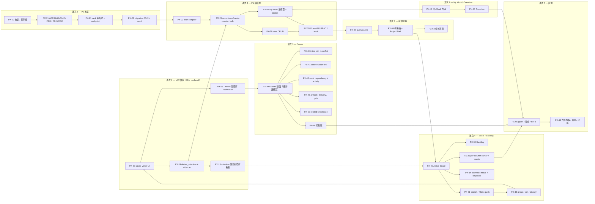

# 00 — 執行總控（`beta.1` Collaborative Project Workspace）

Ticket 前綴 `PX-`。上游規劃：[`research/03/04`](../../research/03/04-phase-p1-view-and-read-model.md)–[`07`](../../research/03/07-phase-p4-my-work-and-overview.md)。

> **本期是「同一個事實在六個畫面上不會有六種說法」這個問題的落地階段。**
> 而它的驗收方式是 **E2E-J1：一句模糊需求在同一張 Ticket 裡走完釐清 → 實作 → 驗證 → 核准，全程不進 Terminal**
> （[`10`](./10-verification-and-exit.md) §4），不是「我們做了新看板」。

## 0. 待裁決項目

**這一節是開工前唯一要讀的東西。** 每一項都寫了「不同意的話會怎樣」，
全文在 [`01`](./01-decisions-and-governance.md)。

### 0.1 A 類 — 擋開工（8 項）

> **☑ 八項全部於 2026-08-23 裁決，全部採納計畫的答案。**
> 以下**保留原文**（含「不同意的話會怎樣」），因為那是**為什麼這樣決定**的紀錄——
> 三個月後沒有人會想知道選了什麼，但每個人都會想知道當時放棄了什麼。
> 這一節因此從「開工前要決定的東西」變成「開工時要照著做的東西」。
> 裁決單在 [`12`](./12-implementation-status.md) §1。（`D116` 已由 `D117` 取代。）

---

**☑ D92 — `attention` 怎麼進得了 `WHERE`**（**2026-08-23 裁決：採納**）

> **計畫的答案：進不了，而且不該假裝進得了。`derive_attention` 兩相位求值——
> 相位 A 在 SQL 裡算 1／2／3／4／7／8 六級並圈出 queued run 候選集；
> 相位 B 在 Python 裡用 `NodeConnectionRegistry` 解出 5（`no_eligible_runner`）與
> 6（`assigned_runner_offline`）。`tasks.attention_primary` 欄位**永不建立**。**

這一項擋開工，因為它同時決定 `PX-22` 的 migration 內容、`PX-23` 的 filter 編譯路徑、
`PX-24` 的函式簽章與 `PX-25` 的分頁語意。四張 ticket 的形狀由它決定。

上游 [`04`](../../research/03/04-phase-p1-view-and-read-model.md) §5 給了兩個選項——
即時 LATERAL join，或物化成欄位——並說「先做第一種並量測」。**兩個都不成立**，
理由不是效能，是資料在哪：

```python
# repositories/tasks.py:221 — 這個 dict 的內容不在資料庫裡
online = {runner.node_id: is_online(runner.node_id) for runner in runners}
```

`is_online` 是 `NodeConnectionRegistry.is_connected`，而 registry 是
`services/registry.py:80` 的一個 `dict[uuid.UUID, NodeConnection]`。
`services/runners.py` 的 module docstring 把這件事寫成了一條規則：

> **A runner has no online state of its own.** There is no `status` column and no
> `last_seen_at`: a runner is online exactly when its node is… **A stored copy would
> be a second answer that can go stale, and this module deliberately does not create
> one (ADR 0029 sec 1).**

於是：

- **物化不行**——node 斷線不寫任何一列，物化的欄位會停在斷線前的答案。
  要讓它正確就得在斷線時 fan-out 更新所有 queued run 的卡片，而那是在寫
  ADR 0029 §1 拒絕的那份 stored copy。
- **即時 LATERAL join 也不行**——那兩級的輸入根本不在 SQL 能看到的地方。

計畫的做法把「資料庫知道的」與「這個行程知道的」分開：

```text
相位 A（SQL，可 filter／可 group／可 count）
  1 waiting_for_your_input   tasks.open_question_count > 0 AND active_run.status='waiting_for_input'
  2 pending_human_approval   gates 未齊 / delivery 待審
  3 verification_failed      最新 report.result IN ('failed','partial')
  4 run_failed               最新 run.status='failed' 且無較新的 run
  7 dependency_blocked       blocking_count > 0
  8 over_wip_or_stale        updated_at 超過門檻
  ── 同時輸出「queued 候選集」：active_run.status='queued' 的 task_id

相位 B（Python，行程內 registry，只跑在候選集上）
  5 no_eligible_runner       複用 RunService.resolve_waiting_reason 的述詞
  6 assigned_runner_offline   同上
```

**候選集是有界的**，而且界線不是卡片數而是**佇列長度**：一個 200 張卡的專案
同時 queued 的 run 通常是個位數（固定資料集是 6）。所以相位 B 的成本與 board 大小無關。

`attention = no_eligible_runner` 的 **filter 與 count** 因此這樣算：
先用相位 A 取得該專案（或該使用者可見全部專案）的完整 queued 集合，
相位 B 解出真正的兩級，再與 SQL 結果做交集。**counts 與 items 走同一段程式碼**，
所以 [`10`](./10-verification-and-exit.md) 的「counts 與 items 同 predicate」仍然成立——
只是那個 predicate 有兩半。

**要一起接受的代價**：三件事。

1. **`no_eligible_runner` 與 `assigned_runner_offline` 不能當作 `order_by` 的鍵**，
   因為它們不在 SQL 裡。排序 allowlist 因此不含這兩個（[`04`](./04-filter-and-query-compiler.md) §4）。
2. **多 worker 部署時，這兩級的答案是 per-process 的。** 今天 Central 是單行程
   （`Makefile:96` 的 `uvicorn` 無 `--workers`，compose 亦然），所以現在正確；
   這件事必須寫進 [`11`](./11-open-measurements.md) 而不是被忘記。
3. 相位 B 對 queued 集合做一次 runner 全表掃描（`resolve_waiting_reason` 現行行為）。
   `PX-24` 要把它改成**一次查詢 ＋ 一次 registry snapshot 服務整個頁面**，
   而不是每個 run 一次——這是既有 `waiting_reasons()` 已經在做的形狀，照抄。

**不同意的話**：若堅持物化，必須先撤銷 ADR 0029 §1，在 node 斷線／連線的兩個
事件上做 fan-out 更新，並接受「Central 重啟後全部卡片的 attention 是錯的直到下一次
fan-out」。若堅持即時 join，那兩級只能永遠回 `null`，而 My Work 的第五個 section
（[`08`](./08-my-work-and-navigation.md) §3）與 quick filter 的 `Blocked`／`No runner`
就要從產品裡拿掉——那是提案 §7 的差異化理由本身。

---

**☑ D93 — 「跨專案不洩漏」要怎麼測，當系統裡沒有 project membership**（**2026-08-23 裁決：採納**）

> **計畫的答案：所有 work-items 查詢的專案述詞由 `visible_project_ids(user)` 一個函式產生，
> 用 AST gate 斷言沒有第二條路徑；isolation 測試斷言**述詞被套用**，
> 而不是斷言一個不存在的 ACL 起了作用。上游那條「無權專案的卡不在 counts」的
> 出口條件**改寫成今天證得出來的形式**，證不出來的那一半寫進未量測項。**

這一項擋開工，因為它決定 `PX-23`／`PX-25`／`PX-47` 的查詢入口長什麼樣，
也決定 SR-3 的第三項到底在審什麼。

現況（`services/rbac.py`）：

```python
_VIEWER_ACTIONS = frozenset({NODE_VIEW, SESSION_VIEW, FILE_BROWSE, PROJECT_VIEW, AGENT_VIEW})
ROLE_ACTIONS = {ADMIN: …, DEVELOPER: …, VIEWER: _VIEWER_ACTIONS}
```

一個使用者一個全域角色。**沒有 `project_members` 表，`authz.py` 裡沒有任何
project-scope 函式。** 所以今天只有兩種狀態：拿得到 `project.view` 就看得到**全部**專案，
拿不到就一個都看不到。

上游 [`10`](../../research/03/10-verification-and-exit.md) SR-3 第 3 項寫「無權專案的卡不在
items 也不在 counts」，並要求 ≥1 條 inference 測試。**照字面寫，那條測試會用一個
沒有 `project.view` 的角色，然後斷言它拿到 403**——那證明的是 `require_action`，
與 My Work 的查詢邊界無關。而一組通過得毫無阻力的 isolation 測試，
比沒有測試更糟：它讓下一個人以為這件事被守住了。

計畫的做法：

```python
# services/work/scope.py — 本期唯一決定「哪些專案」的地方
async def visible_project_ids(session, user) -> ProjectScope:
    """今天：拿得到 project.view 就是全部未刪除的專案。

    這個函式存在的理由**不是**今天的邏輯——今天的邏輯是一行。
    它存在是為了當 per-project membership 進來時，要改的地方是一個而不是九個。
    `GATE-PX-ONE-PROJECT-SCOPE` 斷言 `work_items`／`work_counts`／`me_work_items`
    的每一條 select 都從這裡取述詞。
    """
```

出口條件因此改寫成三條**證得出來**的：

| 上游的條件 | 本期改成 | 為什麼 |
|---|---|---|
| 無權專案的卡不在 items 也不在 counts | **counts 與 items 由同一個 `ProjectScope` 與同一個 filter 編譯結果產生**（同一段程式碼路徑的斷言 ＋ 一組「兩者對同一 fixture 回相同集合大小」的測試） | 這是今天真正會壞掉的東西：兩個 endpoint 各寫一次述詞 |
| My Work 跨專案隔離 | **`GATE-PX-ONE-PROJECT-SCOPE`**：AST 掃描 work-items 相關 select，任何未經 `visible_project_ids` 的 `Task` 查詢即 FAIL | 守住的是「未來加 ACL 時只有一個地方要改」 |
| inference 測試 | **保留但誠實命名**：`test_a_viewer_without_project_view_sees_no_work_items_and_zero_counts` | 它測的是全域角色，名字要說出來 |

**沒被證明的那一半**——「有 per-project membership 時 counts 不洩漏存在性」——
寫進 [`11`](./11-open-measurements.md) 第 1 項，並註明「本期不可測，因為沒有 membership」。

**要一起接受的代價**：SR-3 的第三項在簽核時會是一句「本部署的模型下無法產生負面案例，
守護方式是 gate 而非測試」。那句話必須被寫下來並簽名，不能靠一組空轉的測試蓋過去。

**不同意的話**：本期得先做 per-project membership——新表、新 seed migration、
27 個動作全部要重新想 scope、既有 27 個 endpoint 的授權都要改。
那是一整期的工作，而且是 `Horizon 3 / Enterprise governance` 的工作。

---

**☑ D94 — `WorkItemCardDTO` 的大小預算是多少**（**2026-08-23 裁決：採納**）

> **計畫的答案：先量再釘。`PX-25` 在固定資料集上量出 33 欄的實際 bytes，
> 以「量測值 ＋15%」寫進釘死測試，並在測試 docstring 記錄**逐欄 bytes 的前五名**。
> 上游的 160 KB **不得直接抄**。**

這一項擋開工，因為 DTO 的欄位清單要在 `PX-25` 開工前定案，而定案的依據是預算。

上游 [`01`](../../research/03/01-architecture-decisions.md) §1.5 的推導是：
「這個數字是 74 KB 的兩倍多一點」。**74 KB 已經不是現況**：

```python
# repositories/tasks.py:45 — BoardCard 的 docstring
# Not the ORM row: M1 measured a 200-card board at 439 KB with the full card and
# 74 KB with the original summary. Plan/19 adds only active status, runner name and
# a fixed waiting-reason enum: the same 200-card fixture is 89,251 bytes against a
# 90,000-byte budget.
```

**89,251 / 90,000 = 99.2%。** 現行看板卡已經貼著自己的上限。
三個小欄位（一個 enum、一個字串、一個 enum）就吃掉 15 KB，
因為 200 張 × JSON 的 key 名本身就是成本。

`WorkItemCardDTO` 是 **33 個欄位**，其中 `blocking_refs`（陣列）、`labels`（陣列）、
`attention_signals`（陣列）三個是**不定長**的。把 160 KB 當成上限去設計，
第一個 label 多的專案就會撞牆，而症狀是一個沒有人在看的預算測試變紅。

計畫的做法（`PX-25` 的第一步，早於 endpoint 實作）：

```text
1  在固定資料集上序列化 33 欄的 WorkItemCardDTO × 200，量出 bytes
2  印出逐欄成本（key 名 + 值）前五名
3  若量測值 > 200 KB：先砍欄位再寫 endpoint，砍哪一個記在 12 §2
4  釘死測試的門檻 = 量測值 × 1.15，數字與量測日期寫在 docstring 裡
5  同一支測試順便重量 BoardCardDTO，斷言它 **仍然是 89,251 ± 2%**
```

第 5 步是重點：`BoardCardDTO` 的 OpenAPI diff 為空只證明**形狀**沒變，
不證明**大小**沒變——而新讀模型會共用 `active_runs()`／`blocking_counts()`，
有人為了新卡而讓那兩個查詢多回一欄，舊卡會跟著變大。

**要一起接受的代價**：`PX-25` 多一個「量測先行」的子步驟，
而且它的產物（逐欄 bytes）要進 `artifacts/px/local/`。

**不同意的話（直接用 160 KB）**：兩種結局。若實測低於它，這個測試從第一天起就不守任何東西；
若高於它，`PX-25` 會在 endpoint 寫完之後才發現要砍欄位，而那時 `PX-18` 的卡片元件已經在用那些欄位。

---

**☑ D95 — 新鮮度從哪來**（**2026-08-23 裁決：採納**）

> **計畫的答案：只輪詢 `work-counts`。20 秒一次、`document.hidden` 時停、
> counts 有 delta 才去重取 items。**beta.1 不開瀏覽器 WebSocket。****

這一項擋開工，因為它決定 `PX-27` 的 query 層要不要有訂閱模型，
也決定 `PX-25` 的 `work-counts` 是「順便的第二個 endpoint」還是「最熱的那一個」。

上游 [`09`](../../research/03/09-frontend-architecture.md) §5 寫「WSS 事件只 invalidate／append
已確認的 metadata」。**這個 repo 的瀏覽器端沒有 WSS**：`frontend/src/api/client.ts`
唯一鑄造的票券是 terminal 的（`client.ts:241,585`），
`grep -rn "WebSocket" frontend/src/api frontend/src/stores` 只有那兩行。

而 board 目前**完全不會自己更新**：

```ts
/** One reload for the whole task layer. … */   // views/ProjectDetailView.vue:104
async function reloadTasks(): Promise<void> { … }
```

它只在 create／update／dispatch 之後被呼叫。於是「這張卡剛剛開始等你回覆」
這件事在畫面上永遠不會自己出現——而**那正是本期整個產品論述的核心事件**。

計畫的做法：

| | 做法 | 成本 |
|---|---|---|
| counts | **輪詢**，20s，`visibilitychange` 暫停，`work-counts` 一次查詢 | 每分鐘 3 個請求／使用者 |
| items | **不輪詢**。counts 的任一格變動 → 只 invalidate 受影響的 group | 0 |
| Drawer 的 conversation | 開啟時輪詢 5s（沿用 `RunDetailView.vue:99` 的 2s 形狀，放寬到 5s） | 只在 Drawer 開著時 |
| My Work | 與 counts 同一個輪詢器 | 共用 |

**20 秒的理由**：runner poll 是 5 秒（`DefaultRunnerPollInterval`），
`alpha.2` 量到的 message → turn P95 目標是 10 秒。20 秒的輪詢讓「Agent 開始問問題」
到「畫面上出現」的 P95 落在 30 秒內，而那與人類看板的節奏相稱。
**這個數字是可調的，而且它是 [`11`](./11-open-measurements.md) 第 3 項。**

**要一起接受的代價**：一個開著看板的分頁每分鐘打三次 `work-counts`。
所以 `work-counts` 必須是**單一查詢**（[`05`](./05-work-items-and-view-api.md) §3），
不能是「跑一次 items 再數」。

**不同意的話（開瀏覽器 WS）**：新增一條認證過的 central→browser 通道，
要 ticket 機制、要 per-project 的訂閱授權、要 reconnect 與 backfill、
要決定斷線期間錯過的事件怎麼補。那是新的信任邊界，SR-3 的範圍會從
「讀模型的權限邊界」變成「讀模型的權限邊界 ＋ 一條新的推播通道」——
與 [`research/03/01`](../../research/03/01-architecture-decisions.md) §1.4
把 provider sync 移到 `beta.2` 的理由**逐字相同**。

---

**☑ D96 — bulk update 怎麼寫**（**2026-08-23 裁決：採納**）

> **計畫的答案：逐張呼叫 `TaskService.update()`，全部包在一個交易裡。
> 不寫第二條 `UPDATE tasks` 路徑。上限先訂 100，`PX-25` 量交易成本後可下修。**

這一項擋開工，因為它決定 `PX-25` 的 bulk endpoint 是「一個 SQL」還是「一個迴圈」，
而錯誤的那個選擇會**通過所有測試**。

```python
# services/done_gate.py:16 — module docstring
# **There is one entrance.** `TaskService.update()` is the only caller, because it is
# the only thing that assigns `task.stage`. A run does **not** move a card —
# `finish()` never touches the column and `GATE-DV-SINGLE-DONE-PATH` scans for an
# assignment there.
```

一個 `UPDATE tasks SET stage='done' WHERE id = ANY(:ids)` 會同時繞過：

1. **Done Gate 的六個條件**（`_check_done_gate`）；
2. **相依性拒絕**（`_check_dependencies_for`）；
3. **樂觀鎖**（`version` 比對）；
4. **audit ＋ activity**（`_record`）；
5. **knowledge outbox**——`ActivityService.record()` 是 `alpha.3` 唯一的入列點
   （`services/activity.py:246`），所以繞過 activity 就是讓那 100 張卡的知識**永遠不更新**，
   而症狀是「這幾張卡看起來只是安靜了一陣子」。

第 5 條是本期與 `alpha.3` 唯一的交互作用，而它在上游規劃裡完全沒有出現。

**成本要先算清楚**：一張卡走一次 `update()` 寫

```text
1 × UPDATE tasks
1 × INSERT activity_events
1 × INSERT audit_log
0–1 × INSERT knowledge_jobs   （ON CONFLICT DO NOTHING，不同卡不會互相去重）
```

100 張 = **約 400 列寫入 ＋ 100 次 Done Gate 評估**（若 patch 含 `stage='done'`，
每次 Done Gate 是 3–4 個查詢）。最壞情況一個交易裡有 700+ 次往返。
`PX-25` 要量這個交易的 P95，若超過 3 秒就把上限下修到量出來的值——
**上限是量出來的，不是抄來的**。

**要一起接受的代價**：bulk update 不是「一個 SQL」，所以它慢。
產品上的緩解是 UI 顯示進度與「全部或全不」的明確說明，不是偷偷放寬到 partial。

**不同意的話**：`GATE-DV-SINGLE-DONE-PATH` 會擋下 `services/` 內的 stage 賦值，
所以「不同意」的實作形式只有一種——把它寫在 `repositories/` 或 raw SQL 裡繞過 AST 掃描。
那正是那個 gate 存在的理由。

---

**☑ D97 — `STAGE_TRANSITION_REFUSED` 這個 machine code 要不要加**（**2026-08-23 裁決：採納**）

> **計畫的答案：不加。上游 machine code 表的八個減為七個。**

這一項擋開工的程度較輕，但它決定 `PX-30` 的 Ready transition 是「拒絕」還是「警告」，
而那是 UI 與後端要一起決定的事。

上游 [`08`](../../research/03/08-data-model-and-contract.md) §8 列了
`STAGE_TRANSITION_REFUSED`，並要求「回應必須列出未滿足的 gate 項目」。
核對程式碼之後：**這個 repo 只有兩個硬拒絕，兩個都已經做到了那件事。**

| 拒絕 | 既有 code | 已經回什麼 |
|---|---|---|
| 相依未完成 | `TASK_DEPENDENCY_UNSATISFIED`（409） | `details.blocking_refs` = 全部未完成的 `card_ref` |
| Done Gate 未過 | Done Gate 的既有拒絕 | **每一個** missing item，不是第一個（`done_gate.py`「Every refusal names every missing item」） |

而 Definition of Ready **刻意不拒絕**，理由寫在 `services/process.py` 的 docstring 裡：

> Definition of Ready and WIP **report and do not refuse** — enforcing all seven
> readiness items from day one is how a board stops being written to, and an unused
> board is a source of truth nobody updates.

上游 [`05`](../../research/03/05-phase-p2-board-and-backlog.md) §4.3 已經把這件事標成
「維持警告或改拒絕，由 `PX-30` 依 process 設定決定——不要在這裡硬編」。
**本計畫的裁決是：維持警告。** 理由是上面那段 docstring 已經是一個經過論證的決定，
而本期沒有帶來任何推翻它的新證據；而且 `process_overrides` 只能**關掉** readiness item，
不能新增，所以「依 process 設定決定要不要拒絕」需要一個 `process_definitions` 的新欄位——
那是改變 process 語意，屬於另一題。

於是 `STAGE_TRANSITION_REFUSED` **沒有 raise 點**。這與 `plan/25` §2.12 的
`CROSS_PROJECT_DENIED` 是同一個錯誤，而那一期是在實作到一半才發現的：

> 計畫的 machine code 表列了六個。五個有 raise 點；第六個**每一個候選位置都不能用**。

**本期在計畫階段就把它刪掉。**

**要一起接受的代價**：`PX-30` 的「送到 Ready」在缺 readiness 時是一個
**可以按下去的確認對話框**（列出缺失項 ＋ 「仍要送出」），不是一個 400。
UI 的責任因此變重：缺失項要能直接點開去補。

**不同意的話**：要先改 `process_definitions` 的 schema 加一個
`readiness_enforced: bool`，改 `ProcessService.effective()`，
改 `TaskService.update()` 增加第三個硬拒絕，並回答「既有專案預設是哪個值」——
預設 `true` 會讓所有現存部署的看板突然開始拒絕寫入。

---

**☑ D115 — 使用者要等多久才看得到東西**（**2026-08-23 裁決：採納**）

> **計畫的答案：新增**波次 0**。四張 ticket、全部跑在**既有** backend 上、
> 全部不是拋棄式的，交付一個**看得見的看板改變**——
> 卡片上有 attention、點卡不再離開看板。**

這一項擋開工，因為它改變波次順序，而波次順序是這份計畫的骨架。

**問題的證據不在程式碼裡，在發布史裡**：

| 版本 | 交付 | 使用者看得到的畫面變化 |
|---|---|---|
| `alpha.1` | Project／Task／Runner／Delivery／Verification 基線 | 六欄看板 |
| `alpha.2` | conversation seq、question、answer＋resume、continuation turn | Task 詳情頁多一個對話面板 |
| `alpha.3` | knowledge sources、hybrid search、citations、Context Builder | 一個新的 Knowledge 分頁 |
| `beta.1`（本計畫**第一版**） | 讀模型、Board、Drawer、My Work | **波次 3 之前是零**，而波次 3 要等波次 1–2 兩輪後端 |

第一版的波次表把**全部**前端排在波次 3 之後，前面是
`PX-00 → PX-21 → PX-61 → PX-22 → PX-23 → PX-24 → PX-25 → PX-26 → PX-47 → PX-28`
十張純後端 ticket。**那是第四次把畫面排在最後。**

而「排在最後」在這份計畫的**第一版**還多一層：新 UI 藏在一個預設 `false` 的旗標後面，
所以即使做完，預設也看不到。**☑ D117 拿掉了那一層**——這一項因此只剩「順序」一個問題。

**它可以不必這樣，因為既有的 `BoardCardDTO` 已經帶得夠多了**：

```python
# schemas.py:1042 — 既有 16 欄，一個位元組都不用動
active_run_status      → waiting_for_your_input
waiting_reason         → no_eligible_runner / assigned_runner_offline
blocking_count         → dependency_blocked
gates_approved_count   → pending_human_approval（配 process.gates）
updated_at + wip_suggested → over_wip_or_stale
```

**八級裡有六級今天就算得出來。** 缺的兩級（`verification_failed`、`run_failed`）
需要兩個 lateral join，而那是 `PX-24` 本來就要寫的。

於是波次 0 是：

```text
PX-17  十個 token                                    無後端依賴
PX-24  derive_attention 兩相位 ＋ side-car endpoint    不依賴 0043
PX-18  attention 徽章掛到**既有** TaskBoard.vue        用 side-car
PX-38  Drawer shell 包住**既有** TaskDetail.vue        ?task= URL 驅動
```

**四張都不是拋棄式的**：`PX-24` 寫的就是波次 2 要用的同一個函式；
`PX-18` 的元件波次 4 直接接到 `WorkItemCardDTO`；
`PX-38` 的殼波次 5 換掉內容。**唯一會被丟掉的是 side-car endpoint 本身**
（[`05`](./05-work-items-and-view-api.md) §9，約 40 行），
而它換到的是「三個波次之前就有回饋」。

**要一起接受的代價**：三件事。

1. `derive_attention` 要能在**沒有** `is_blocked` 欄位的情況下跑
   （波次 0 時 `0043` 還沒上）。做法是 `stage='blocked'` 直接投影
   ——那本來就是 [D102](./01-decisions-and-governance.md) 的規則之一。
2. side-car endpoint 是一個會被刪的 endpoint。**它不進 OpenAPI 的相容承諾**，
   在 docstring 第一行寫明「temporary, removed when `work-items` lands in wave 2」。
3. 波次 0 直接改 `frontend/src/components/project/TaskBoard.vue`
   （**☑ D117 之後不需要旗標包裹**）。改動前後各存一份視覺基準，
   **diff 是給人審查的材料，不是 gate**——這一輪的目的就是讓畫面改變。

**不同意的話**：`beta.1` 的第一個可看的畫面落在波次 3 結束，
而波次 1–2 是十張 ticket。若那十張走了六週，就是**第四次**在六週內沒有任何
可以拿給人看的東西——而這一輪的整個論述是「產品體驗重設」。

---

**☑ D117 — UI 不分 V1／V2；`CLIORA_PROJECT_EXPERIENCE_V2` 不建立**（**2026-08-23 人工確認**）

> **前端一律以最新為主，不保留舊版並存路徑。旗標不新增。**
> `CLIORA_PROJECTS_ENABLED` 與 `CLIORA_AGENT_RUNS_ENABLED` 不變——
> 那兩個是能力閘門，不是 UI 版本。

`grep -rn "PROJECT_EXPERIENCE_V2" backend/ frontend/src/` 是**零結果**：
它從來只存在於規劃文件裡，拿掉的成本是零。

全文與六項簡化在 [`01`](./01-decisions-and-governance.md#d117)。要一起接受的代價是
**沒有 kill switch**：回滾只剩「回上一個 image ＋ downgrade `0043`」，
而 downgrade 會刪掉 saved view。三個緩解——
完整頁面 `/projects/:id/tasks/:taskId` 保留、`/board` API 保留一版（[D118](./01-decisions-and-governance.md#d118)）、
以及**波次 0 因此更重要**（早三個波次拿到回饋是唯一剩下的風險控制）。

**它取代了 D116**（旗標預設何時裁決）。D116 的論證——
「預設 `false` 就沒有真實使用」是一個循環——仍然成立，而且是本項的理由之一。

---

### 0.2 B 類 — 改變某一節但不擋開工（9 項）

實作時依計畫的答案執行；有異議記在 [`12`](./12-implementation-status.md) §2。

| # | 決定 | 計畫的答案 | 影響 |
|---|---|---|---|
| D98 | rank 純函式在哪一個波次 | **波次 1**，早於 `0043` | `0043` 的 backfill 要用 `rebalanced_ranks()`；上游把 `PX-61` 排在第二段是一個順序缺陷 |
| D99 | kintra 的程式碼怎麼移植 | **函式體與測試逐字移植，docstring 翻成英文**；保留三個不變式的命名 | kintra 的註解是中文，cliora 的程式註解是英文；混用會讓下一個讀者以為這個檔案是外來物 |
| D100 | 前端 query 層是擴充還是新增 | **新增 `modules/work/queryCache.ts`**；`useAsyncResource` 一行不動 | 它 78 行且沒有快取可以擴充 |
| D101 | 預設 view 什麼時候 seed | migration backfill 既有專案 ＋ `ProjectService.create()` 加一段 | 否則新專案沒有 view，Board 開起來是空的 |
| D102 | `is_blocked` 的 dual write | **新 UI 只寫 `is_blocked`；舊 UI 仍可寫 `stage='blocked'`；讀模型兩者都認** | D49 的過渡；`HD-06` 是還款計畫 |
| D103 | quick filter 與 saved view 的關係 | quick filter 只進 URL，不改 view；toolbar 顯示「已修改／另存為／還原」 | 上游 §2 已寫，本計畫照做並補 URL 序列化格式 |
| D104 | Done 欄的「近 7 天」怎麼查 | `0043` 補 `ix_tasks_project_updated (project_id, updated_at DESC)` | **今天沒有這個索引**，而看板正是 `ORDER BY updated_at DESC` |
| D105 | bulk update 的 audit 幾列 | **audit 一列**（含完整 `card_ref` 陣列）＋ **activity N 列** | 上游只說了 audit 那一半；卡片時間軸仍要看得到自己那一次變更 |
| D106 | 本期動不動 daemon | **零 diff**，並且有 `GATE-PX-NO-DAEMON-DIFF` 與 `GATE-PX-CONTRACT-FROZEN` | 任何 daemon 變更會把「未升級節點行為不變」從恆真變成待驗證的命題 |

### 0.3 從上游繼承、仍未關閉

| # | 決定 | 狀態 | 影響 |
|---|---|---|---|
| ★ D46 | provider 同步落在哪一版 | ☐ 未裁決 | 本計畫假設 `beta.2`。不擋任何波次；只影響 `PX-66` 的 release note 措辭 |

### 0.4 上游的計畫決定，本期直接執行

| # | 來源 | 內容 |
|---|---|---|
| D48 | `research/03/01` §1.5 | `BoardCardDTO` 與 `/board` 一個位元組都不動；新開 `WorkItemCardDTO` |
| D49 | `research/03/01` §1.7 | stage 只做投影，`blocked` 仍是合法值 |
| D50 | `research/03/01` §1.8 | rank 的 scope 是 **project**，不是欄 |
| D53 | `research/03/08` §6.1 | **不新增 RBAC 動作**（27 → 27） |
| D54 | `research/03/04` §3 | filter 是 allowlist，不是 DSL |
| D56 | `research/03/09` §3 | 不引入 query cache 套件 |

---

## 1. 八個波次

**波次 0 是 [D115](./01-decisions-and-governance.md) 加的**：它跑在既有 backend 上，
交付一個看得見的看板改變，而四張 ticket 沒有一張是拋棄式的。



**波次 1 需要 D93 之外的全部 A 類。** 精確地說：

**☑ A 類八項已於 2026-08-23 全部裁決，以下表只是紀錄哪一項曾經擋哪一段。**

| 波次 | 曾經需要哪些裁決 |
|---|---|
| **0** | **D115（波次 0 存在）、☑ D117（不分版本 → 直接改 `TaskBoard.vue`）、D92（`derive_attention` 的形狀）** |
| 1 | D98（順序）、D94（DTO 欄位清單要定案才能寫 ADR 0040） |
| 2 | **D93、D94、D96、D97** |
| 3 | **D95、D100** |
| 4–6 | 無新增（依波次 2、3 的產物） |
| 7 | D93（SR-3 的措辭）、★ D46（release note） |

**前置條件（擋波次 1 起；☑ 波次 0 不受它擋）**：`plan/25` 的 `alpha.3` 出口條件 26／28 中缺的兩項
（Railway 的 `pg_trgm` 驗證、SR-2 簽核）**必須先關閉並打上 `v2.0.0-alpha.3` tag**，
再開始波次 1。理由不是儀式：`PX-62`（Related knowledge）整合 `KN-11`，
而在一個沒有簽核的 knowledge 層上疊 UI，等於把 SR-2 的未結項帶進 SR-3。

> **後記（2026-08-27）：這一條沒有被遵守，而全期就是在那個狀態下做完的。**
> 波次 1 起是在三項前置條件未關閉的情況下經人工裁決開工的（[`12`](./12-implementation-status.md) §2.7）。
> SR-2 於 **2026-08-27** 簽核——也就是**在 SR-3 簽核的同一天，在 `beta.1` 全部做完之後**。
> 所以上面那句「等於把 SR-2 的未結項帶進 SR-3」**實際發生了**，
> 而它的處置是兩份審查同一天由同一個人核准。
> Railway 的 `pg_trgm` 那一項**到今天仍然開著**，由 `plan/27` 的 `HD-00` 承接。
> **留著原文不劃掉**：它是對的，而它被繞過了，這兩件事都要看得到。

## 2. 三十四張 ticket

| ID | 工作 | 主要落點 | 依賴 | 規模 |
|---|---|---|---|---|
| `PX-17` | **【波次 0】** `--attention-*`（5）＋ `--work-*`（5，`--stage-*` 的別名）token；`checkTokens.test.ts` 涵蓋；`research/style.md` 補非顏色規則 | `frontend/src/theme/`、`research/style.md` | — | S |
| `PX-24` | **【波次 0】`derive_attention` 兩相位**（D92）：相位 A 的 SQL 投影、相位 B 的 registry snapshot、八級固定優先序、四個正交狀態面；**＋ side-car endpoint `GET /projects/{id}/board-attention`**（暫時，波次 2 刪除）；200 張卡 P95 量測 | `services/work/attention.py`（新）、`services/work/projection.py`（新）、`api/http/work.py`（新） | `PX-00` | **L** |
| `PX-18` | **【波次 0】** `WorkItemCard`／`WorkItemRow` 的 attention 區塊：八種 attention × 兩種密度、**icon ＋ 文字 ＋ 形狀至少兩項**、execution zone；**先掛到既有 `TaskBoard.vue` 的卡片**（旗標之後），波次 4 接 `WorkItemCardDTO` | `frontend/src/modules/work/components/`、`components/project/TaskBoard.vue` | `PX-17`、`PX-24` | M |
| `PX-38` | **【波次 0】Drawer shell**：URL 驅動（`?task=`／`router.replace`）、focus trap／restore、aria、「開新分頁」；**先包住既有 `TaskDetail.vue`**（時間順序，不是版本並存），波次 5 由 `PX-39` 換內容 | `frontend/src/modules/task/` | `PX-17` | M |
| `PX-00` | 文件校正與基準線：回寫 `research/03/` 的九處過期事實（[`12`](./12-implementation-status.md) §0）；`scripts/px/capture-baseline.sh` 抓 `BoardCardDTO` bytes、`tasks` 索引清單、tokens 數、requirements 數 | `research/03/`、`scripts/px/` | — | XS |
| `PX-21` | **ADR 0040**（lifecycle 投影、attention 兩相位、stage 相容策略）**＋ ADR 0042**（view schema／scope／權限／rank）；`research/prd.md` 增訂 FR-WORK 十二節 ＋ AC anchor；`traceability/requirements.json` 註冊 12 條 | `docs/adr/`、`research/prd.md`、`traceability/` | `PX-00` | S |
| `PX-61` | **Rank**（D98／D99）：移植 `ranking.py` 純函式 ＋ 兩組測試（docstring 翻譯）；`POST /api/tasks/{id}/rank`（neighbor IDs，不是 index）；背景再平衡 24／同步保險閥 48 | `services/work/ranking.py`（新）、`api/http/tasks.py` | `PX-21` | M |
| `PX-22` | **Migration `0043`**：`work_views` ＋ `tasks` 四欄 ＋ 四個索引 ＋ rank backfill ＋ `is_blocked` backfill ＋ ambiguous report ＋ 五個預設 view 的 seed；`ProjectService.create()` 加 seed；downgrade roundtrip | `db/migrations/versions/`、`db/models.py`、`services/projects.py` | `PX-61` | **L** |
| `PX-23` | **Filter 驗證與 query compiler**（D93）：15 欄 × 8 運算子、深度 ≤3／條件 ≤20、`visible_project_ids` 述詞、三個 machine code（**指名 field／op**）、六個負面測試 | `services/work/filters.py`（新）、`services/work/scope.py`（新） | `PX-22` | **L** |
| `PX-25` | **`work-items`／`work-counts`／`bulk-update`**（D94／D96）：**量測先行**、cursor ＋ per-group cursor、counts 與 items 同 predicate、逐張授權、all-or-nothing、冪等、釘死測試 ×2 | `api/http/work.py`（新）、`services/work/items.py`（新） | `PX-23`、`PX-24` | **L** |
| `PX-26` | **View CRUD**：personal／project scope、`ck_work_views_scope`、default 變更 audit、duplicate、`VIEW_NAME_CONFLICT`／`VIEW_NOT_OWNED` | `api/http/work.py`、`services/work/views.py`（新） | `PX-25` | M |
| `PX-47` | **My Work 跨專案讀模型 ＋ attention counts**（合併上游 `PX-47`＋`PX-48`）：`GET /api/me/work-items`、`GET /api/me/attention-counts`，**共用同一個 compiler 與同一個 `derive_attention`** | `api/http/me.py`（新） | `PX-25` | M |
| `PX-28` | **相容與稽核**：OpenAPI 快照、`BoardCardDTO` diff 為空 **＋ bytes 未變**、RBAC 矩陣（27 不變）、audit 斷言（shared default 寫、personal density 不寫） | `backend/tests/`、`scripts/px/` | `PX-26`、`PX-47` | M |
| `PX-27` | **`queryCache`**（D100）：結構化 key、前綴失效、optimistic snapshot／rollback、in-flight 去重、**counts 輪詢器**（D95：20s ＋ visibilitychange） | `frontend/src/modules/work/queryCache.ts`（新） | `PX-28` | **L** |
| `PX-64` | **`ProjectShell` ＋ 子路由 ＋ `ProjectDetailView` 逐頁替換**（D117）：八個子路由、舊 `?tab=` 相容、**逐頁替換而非雙路徑**、逐頁視覺 diff、**完成時刪除 `ProjectDetailView.vue`** | `frontend/src/modules/project/`、`router/index.ts` | `PX-27` | **L** |
| `PX-63` | 全域導覽重整：四組 ＋ `My Work` ＋ `Dashboard`→`Home`；**保留 fleet health 區塊**；`/dashboard` 保留為別名 | `frontend/src/components/layout/`、`router/index.ts` | `PX-64` | M |
| `PX-29` | **Active Board 四欄** ＋ Done 的「近 7 天／近 N」＋ 欄頭 server count ＋ blocked 留在原 stage | `frontend/src/modules/work/` | `PX-18`、`PX-64` | **L** |
| `PX-30` | **Backlog List**：inline create／rename、rank handle、multi-select、bulk 動作、Ready transition（D97：**警告 ＋ 可按下去**，缺失項可直接點開補） | `frontend/src/modules/work/` | `PX-29` | **L** |
| `PX-31` | Search、Filter builder、quick filters（7 個 chip）＋「已修改／另存為／還原」（D103） | `frontend/src/modules/work/components/` | `PX-29` | **L** |
| `PX-32` | Group（6 種）、Sort、Display options、density；**grouping 不建立第二份排序來源** | `frontend/src/modules/work/components/` | `PX-31` | M |
| `PX-33` | Saved personal／project views UI、default、duplicate、「這是共用 view」的明確標示 | `frontend/src/modules/work/components/` | `PX-32`、`PX-26` | M |
| `PX-34` | **Optimistic move ＋ 鍵盤等價路徑**（合併上游 `PX-34`＋`PX-35`）：`version` 帶入、409 回滾、具體拒絕原因、Move dialog、screen-reader 播報、**filter 開啟時送 neighbor IDs** | `frontend/src/modules/work/composables/` | `PX-29`、`PX-61` | **L** |
| `PX-36` | **每欄 cursor pagination ＋ 全螢幕**（合併上游 `PX-36`＋`PX-37`）：`Load more`、server count 釘死測試、full-screen state restore | `frontend/src/modules/work/` | `PX-29` | M |
| `PX-39` | **Drawer 版面接新讀模型**：main＋sidebar 區塊順序、conversation 前移、**造成 blocked／warning 的執行設定自動展開並置頂**（四種情境） | `frontend/src/modules/task/` | `PX-38`、`PX-25` | M |
| `PX-40` | Inline editing 與 conflict recovery：explicit save（dirty 指示）、select 即時 patch、409 **保留草稿** ＋ reload／compare、field error 在欄位旁 | `frontend/src/modules/task/` | `PX-38` | M |
| `PX-41` | **Conversation-first**：整合 `CV-10`／`CV-11`，`waiting_for_input` 時自動捲到並聚焦；「留言」與「回覆並繼續」視覺明確不同；`agent_seen` 的 tooltip | `frontend/src/modules/task/` | `PX-38` | M |
| `PX-42` | **Run summary ＋ dependency ＋ activity**（合併上游 `PX-42`＋`PX-45`）：log deep link，**raw log 不進 conversation 串** | `frontend/src/modules/task/` | `PX-38` | M |
| `PX-43` | **Artifact／delivery／verification／gate**（合併上游 `PX-43`＋`PX-44`）：**human actor ＋ 時間永遠可見** | `frontend/src/modules/task/` | `PX-38` | M |
| `PX-62` | Related knowledge 區塊（整合 `KN-11`）：top sources、pin／exclude、「為什麼被選中」 | `frontend/src/modules/task/`、`modules/knowledge/` | `PX-38` | S |
| `PX-46` | 行動版全螢幕 detail：header 固定、sidebar 收成 accordion、composer 保持可見 | `frontend/src/modules/task/` | `PX-38` | S |
| `PX-49` | My Work 六個 section ＋ 個人 saved views ＋ **notification 已讀不影響 counts** 的測試 | `frontend/src/modules/mywork/` | `PX-47`、`PX-27` | **L** |
| `PX-50` | **Project Overview**（合併上游 `PX-50`＋`PX-51`＋`PX-52`）：attention strip、work distribution、active runs、requirements progress、recent deliveries、stale／failure 可見性 | `frontend/src/modules/project/` | `PX-49` | **L** |
| `PX-65` | **安全與正確性**：SR-3 的八個審查項、九個 `GATE-PX-*`、filter 的 15 條授權測試、bulk 的混權限 batch、a11y 全鍵盤路徑 | `backend/tests/`、`frontend/src/**/*.test.ts`、`scripts/px/` | 波次 4–6 全部 | **L** |
| `PX-66` | **證據**：六條旅程（J1／J2／J4／J10／J15／J16）、八項使用者任務時間、六項效能量測、SR-3 簽核、九項 release 產物、flag 矩陣五組合 | `scripts/px/journeys/`、`docs/`、`artifacts/px/local/` | `PX-65` | **L** |

**為什麼 `PX-65` 與 `PX-66` 分開**：同 `plan/25` §2 的理由。
`plan/24` 整整一期在做的事，就是把上一期塞在最後一張 ticket 尾巴的證據補齊。
**證據是自己的一期。**

**與上游 ticket 的對應**（上游 38 張 − 7 張合併 ＋ 3 張新增 = **本期 34 張**）：

| 上游 | 本期 | 為什麼合併／改號 |
|---|---|---|
| `PX-48` | 併入 `PX-47` | 兩者共用同一個 compiler 與同一個 predicate，拆開會讓「同 predicate」變成一個要維護的約定而不是一段程式碼 |
| `PX-35` | 併入 `PX-34` | 鍵盤 move 與拖曳 move 是**同一條 mutation 路徑**的兩個入口；拆開會做出兩份回滾邏輯 |
| `PX-37` | 併入 `PX-36` | full-screen 是分頁狀態還原的一個 case |
| `PX-39` | **維持獨立**（第一版曾併入 `PX-38`） | [D115](./01-decisions-and-governance.md) 把 shell 前移到波次 0，而版面要接新讀模型。殼與內容因此落在不同波次 |
| `PX-45` | 併入 `PX-42` | dependency／activity 與 run summary 是同一組 read-only 面板 |
| `PX-44` | 併入 `PX-43` | verification／gate 的呈現與 delivery review 共用「human actor ＋ 時間」的元件 |
| `PX-51`／`PX-52` | 併入 `PX-50` | Overview 的七個模組是一頁，拆成三張 ticket 會做出三次版面決定 |
| — | **新增 `PX-00`** | 上游的過期事實會被下一個讀者當成基準（`plan/25` §0 的教訓） |
| — | **新增 `PX-65`／`PX-66`** | 上游只有一行「SR-3 通過」與一行「出口條件全綠」，沒有 ticket |

## 3. 禁區清單（`GATE-PX-TOUCH-LIST` 會檢查）

本期**不得**修改。動了會過所有測試，但改變的是別的階段的承諾：

```text
daemon/                                    全樹。本期的 daemon diff 必須是 0（GATE-PX-NO-DAEMON-DIFF）
contracts/                                 全樹 sha256 與基線相同（GATE-PX-CONTRACT-FROZEN）
backend/app/services/agent_auth.py         RUN_TOKEN_SCOPES 與 AGENT_FORBIDDEN_FIELDS 的既有五欄
backend/app/services/rbac.py               27 個動作，一個都不加（D53）
backend/app/services/done_gate.py          六個條件與唯一入口
backend/app/services/secrets.py            機密下放
backend/app/services/deliveries.py         交付與 PR
backend/app/services/knowledge/            alpha.3 的全部（PX-62 只讀既有 endpoint）
backend/app/api/http/tasks.py::read_board  /board 與 BoardCardDTO，一個位元組都不動（D48）
backend/app/repositories/tasks.py          board_cards() / active_runs() / blocking_counts() 的回傳形狀
backend/pyproject.toml 的 dependencies     不新增任何套件
frontend/package.json 的 dependencies      不新增任何套件（D56）
frontend/src/composables/useAsyncResource.ts   一行不動（D100）
frontend/src/views/  的 terminal / session / node / file 相關    本期不碰（範圍之外，不是版本承諾）
```

**四個具名例外**：

1. `AGENT_FORBIDDEN_FIELDS` **新增 `is_blocked` 與 `blocking_reason`**
   （`research/03/08` §6.2）。這是**擴大**禁區不是縮小，
   理由是一個能把自己標成「非阻塞」的 Agent 等於能繞過 dependency gate。
2. `services/projects.py` 的 `create()` **會被加一段** 預設 view seed（D101）。
3. `api/http/tasks.py` **會被加一個** `POST /tasks/{id}/rank`（`PX-61`），
   `read_board` 與 `BoardCardDTO` 不動。
4. `services/tasks.py` 的 `EDITABLE_FIELDS` **新增 `is_blocked`／`blocking_reason`／
   `blocking_message`／`rank`**。**`rank` 同時進 `AGENT_FORBIDDEN_FIELDS`**——
   一個能改自己排序的 Agent 可以把自己插到佇列最前面。

`repositories/tasks.py` 可以**新增**方法（新讀模型會複用 `active_runs()` 與
`blocking_counts()`），但既有六個方法的回傳形狀不動——`PX-28` 的
「`BoardCardDTO` bytes 未變」測試就是在守這一條。

## 4. 版本節奏

| 元件 | 從 | 到 | 理由 |
|---|---|---|---|
| contract | 1.13.0 | **1.13.0** | 本期沒有任何 wire 變更。`GATE-PX-CONTRACT-FROZEN` 斷言 |
| `agentd` | 0.14.1 | **0.14.1** | **零 diff**。本期是 Central ＋ 前端。`GATE-PX-NO-DAEMON-DIFF` 斷言 |
| migration | 0042 | **0043** | 一個。全部 additive，可 downgrade（[`02`](./02-data-layer.md) §6） |
| API | — | **`/board` 標 deprecated** | [D118](./01-decisions-and-governance.md#d118)：唯一消費者是 `ProjectDetailView.vue`，`PX-64` 完成後歸零；`beta.2` 刪除 |
| ADR | 0035–0039、0041 | **＋0040、0042** | 用掉最後兩個空號。**之後從 0044 開始**（0043 已由上游 `research/03/11` 指派給 `beta.2` 的 provider ingestion） |
| RBAC | 27 | **27** | 不新增動作（D53） |
| requirements | 189 | **201** | `FR-WORK-001`…`-012`，`lifecycle: proposed`（與 `FR-CONV`／`FR-KNOW` 一致） |
| machine code | — | **＋7** | `FILTER_FIELD_NOT_ALLOWED`／`FILTER_OP_NOT_ALLOWED`／`FILTER_TOO_COMPLEX`／`VIEW_NAME_CONFLICT`／`VIEW_NOT_OWNED`／`BULK_LIMIT_EXCEEDED`／`RANK_NEIGHBOR_STALE`。**`STAGE_TRANSITION_REFUSED` 不加**（D97） |
| gate | 既有 ＋ CV 七 ＋ KN 八 | **＋9 個 `GATE-PX-*`** | [`10`](./10-verification-and-exit.md) §3 |
| 前端 token | 62 | **＋10** | `--attention-*` 五個 ＋ `--work-*` 五個別名 |
| feature flag | 2 | **2（不變）** | ☑ [D117](./01-decisions-and-governance.md#d117)：`CLIORA_PROJECT_EXPERIENCE_V2` **不建立**。`PROJECTS` 與 `AGENT_RUNS` 是能力閘門，不是 UI 版本 |

## 4b. 每個波次都要有一個看得見的產出

[D115](./01-decisions-and-governance.md) 的規則不只適用於波次 0。
**每個波次結束時，要有一件可以拿給人看的事**，而且證據是截圖不是綠燈。

| 波次 | 可看的東西 | 證據落點 |
|---|---|---|
| **0** | 既有看板的卡片上出現 attention 徽章；點卡開 Drawer 不離開看板 | `artifacts/px/local/w0/*.png` ＋ 一段 30 秒操作錄影 |
| 1 | Backlog 有了穩定順序（rank backfill 之後重整不洗牌） | 升級前後的兩張截圖 |
| 2 | 一個 `curl` 就能拿到 filtered／grouped 的 work-items | 三個查詢範例 ＋ 回應 |
| 3 | Project 有了子路由與新導覽；Home 上的 fleet health 沒變形 | 逐頁截圖 ＋ 視覺回歸 diff |
| 4 | Active Board 四欄、Backlog、filter、拖曳、鍵盤移動 | 操作錄影 |
| 5 | Drawer 內完成一次「回覆並繼續」 | 操作錄影（J1 的一段） |
| 6 | My Work 一頁看到六類待辦 | 截圖 |
| 7 | 六條旅程的 verdict ＋ 八項任務時間 | `artifacts/px/local/journeys/` |

**「這個波次沒有可看的東西」是一個要在 [`12`](./12-implementation-status.md) §2
寫下來的事實**，不是一個可以略過的欄位。前三次 prerelease 的共同點是
每一次都有充分的理由讓畫面等一等，而三次加起來的結果是使用者看不到改變。

## 5. 執行慣例

沿用既有：每個波次開一個背景 tmux 承載長時間工作。

```bash
tmux new-session -d -s cliora-px1 -c /home/ubuntu/workspace/cliora
tmux send-keys -t cliora-px1 'make check' C-m
tmux attach -t cliora-px1
```

命名 `cliora-px1`…`cliora-px7`。

`PX-66` 的旅程需要真的 daemon，沿用 [`plan/24/02`](../24/02-e2e-harness.md) 建好的堆疊：

```bash
E2E_RUNNER=1 scripts/e2e/run-stack.sh \
  uv run --project backend python scripts/px/journeys/j1_vague_to_done.py
```

效能量測一律在 `scripts/cv/seed-dataset.py` 的固定資料集上跑
（seed 20260819），並在 `artifacts/px/local/` 留下環境、版本與輸出。
**固定的是規則不是位元組**（`plan/24` D76）。
