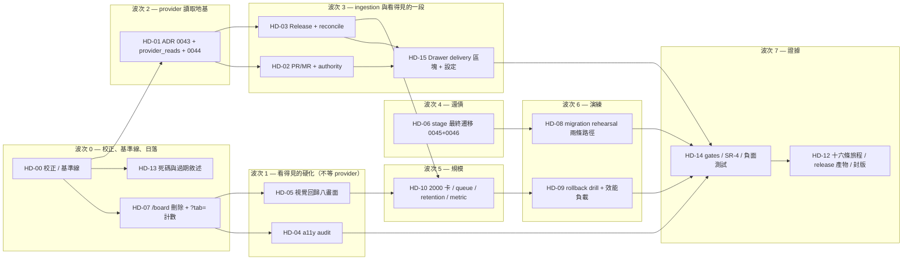

# 00 — 執行總控（`beta.2` Ecosystem and Hardening）

> 本檔是開工前唯一必讀。§0.1 的九項曾經**擋開工**，**已於 2026-08-25 全部裁決**。
> §0.4 的前置條件於 **2026-08-27** 關掉三項（SR-2、SR-3、PR #45）；
> **剩下的只有一次 Railway `pg_trgm` 量測與兩個 tag**。
> §3 的禁區清單由 `GATE-HD-TOUCH-LIST` 檢查。

## 0. 裁決項目

> **☑ A 類九項全部於 2026-08-25 裁決，全部採納本計畫的答案**（裁決單在 [`01`](./01-decisions-and-governance.md) §0）。
> **所以 §0.1 現在是讀而不是決定**——但要讀，因為每一項的
> 「不同意的話會怎樣」就是實作時不能繞過的那條線。

上游 [`research/03/12`](../../research/03/12-migration-and-rollout.md) §6 給了十二張 ticket 與一行說明。
把它對到程式碼之後，有 **九項必須先決定**（**已裁決**）、**十一項依計畫執行但有異議時要記下來**。

**格式沿用 `plan/26`**：每一項都寫「不同意的話會怎樣」，
而且**裁決之後那一段仍然保留**。三個月後沒有人會想知道選了什麼，
但每個人都會想知道當時放棄了什麼。

### 0.1 A 類 — 擋開工（9 項，**☑ 全部已裁決**）

#### ☑ ★ D120 — `beta.2` 只做 pull，不做 inbound webhook（**2026-08-25 已裁決：採納**）

**上游怎麼說**：`HD-01` = 「provider webhook 入口（signature、delivery 去重、非同步 enqueue）」。
SR-4 的五個審查項有三項是 webhook 專屬的。

**實際狀況**：這個 repo 的 `backend/app/api/http/` 有 140 條路由，**沒有一條是未認證的**。
沒有 rate limiter（`grep -rn 'rate_limit' backend/app` 是空的）、沒有 HMAC 驗證、
沒有 delivery 去重表、`secrets.py` 的 `KINDS` 裡沒有 webhook secret。

而**要做的那件事所需的零件已經全部在了**，只是形狀是 pull 不是 push：

```text
services/knowledge/worker.py:19    advisory lock 的 reconciler，"its cost is per replica
                                   and its benefit is not"
services/knowledge/worker.py:49    RECONCILE_INTERVAL_SECONDS = 300.0
services/knowledge/outbox.py:15    "a row here means *this entity may have changed; go and
                                   look*" —— retry 免費、重複 enqueue 收斂
services/knowledge/repo.py:255     速率上限「Counted from the sources themselves rather
                                   than from a counter table」
```

**這一項的裁決**：**只做 pull**。reconciler 每輪對啟用了 provider 同步的專案，
對每個 repository 發**唯讀 GET**，把 PR 與 release 的當前狀態當成一個 entity 重讀。

| | |
|---|---|
| **建議** | **只做 pull。** ADR 0043 **同時寫下 webhook 的設計**並明確標記為「已設計、未實作」 |
| **一起接受的代價** | 新鮮度從「秒」變成「一個 reconcile 週期」（建議 300 秒，見 [D128](./01-decisions-and-governance.md#d128)）。一個剛剛合掉的 PR 最多五分鐘後才出現在 Related knowledge |
| **換到的** | ①系統**不新增第一個未認證入口** ②SR-4 從五項縮成兩項 ③`0044` 少一張 delivery 去重表 ④不需要 rate limiter、不需要新 secret kind ⑤`HD-01` 從 L 變 M |
| **不同意的話** | `HD-01` 要多做：未認證的 `POST /api/providers/{host}/webhook`、HMAC-SHA256 常數時間比較、`provider_deliveries` 去重表（含 delivery id 唯一索引與保留期）、一個通用 rate limiter（因為未認證入口沒有 rate limit 是一個可以打爆資料庫的形狀）、`webhook_secret` secret kind 與輪替、以及一次**針對未認證入口**的獨立安全審查。**估約多兩個波次**，而換到的只有新鮮度 |
| **保留的退路** | reconcile 的每一步都是「重讀 entity 的當前狀態」。webhook 若日後加入，它做的事就是 `enqueue()` 一列——**與 pull 走同一條 ingest 路徑**，而不是第二條 |

**為什麼這一項要先決定**：它決定 `0044` 有幾張表、SR-4 有幾項、
`api/http/` 有沒有新的路由檔案、`secrets.py` 是不是禁區。
在它未定之前，波次 2 起的每一張 ticket 的規模都是猜的。

**裁決之後固定了四件事**：

1. `0044` **沒有 `provider_deliveries` 表**，只有兩個 CHECK 的擴充與四個欄位（[`02`](./02-provider-ingestion.md) §4）。
2. `api/http/` **不新增路由檔案**，且 `GATE-HD-NO-PROVIDER-IN-REQUEST` 斷言它連 import 都不行。
3. `secrets.py` **留在禁區**——不新增 `webhook_secret` kind（[D129](./01-decisions-and-governance.md#d129)）。
4. **「300 秒」成為一個產品承諾**，要寫進 release note，並由
   `provider_reconcile_lag_seconds` 這個 metric 證明（出口條件第 32 項）。
   一個沒有 metric 的承諾是一句話。

#### ☑ D119 — `httpx` 的第二個合法模組是 `services/provider_reads.py`；`providers.py` 一行不動（**2026-08-25 已裁決：採納**）

**兩個 gate 的夾擊**：

```bash
# scripts/kn/gates.sh:65 —— httpx 只能在一個模組
grep -rn "^import httpx\|^from httpx" backend/app --include=*.py | grep -v 'services/providers.py'
# scripts/dv/gates.sh:99-101 —— 那個模組不准出現這些字
absent "GATE-DV-PROVIDER-VERBS" -iE '(def |"|/)(merge|approve|request_changes|close|delete|release|tag)\b' \
  backend/app/services/providers.py
```

於是「讀 PR 合了沒有」與「讀 release 清單」沒有合法落點：
放進 `providers.py` 撞第二個 gate，放進別的模組撞第一個。

**三個候選，選第三個**：

| 候選 | 問題 |
|---|---|
| 擴充 `providers.py`，改寫 `GATE-DV-PROVIDER-VERBS` 的 regex | 這個 gate 是**以缺席驗證**的（它自己的 docstring 這樣寫）。把它從「這個檔案沒有這些字」改成「這個檔案的某些這些字沒關係」，等於把一個**事實**換成一個**判斷**，而判斷需要一個讀它的人 |
| 靠命名繞過現有 regex | **做得到，而且實測過**（見下方）。**而這正是問題**：`plan/26` 的 D96 已經記過一次「gate 比它的名字弱得多」，再刻意利用那個弱點是把一個已知缺陷變成一個依賴 |
| **新增 `services/provider_reads.py`** | ✅ 兩個 gate 各自維持原意，新模組有自己的兩個 gate |

**regex 的實測結果**（把四行餵給那個 grep）：

```text
GET "/repos/%s/%s/releases"     不匹配   ← `release` 之後是 `s`，\b 失敗
payload["merged_at"]            不匹配   ← `merge` 之後是 `d`，\b 失敗
def read_pull_request(          不匹配   ← `def ` 之後不是那七個字
"tag"                           **匹配**
```

**四行裡只有一行被抓到。** 一個 release ingestion 的實作要通過這個 gate，
只需要不寫 `"tag"` 這四個字元——而它讀的是 `tag_name`，本來就不會寫。

**這一段寫下來是刻意的**：它是選第三個候選的**真正**理由。
不是「做不到」，是「做得到，而做到的方式是讓一條紅線在下一個人眼裡仍然是綠的」。

| | |
|---|---|
| **建議** | 新增 `backend/app/services/provider_reads.py`。`GATE-KN-NO-NEW-EGRESS (httpx)` 的排除從一個檔案改成**明列的兩個**；新增 `GATE-HD-READS-ARE-GETS`（AST：該模組的 HTTP method 字面只有 `"GET"`）與 `GATE-HD-NO-WRITE-IMPORT`（該模組不 import `providers.py` 的三個動作） |
| **一起接受的代價** | 兩個模組各有一份 timeout 常數、host allowlist 檢查與 token 剝除。**刻意重複**——共用一個 `_request()` 會讓「這個模組只 GET」從一個 gate 退化成一個呼叫端的約定 |
| **不同意的話** | 若選第一個候選：`GATE-DV-PROVIDER-VERBS` 要改成 AST gate（區分「會改變 provider 狀態的方法」與「讀」），而寫那個 AST gate 比寫這個模組貴，且它保護的紅線 5 從此需要一個人去讀它 |

#### ☑ D121 — 新增兩個 source type，並把「外部觸發」從測試裡的字面集合變成 `store.py` 的宣告（**2026-08-25 已裁決：採納**）

**實際狀況**：`source_type` 的封閉集合出現在**四個地方**：
`knowledge_sources` 的 CHECK、`knowledge_jobs` 的 CHECK（`0042_knowledge_tables.py:135,267`）、
`store.py:64` 的 `SOURCE_TYPES`、`search.py:70` 的 `_HALF_LIFE_DAYS`（有 `.get(…, 90.0)` 預設，安全）。

而覆蓋率斷言是一個**字面集合**：

```python
# tests/db/test_knowledge_ingestion.py:168
assert SOURCE_TYPES - mapped == {"repo_doc"}
```

`pull_request` 與 `release` **沒有 `ActivityService` kind**——PR 合掉不是 Cliora 做的事，
所以沒有 activity row 描述它，跟 `repo_doc` 完全同一個理由。
照字面加上去，這個斷言變成 `== {"repo_doc", "pull_request", "release"}`，
而一個有三個成員的例外集合**不再是覆蓋率斷言，是一份要維護的清單**。

| | |
|---|---|
| **建議** | 型別加。**同時**在 `store.py` 加 `EXTERNALLY_TRIGGERED: frozenset = {"repo_doc", "pull_request", "release"}` 並附「為什麼這一型別沒有 activity kind」的一行理由，測試改成 `SOURCE_TYPES - mapped == EXTERNALLY_TRIGGERED`。**這樣加第四個型別時，要寫的是理由而不是測試** |
| **一起接受的代價** | 測試從「斷言一個值」變成「斷言兩個宣告一致」，強度略降。換到的是**新增型別時不會有人去改測試** |
| **不同意的話** | 若不加型別而把 PR 塞進 `artifact` 或 `decision`：`_HALF_LIFE_DAYS` 給不出對的半衰期（一個 PR 討論的半衰期不是 90 天也不是 365 天），而 `authority` 的 `reviewed` 這一級會失去它唯一的來源型別，於是「這是一個 merged PR」與「這是一個 machine-verified 報告」在 rerank 上無法區分 |

#### ☑ D122 — provider 資料的 authority 值域是 frozenset ＋ gate；三個高階永不可達（**2026-08-25 已裁決：採納**）

**實際狀況**：SR-4 有一項是「merge 前的 PR 內容不自動成為 policy」。
而 `store.py:36` 的 docstring 早就寫好了答案的一半：

```python
# store.py:36 —— 十級 authority，最高信任在前
# ...the two with no writer in `alpha.3` (`reviewed`, which arrives with provider sync)
# are present anyway, because merging levels later is a migration while splitting one
# later is a judgement about rows written before the distinction existed
```

所以這不是一個新機制，是**一個值域限制**：

```text
PR / MR 未合併        → discussion    (0.75)
PR / MR 已合併        → reviewed      (1.15)
Release               → reviewed      (1.15)
accepted / authoritative / canonical  → 永不可從 provider 資料產生
```

| | |
|---|---|
| **建議** | `provider_reads.py` 的 handler 只從一個 `PROVIDER_AUTHORITIES: frozenset = {"discussion", "reviewed"}` 取值，並新增 `GATE-HD-PROVIDER-AUTHORITY-CEILING`：該 handler 檔案裡不出現 `accepted`／`authoritative`／`canonical` 三個字串 |
| **一起接受的代價** | 一個真的被團隊當成規格在讀的 PR 描述，永遠比一個 accepted 的 Ticket 決議低一級。**這是對的**——它沒有經過 Cliora 的核准動作，而 `admin.py:119` 已經對人工標註定了同一條規則（「They may not say `canonical` or `verified`」） |
| **不同意的話** | 需要一個「把 provider 內容升為 accepted」的人工動作，而那是一個新的 RBAC 面與一個新的 audit 事件——本期禁區說不加 RBAC 動作（[D130](./01-decisions-and-governance.md#d130)） |

#### ☑ D123 — `HD-06` 拆成 `0045`（可逆）與 `0046`（不可逆），中間有 go／no-go（**2026-08-25 已裁決：採納**）

**上游怎麼說**（`research/03/12` §3.3）：五個步驟，一段。

**實際狀況**：這是 **V2 系列第一個不可逆的 migration**（`pg_trgm` 那一行不算，
它是 extension 而不是資料）。三件事讓它比上游描述的貴：

1. `ck_tasks_stage`（`0023_task_board.py:378`）**在資料庫裡但不在 ORM 的 `__table_args__`**。
   `models.py:796` 只有 `stage: Mapped[str] = mapped_column(String(16), default="backlog")`。
   於是「stage 的合法值域」這件事，**讀 model 看不到**。
2. 收掉 `'blocked'` 之後，downgrade 可以把值加回 CHECK，
   **但沒有東西記得哪些卡曾經是 stage-blocked**。`is_blocked` 記得它現在被阻塞，
   不記得它的 stage 曾經是那個字。
3. 三個寫入點（`run_reaper.py:176`、`run_reaper.py:246`、`runs.py:1510`）
   直接寫 `task.stage = "blocked"`，**繞過 `TaskService.update()`**，
   而 `GATE-DV-SINGLE-DONE-PATH` 只掃 `runs.py` 的 `'done'`，看不到它們。

| | |
|---|---|
| **建議** | 拆兩個 revision。`0045`：改寫資料（`stage='blocked'` → 推導出的 stage ＋ `is_blocked=true`）並在 `tasks` 加一個 `legacy_blocked_at TIMESTAMPTZ NULL`，**完全可逆**。`0046`：收 CHECK，**不可逆**。同時把三個寫入點改成寫 `is_blocked` ＋ reason，並新增 `GATE-HD-NO-LEGACY-BLOCKED`（掃 **`backend/app` 全樹**，不只 `runs.py`）。ORM 補上 `ck_tasks_stage` 的 `CheckConstraint`，讓值域在 model 上看得見 |
| **一起接受的代價** | 多一個欄位（`legacy_blocked_at`）與多一個 revision。這個欄位的用途只有一個：**讓 `0046` 的 downgrade 說得出「這張卡曾經是 stage-blocked」**。它會在 `rc` 之後被移除，而那是一個要寫進 release note 的計畫 |
| **go／no-go** | `0045` 開跑的前提是**`beta.1` 的 ambiguous report 已經被人讀過並歸類**（`scripts/px/ambiguous-report.py` 的 docstring 已經寫著這一條）。而 `beta.1` **還沒有 tag、沒有部署**，所以這份 report 現在不存在。**若 `beta.2` 的窗口內拿不到它，`HD-06` 整張跳過，而那要是一個明確的決定並記進 ADR 0040 的修訂**，不是「後來就沒人提了」 |
| **不同意的話** | 若照上游寫成一段：downgrade 之後資料庫允許 `'blocked'` 但沒有一張卡是它，而三個寫入點在退版後會重新寫入一個新讀模型看得懂但舊看板已經刪掉的值。**這是一個所有測試都會綠的狀態** |

#### ☑ D124 — 視覺回歸用 Playwright 內建 `toHaveScreenshot`，八個畫面，門檻是比例不是 0（**2026-08-25 已裁決：採納**）

**上游怎麼說**：「沿用 `plan/19` baseline 機制，只補新畫面」。

**實際狀況**：`grep -rn 'toHaveScreenshot\|toMatchSnapshot' frontend/` **是空的**。
`plan/19` 的「baseline」是 `scripts/ui/evidence.sh:29` 那一行——
一疊人工存到 `artifacts/ui/local/` 的截圖，由人看。**那不是回歸，那是紀錄。**

| | |
|---|---|
| **建議** | 用 Playwright 1.61.1 **內建**的 `toHaveScreenshot`（不新增套件）。**只釘八個畫面**：Active Board、Backlog、Drawer（三種 attention）、My Work、Project Overview、關旗下的側欄。`maxDiffPixelRatio: 0.01`，baseline 進 repo（`frontend/tests/visual/__screenshots__/`），只在 chromium 上跑 |
| **一起接受的代價** | 八個畫面抓不到第九個畫面的回歸。**刻意的**：一套釘二十個畫面的套組，第三次誤報之後就會有人加 `--update-snapshots` 到 CI，而那時它擋不住任何東西 |
| **為什麼不是 0** | 字型 hinting、游標、animation 的最後一格都會產生幾十個像素的差異。門檻 0 的套組會在**第一次**就紅，而紅一次沒人查的 gate 等於沒有 gate |
| **不同意的話** | 若用 `artifacts/` 的人工截圖：`HD-05` 的出口條件變成「有人看過」，而那句話在 `plan/26` §6 的「沒有 Go 工具鏈」那一段已經被證明過會怎樣——**一個附了理由的空方框會被接受** |

#### ☑ D125 — `@axe-core/playwright` 是本期唯一的新 devDependency，並明列它抓不到的那一半（**2026-08-25 已裁決：採納**）

**實際狀況**：`grep -rn axe frontend/package.json frontend/tests` 是空的。
而 `GATE-PX-TOUCH-LIST (frontend dependencies)`（`scripts/px/gates.sh:151`）
正在守著「D56：不新增前端套件」。

| | |
|---|---|
| **建議** | 新增 `@axe-core/playwright` **一個** devDependency，基線推進一格並在 `HD-00` 記錄舊 sha。**同時明列 axe 抓不到的六項**（見 [`04`](./04-accessibility.md) §3），做成人工 checklist ＋ 具名簽核 |
| **一起接受的代價** | 「不新增套件」這條線本期破一次。理由是替代方案是「人工 audit」，而一個人工 audit 的結論**不能回歸**——下一期改一個 `div` 就把它變成過期文件 |
| **為什麼要明列那一半** | axe 抓得到對比、缺 label、role 錯、landmark 缺。**抓不到**：focus 順序對不對、狀態變化有沒有被播報、拖曳有沒有鍵盤等價路徑、200% 縮放下有沒有橫向捲軸、reduced motion 有沒有被尊重、以及「attention 不只靠顏色」。**一份只有 axe 綠燈的 a11y 報告會讓這六項看起來已經過了** |
| **不同意的話** | 全人工：`HD-04` 的證據是一份 markdown，而它在下一次改版時沒有任何東西會說它過期了 |

#### ☑ D126 — `/board` 整組刪除；`?tab=` 保留到 `rc.1` 並加一個計數器（**2026-08-25 已裁決：採納**）

**實際狀況**：`HD-07`（「舊路由 redirect 與 `?tab=` 相容」）**已經做完了**——
`plan/26` 的 `PX-64` 把它實作在 `router/index.ts:106` 一處，
註解自己寫著「the redirect is visibly temporary」。

而三件事正在等著被刪：

```text
api/http/tasks.py:313         @router.get(..., deprecated=True)  —— D118 說 beta.2 刪
api/client.ts:348             getBoard()  —— 零個呼叫點
scripts/px/gates.sh:86        GATE-PX-BOARD-UNCHANGED  —— 在守一個要被刪掉的東西
repositories/tasks.py         board_cards() 與 BoardCardDTO 的 16 欄 bytes 釘死測試
```

| | |
|---|---|
| **建議** | **`/board` 整組刪除**：endpoint、`BoardCardDTO`、`board_cards()`、`getBoard()`、`GATE-PX-BOARD-UNCHANGED`、`test_the_board_card_stays_a_summary`。**`?tab=` redirect 不刪**：加一個 `legacy_route_hit_total` counter（label 只有 tab 名，低基數），保留到 `rc.1`；**計數為零連續一個 release window 才刪** |
| **一起接受的代價** | `test_the_board_card_stays_a_summary` 是一個**寫得很好的**釘死測試，它的 docstring 記錄了 74 KB／439 KB 的實測與「就是取代分頁的那個決定」。刪掉它會失去那段記錄，**所以那段 docstring 要搬進 `0044` 之前的 ADR 0044 修訂**而不是隨檔案消失 |
| **為什麼兩者處置不同** | `/board` 的消費者是**程式碼**，而程式碼可以被 grep 到零。`?tab=` 的消費者是**書籤與聊天記錄裡的連結**，那個集合 grep 不到，只能量 |
| **不同意的話** | 兩個都留：OpenAPI 上有一個沒人叫的 deprecated endpoint、一個守著它的 gate、一個 16 欄的 DTO，而下一個讀者要花時間才能發現它們是墳墓 |

#### ☑ D138 — 波次 1 是 a11y 與視覺回歸；新增 `HD-15` 把 provider 做成看得見的一段（**2026-08-25 已裁決：採納**）

**實際狀況**：上游十二張 ticket **沒有一張是畫面**。
provider 同步、migration 演練、rollback drill、負載測試——對使用者是零可見變化。
而 `plan/26` 的 D115 已經為同一件事寫過一段：

> 這會是第四次把畫面排在最後。`alpha.1`／`alpha.2`／`alpha.3` 三次 prerelease，
> 使用者看到的變化是「六欄看板 → 多一個對話面板 → 多一個 Knowledge 分頁」。

| | |
|---|---|
| **建議** | ①**波次 1 是 `HD-04`＋`HD-05`**，跑在既有 `beta.1` 前端上，不等 provider。②**新增 `HD-15`**：Drawer 的「Related delivery」區塊顯示這張卡的 PR 狀態與所屬 release，專案設定加 provider 同步開關與「上次同步時間／下次同步時間」。③每個波次都要有一件可以拿給人看的事（§4b） |
| **一起接受的代價** | `HD-15` 是十六張裡唯一沒有上游對應的**功能** ticket，而本期的定位是 hardening。理由是：一個「PR 合了會進 knowledge」的能力，**如果沒有一個地方看得到它發生了，它與沒做的差別只有測試看得出來** |
| **不同意的話** | 本期的可看產出是「a11y 報告 ＋ 兩份演練紀錄」。那對團隊有價值，對使用者是第五次沒有變化 |

### 0.2 B 類 — 改變某一節但不擋開工（11 項）

| # | 決定 | 落在哪一節 |
|---|---|---|
| [D127](./01-decisions-and-governance.md#d127) | 負載測試沿用 service-level 量測形狀；固定資料集從 200 擴到 **2000**，**新 seed 檔而不是改舊的** | [`06`](./06-scale-and-observability.md) §2、[`07`](./07-drills.md) §4 |
| [D128](./01-decisions-and-governance.md#d128) | provider reconcile 節奏 300 秒；每 repository 每小時 GET 上限 **從資料推導**（沿用 `repo.py:255` 的形狀） | [`02`](./02-provider-ingestion.md) §5 |
| [D129](./01-decisions-and-governance.md#d129) | provider token 沿用既有 `provider_token` secret kind 與 per-repository 欄位，**不新增 kind** | [`02`](./02-provider-ingestion.md) §6 |
| [D130](./01-decisions-and-governance.md#d130) | **不新增 RBAC 動作（27 不變）**；provider 同步設定沿用 `project.update` | [`02`](./02-provider-ingestion.md) §6 |
| [D131](./01-decisions-and-governance.md#d131) | contract 停在 **1.13.0**，`agentd` diff 為零 | §4 |
| [D132](./01-decisions-and-governance.md#d132) | provider source 沿用 knowledge 的無保留政策（ADR 0038 §6）；**`release` 的 tombstone 規則要明寫**（一個被刪掉的 release 不等於它從沒發生） | [`02`](./02-provider-ingestion.md) §7 |
| [D133](./01-decisions-and-governance.md#d133) | 大 Project 只加 metric 與 `EXPLAIN`，**不加 partition、不改 `BATCH`** | [`06`](./06-scale-and-observability.md) §3 |
| [D134](./01-decisions-and-governance.md#d134) | 十級 authority 的量測方式：**只記 metadata**（每一級被 cite 的次數），不記內容 | [`10`](./10-open-measurements.md) §2 |
| [D135](./01-decisions-and-governance.md#d135) | `cliora task wait` 的 120 秒由 `HD-11` 順便收集，**不改 daemon** | [`10`](./10-open-measurements.md) §3 |
| [D136](./01-decisions-and-governance.md#d136) | 自製 query 層的維護成本以「本期改了它幾次、為什麼」量，不做問卷 | [`10`](./10-open-measurements.md) §4 |
| [D137](./01-decisions-and-governance.md#d137) | 死碼與過期敘述一併清除，**列成 ticket 而不是順手** | [`08`](./08-sunset-and-cleanup.md) §3 |

### 0.3 從上游繼承的三項

| # | 決定 | 狀態 | 影響 |
|---|---|---|---|
| ☑ ★ D46 | provider 同步落在哪一版 | ☑ **已關閉**（2026-08-25） | **由 ★ D120 一併關閉**：落在 `beta.2`，形狀是 pull。上游 `research/03/01` §3 的最後一項待裁決項至此清空——`HD-00` 負責回寫 |
| D49／ADR 0040 | stage 只做投影是過渡 | 過渡中 | `HD-06` 是它的還款計畫；[D123](./01-decisions-and-governance.md#d123) 是還款方式 |
| D118 | `/board` 由 `beta.2` 刪除 | 待執行 | [D126](./01-decisions-and-governance.md#d126) |

### 0.4 前置條件

> **☑ 四項中的三項已於 2026-08-27 關閉**（SR-2、SR-3、PR #45 核准；
> 連同九份 `proposed` ADR 一併轉 accepted）。
> **剩下三項，而它們的性質完全不同**：一項是量測、兩項是 tag。

| ☑/☐ | 事項 | 擋哪些波次 | 誰能關 |
|---|---|---|---|
| ☑ | **SR-2 具名簽核** | — | **已簽核（2026-08-27）**，`docs/security-review-v2k1.md` §6 |
| ☑ | **SR-3 具名簽核**（兩列） | — | **已簽核（2026-08-27）**，`docs/security-review-v2p1.md` §6 |
| ☑ | **`v2` → 上游核准**（PR [#45](https://github.com/Lei-k/cliora/pull/45)） | — | **已核准（2026-08-27）** |
| ☑ | 九份 `proposed` ADR 轉 accepted | — | **已完成（2026-08-27）**：0029／0031 的 amendment、0032／0033／0034、0038／0039、0040／0042 |
| ☑ | **`plan/25` 的 `pg_trgm` 驗證** | — | **已於 2026-08-28 關閉**（`HD-00`），而且是**發現問題問錯了**：`pg_trgm` 是 trusted extension，判準是資料庫的 `CREATE` 權限不是 superuser。三種角色實測、兩條拒絕路徑各驗、`docs/deployment-railway.md` 補上該節、新增一支斷言 trusted 的測試 |
| ☐ | `v2.0.0-alpha.3` annotated tag | **波次 2、3** | 人。**條件 28／28 全綠**，沒有任何東西擋著它——建 tag 本身是一個人的動作 |
| ☐ | `v2.0.0-beta.1` annotated tag | 波次 4 | 人。**條件 40／40 全綠**，tag 是核准之後的另一個動作 |
| — | **波次 0、1、5 不被擋，且沒有前序依賴 → 現在可開工** | — | a11y、視覺回歸、日落、負載測試都只讀既有程式碼 |
| — | 波次 6、7 不被前置條件擋，但**等前一個波次的產物** | — | 演練與封版要驗的東西還不存在 |

**把「不被擋」寫出來是刻意的。** `plan/26` §2.7 記過一次「在三項前置條件未關閉的情況下經人工裁決開工」，
而那次的教訓是：如果不先算清楚哪些波次真的被擋，
整期就會停在一個等簽名的方框後面，而其中一半的工作根本不需要那個簽名。

**而簽核之後這件事反過來了。** 現在擋波次 2、3 的**不是一個簽名，是一次沒人去做的量測**
——一個下午的工作，卡著兩個波次。這正是 `plan/26` §6 那一段的形狀
（「把它記成環境限制讓一件做得到的事看起來做不到」）的另一個版本：
它被記在一份**已簽核**的安全審查的 §6 裡，而一份已簽核的文件很少被重讀。
**所以它同時出現在這裡、`HD-00` 的 ticket 描述、以及 `beta.2` 的 known limitations。**

**兩個 tag 也不是儀式。** `alpha.3` 的 tag 需要 27／28 變 28／28（等 Railway 那一項）；
`beta.1` 的 tag 條件已經全綠，**而它擋的是 `HD-06` 那條六步的鏈**
（[`03`](./03-stage-final-migration.md) §5）——tag 之後才能部署，
部署之後才有真實資料，有資料才有 ambiguous report。

## 1. 八個波次

**波次 1 是 a11y 與視覺回歸，跑在既有 `beta.1` 前端上。**
這是 [D138](./01-decisions-and-governance.md#d138) 的規則，也是 `plan/26` D115 第二次被套用。



**☑ A 類九項已於 2026-08-25 全部裁決，以下表只是紀錄哪一項曾經擋哪一段。**

| 波次 | 曾經需要哪些裁決 | 被哪些前置條件擋 |
|---|---|---|
| **0** | 無（`HD-00` 只讀）、[D126](./01-decisions-and-governance.md#d126)、[D137](./01-decisions-and-governance.md#d137) | **不被擋 → 可以開工** |
| **1** | [D124](./01-decisions-and-governance.md#d124)、[D125](./01-decisions-and-governance.md#d125)、[D138](./01-decisions-and-governance.md#d138) | **不被擋 → 可以開工** |
| 2 | **★ [D120](./01-decisions-and-governance.md#d120)**、[D119](./01-decisions-and-governance.md#d119)、[D121](./01-decisions-and-governance.md#d121)、[D129](./01-decisions-and-governance.md#d129) | `alpha.3` 三項 |
| 3 | ★ D120、[D122](./01-decisions-and-governance.md#d122)、[D128](./01-decisions-and-governance.md#d128)、[D132](./01-decisions-and-governance.md#d132) | `alpha.3` 三項 |
| 4 | [D123](./01-decisions-and-governance.md#d123) ＋ **ambiguous report 的 go／no-go** | `beta.1` 三項 ＋ go／no-go |
| 5 | [D127](./01-decisions-and-governance.md#d127)、[D133](./01-decisions-and-governance.md#d133) | **不被擋 → 可以開工** |
| 6 | 無新增 | 波次 4 的產物（若 `HD-06` 跳過，`HD-08` 少一段） |
| 7 | ★ D120（SR-4 的範圍）、[D134](./01-decisions-and-governance.md#d134)、[D135](./01-decisions-and-governance.md#d135) | 全部 |

**現在擋的只剩三種東西**：`alpha.3` 的三項（擋波次 2、3）、
`beta.1` 的三項（擋波次 4）、以及 `HD-06` 的 go／no-go（也擋波次 4）。
**波次 0、1、5 三個波次、六張 ticket（`HD-00`／`HD-07`／`HD-13`／`HD-04`／`HD-05`／`HD-10`）現在就可以開工**
——其中 `HD-10` 只依賴 `HD-05` 與 `HD-03`，而它與 `HD-03` 的依賴是「2000 卡量測要含 provider 的 queue」，
可以先做不含 provider 的那一半。

## 2. 十六張 ticket

| ID | 工作 | 主要落點 | 依賴 | 規模 |
|---|---|---|---|---|
| `HD-00` | 文件校正與基準線：回寫 `research/03/` 的**九處**（[`11`](./11-implementation-status.md) §0，含 SCOPE-013 的誤引用）；`scripts/hd/capture-baseline.sh` 抓 `contracts/` sha256、`daemon` commit ＋ `VERSION`、依賴清單（含**推進一格前的**前端 sha）、tokens 數（72）、requirements 數（201）、migration head（0043）、路由清單。**＋ 承接 `plan/25` 的 Railway `pg_trgm` 量測**：對真 Railway PostgreSQL 跑 `0041`、記下結果、在 `docs/deployment-railway.md` 補手動建 extension 的一節（**那一節不存在**）。**這一項擋波次 2、3，而它是一次量測不是一個簽名** | `research/03/`、`scripts/hd/`、`docs/deployment-railway.md` | — | **S**（原估 XS，Railway 那一半加上去） |
| `HD-07` | **日落**（[D126](./01-decisions-and-governance.md#d126)）：刪 `/board` endpoint ＋ `BoardCardDTO` ＋ `board_cards()` ＋ `getBoard()` ＋ `GATE-PX-BOARD-UNCHANGED` ＋ bytes 釘死測試（**docstring 的量測紀錄搬進 ADR 0044**）；`?tab=` 加 `legacy_route_hit_total` 並**保留**；OpenAPI diff 只少那一個路徑 | `api/http/tasks.py`、`repositories/tasks.py`、`api/client.ts`、`router/index.ts`、`scripts/px/gates.sh` | `HD-00` | M |
| `HD-13` | **死碼與過期敘述**（[D137](./01-decisions-and-governance.md#d137)）：`api/http/work.py:3` 的 docstring 還寫著已刪的 side-car；ORM 補 `ck_tasks_stage` 的 `CheckConstraint`；`process.py:46` 的 `LANE_ORDER` 標註 `blocked` 的日落；`plan/26` §0 的十四處回寫**再核對一次是否仍然正確** | `backend/app/`、`plan/26/` | `HD-00` | S |
| `HD-04` | **a11y audit**（[D125](./01-decisions-and-governance.md#d125)）：`@axe-core/playwright` 掃八個畫面（0 critical／0 serious 為門檻）；**六項人工 checklist**（focus 順序、狀態播報、DnD 鍵盤等價、200% zoom 無橫向捲軸、reduced motion、attention 不只靠顏色）＋ 具名簽核；缺陷逐項修到綠 | `frontend/tests/a11y/`、`frontend/src/` | `HD-07` | **L** |
| `HD-05` | **視覺回歸**（[D124](./01-decisions-and-governance.md#d124)）：`toHaveScreenshot` × 八個畫面、`maxDiffPixelRatio: 0.01`、baseline 進 repo、只在 chromium；`GATE-HD-VISUAL-BASELINE`（baseline 檔數 == 宣告數） | `frontend/tests/visual/` | `HD-07` | M |
| `HD-01` | **ADR 0043**（provider ingestion 的信任邊界、**pull 與 webhook 兩個設計、後者標未實作**）＋ `services/provider_reads.py`（只 GET、自己的 timeout／host allowlist／token 剝除）＋ **migration `0044`**（兩個 source type 進兩張 CHECK ＋ `projects.provider_sync_enabled` ＋ `project_repositories.provider_synced_at`）＋ reconcile 掛進既有 worker ＋ 兩個新 gate | `services/provider_reads.py`（新）、`db/migrations/`、`services/knowledge/worker.py`、`docs/adr/0043-*.md`、`scripts/hd/gates.sh` | `HD-00` | **L** |
| `HD-02` | **PR／MR ingestion ＋ authority transition**（[D122](./01-decisions-and-governance.md#d122)）：handler 讀 PR 當前狀態、未合併 `discussion`／已合併 `reviewed`、supersede 鏈、`GATE-HD-PROVIDER-AUTHORITY-CEILING`、redaction 走既有 `ingest()` 出口 | `services/knowledge/sources.py`、`services/provider_reads.py` | `HD-01` | **L** |
| `HD-03` | **Release ingestion ＋ reconcile 排程**：release 當前狀態、tombstone 規則（[D132](./01-decisions-and-governance.md#d132)）、每 repository 速率上限從資料推導（[D128](./01-decisions-and-governance.md#d128)）、`provider_reconcile_lag_seconds` metric | `services/knowledge/sources.py`、`services/knowledge/worker.py` | `HD-01` | M |
| `HD-15` | **看得見的一段**（[D138](./01-decisions-and-governance.md#d138)）：Drawer 的「Related delivery」（PR 狀態、所屬 release、citation 連回 knowledge source）；專案設定的 provider 同步開關 ＋ 上次／下次同步時間 ＋ 最近一次失敗原因 | `frontend/src/modules/task/`、`modules/project/views/ProjectSettingsView.vue` | `HD-02`、`HD-03` | M |
| `HD-06` | **stage 最終遷移**（[D123](./01-decisions-and-governance.md#d123)）：`0045`（改資料 ＋ `legacy_blocked_at`，可逆）、`0046`（收 CHECK，不可逆）、三個寫入點改寫 `is_blocked`、`GATE-HD-NO-LEGACY-BLOCKED`（全樹）、ORM 補 CHECK。**go／no-go 依 ambiguous report** | `db/migrations/`、`services/run_reaper.py`、`services/runs.py`、`db/models.py` | `HD-13` ＋ report | **L** |
| `HD-10` | **規模與可觀測性**（[D127](./01-decisions-and-governance.md#d127)、[D133](./01-decisions-and-governance.md#d133)）：`scripts/hd/seed-large.py`（2000 卡／5000 source／20000 chunk）、`EXPLAIN` 六個熱查詢、queue 深度與 lag 的**六個新 metric**、retention 與體積的實測、cost 一頁 | `scripts/hd/`、`backend/app/metrics.py` | `HD-05`、`HD-03` | **L** |
| `HD-08` | **Migration rehearsal**：`0040`→`0046` 的 upgrade → 驗證 → downgrade → 驗證 → restore，**compose 與 Railway 兩條路徑各一次**；每個 revision 一列「可逆嗎／退回去失去什麼」 | `scripts/hd/rehearsal.sh`、`deploy/` | `HD-06` | **L** |
| `HD-09` | **Rollback drill ＋ 效能／負載**：`beta.1` 資料上關旗 → 舊路徑可用 → downgrade → upgrade → 資料未損；2000 卡上的十三項效能預算重量；**並發**（10／50／100 concurrent 讀 `work-counts`） | `scripts/hd/rollback-drill.sh`、`scripts/hd/measure-*.py` | `HD-10` | **L** |
| `HD-14` | **安全與正確性**：**SR-4 的審查項**（pull 模型下兩項 ＋ 保留精神的三項改寫）、**十個 `GATE-HD-*`**、provider handler 的 authority 天花板負面測試、無權專案的 provider source 不外洩、token 不進 log／error／metric | `backend/tests/`、`scripts/hd/`、`docs/security-review-v2e1.md` | 波次 1–6 全部 | **L** |
| `HD-12` | **證據與封版**：**十六條旅程**完整回歸（J1 不可降級）、三項未量測項的收集（[`10`](./10-open-measurements.md)）、九項 release 產物、flag 矩陣五組合、SR-4 簽核、人工合併提案 | `scripts/hd/journeys/`、`docs/`、`artifacts/hd/local/` | `HD-14` | **L** |

**為什麼 `HD-14` 與 `HD-12` 分開**：同 `plan/25`／`plan/26` 的理由。
`plan/24` 整整一期在做的事，就是把上一期塞在最後一張 ticket 尾巴的證據補齊。
**證據是自己的一期。**

**與上游 ticket 的對應**（上游 12 張 ＋ 4 張新增 = **本期 16 張**）：

| 上游 | 本期 | 為什麼 |
|---|---|---|
| `HD-01`–`HD-03` | 保留編號，**內容改為 pull** | ★ [D120](./01-decisions-and-governance.md#d120) |
| `HD-04`／`HD-05` | 保留編號，**前提從「沿用」改為「建一個」** | [D124](./01-decisions-and-governance.md#d124)、[D125](./01-decisions-and-governance.md#d125) |
| `HD-06` | 保留編號，**拆兩個 revision ＋ go／no-go** | [D123](./01-decisions-and-governance.md#d123) |
| `HD-07` | 保留編號，**從「實作」改為「日落」**——它已經做完了 | [D126](./01-decisions-and-governance.md#d126) |
| `HD-08`／`HD-09`／`HD-10`／`HD-11` | `HD-11`（十六條旅程）**併入 `HD-12`** | 旅程與 release 產物是同一批證據；拆開會做出兩份「哪些過了」 |
| `HD-12` | 保留編號，**吸收 `HD-11`** | 同上 |
| — | **新增 `HD-00`** | 上游的過期事實會被下一個讀者當成基準（`plan/25` §0、`plan/26` §0 的同一個教訓，**這是第三次**） |
| — | **新增 `HD-13`** | 死碼與過期註解不列成 ticket 就不會有人做（[D137](./01-decisions-and-governance.md#d137)） |
| — | **新增 `HD-14`** | 上游只有一行「SR-4 通過」，沒有 ticket |
| — | **新增 `HD-15`** | 否則本期是第五次使用者看不到改變（[D138](./01-decisions-and-governance.md#d138)） |

## 3. 禁區清單（`GATE-HD-TOUCH-LIST` 會檢查）

本期**不得**修改。動了會過所有測試，但改變的是別的階段的承諾：

```text
daemon/                                    全樹。本期 daemon diff 必須是 0
contracts/                                 全樹 sha256 與基線相同
backend/app/services/providers.py          一行不動（D119）——三個動作的表是關的
backend/app/services/agent_auth.py         RUN_TOKEN_SCOPES 與 AGENT_FORBIDDEN_FIELDS（beta.1 加的三欄含在內）
backend/app/services/rbac.py               27 個動作，一個都不加（D130）
backend/app/services/done_gate.py          六個條件與唯一入口
backend/app/services/secrets.py            KINDS 四個、UNDELIVERABLE_KINDS 一個，都不動（D129）
backend/app/services/deliveries.py         交付與 PR ——本期只**讀** provider，不新增動作
backend/app/services/work/                 beta.1 的讀模型：attention 兩相位、filter compiler、scope
frontend/src/composables/useAsyncResource.ts   一行不動（承 D100）
backend/pyproject.toml 的 dependencies     不新增任何套件
```

**四個具名例外**：

1. `frontend/package.json` **新增一個 devDependency**（`@axe-core/playwright`，
   [D125](./01-decisions-and-governance.md#d125)）。基線推進一格，舊 sha 由 `HD-00` 記下。
   **這是本期唯一一個新套件**，`GATE-HD-TOUCH-LIST` 的前端依賴檢查改成
   「與基線相差恰好這一個」而不是「相同」。
2. `services/knowledge/sources.py` **新增兩個 handler**、`store.py` 新增兩個 source type
   ＋ 一個 `EXTERNALLY_TRIGGERED` 宣告、`search.py` 新增兩個半衰期。
   `knowledge/` 從 `beta.1` 的禁區變成本期的工作面——**理由是本期的目的就是給它一個新來源**。
3. `db/models.py` 的 `Task` **新增 `legacy_blocked_at`** 並**補上 `ck_tasks_stage`**
   （[D123](./01-decisions-and-governance.md#d123)）。補 CHECK 是把一個已存在的資料庫約束寫進 model，
   **不是新增約束**。
4. `api/http/tasks.py` 與 `repositories/tasks.py` **刪除** `/board` 相關（[D126](./01-decisions-and-governance.md#d126)）。
   這是禁區的**縮小**，而它需要一個決定，因為 `GATE-PX-BOARD-UNCHANGED` 就是在守它。

## 4. 版本節奏

| 元件 | 從 | 到 | 理由 |
|---|---|---|---|
| contract | 1.13.0 | **1.13.0** | 沒有 wire 變更。`GATE-PX-CONTRACT-FROZEN` 沿用，換基線（[D131](./01-decisions-and-governance.md#d131)） |
| `agentd` | 0.14.1 | **0.14.1** | **零 diff**。本期是 Central ＋ 前端 ＋ 資料 |
| migration | 0043 | **0046** | 三個：`0044`（provider，additive、可逆）、`0045`（stage 資料，可逆）、**`0046`（收 CHECK，不可逆）** |
| ADR | 0001–0042 | **＋0043、0044** | `0043` provider ingestion（`research/03/11` 已指派）；`0044` `/board` 的死亡與 `BoardCardDTO` 量測紀錄的歸檔 |
| ADR 修訂 | — | **0040 修訂** | `HD-06` 的結果——還了或明確不還，兩者都要寫 |
| RBAC | 27 | **27** | 不新增動作（[D130](./01-decisions-and-governance.md#d130)） |
| requirements | 201 | **≤208** | `FR-PROV-001`…（provider ingestion）＋ `NFR` 的 a11y 一條，`lifecycle: proposed` |
| API | — | **`/board` 刪除** | D118 ＋ [D126](./01-decisions-and-governance.md#d126)。OpenAPI diff 只少那一個路徑 |
| machine code | — | **＋3** | `PROVIDER_SYNC_DISABLED`／`PROVIDER_RATE_LIMITED`／`PROVIDER_READ_FAILED`。**每一個都有 raise 點**——D97 的教訓 |
| gate | 既有 ＋ CV 七 ＋ KN 八 ＋ PX 九 | **＋10 個 `GATE-HD-*`** | [`09`](./09-verification-and-exit.md) §2 |
| 前端 token | 72 | **72** | 本期不加 token；`HD-04` 若發現對比不足，改的是既有 token 的值並記進 [`11`](./11-implementation-status.md) |
| feature flag | 2 | **2（不變）** | provider 同步是 **per-project 的 `provider_sync_enabled`**，不是部署旗標——同 D52 對 knowledge 的理由：成本與風險是逐專案的 |
| 依賴 | backend 不變 | **frontend ＋1 devDependency** | [D125](./01-decisions-and-governance.md#d125) |

## 4b. 每個波次都要有一個看得見的產出

[D138](./01-decisions-and-governance.md#d138) 的規則。**證據是截圖或一段錄影，不是綠燈。**

| 波次 | 可看的東西 | 證據落點 |
|---|---|---|
| **0** | OpenAPI 少一個路徑；`?tab=` 的命中計數開始跳 | `artifacts/hd/local/w0/openapi-diff.txt` ＋ metric 截圖 |
| **1** | 一份 axe 報告從紅到綠；八張 baseline；**全鍵盤走完 J2 的錄影** | `artifacts/hd/local/w1/axe-before.json`／`-after.json`、`__screenshots__/`、30 秒錄影 |
| 2 | `curl` 一個 provider 同步狀態端點，看到「上次同步時間」 | 一個查詢 ＋ 回應 |
| 3 | **Drawer 上出現一則 merged PR 的引用**，點得進去 | 截圖 ＋ 錄影（`HD-15`） |
| 4 | 看板上不再有 `blocked` 欄的殘留語意；ambiguous report 從 N 筆變 0 筆 | 遷移前後兩張截圖 ＋ report diff |
| 5 | 2000 卡的看板打得開，六個 metric 在 `/metrics` 上 | 截圖 ＋ `EXPLAIN` 輸出 |
| 6 | 兩條部署路徑各一次 upgrade→downgrade→restore 的完整輸出 | `artifacts/hd/local/w6/` |
| 7 | 十六條旅程的 verdict | `artifacts/hd/local/journeys/` |

**「這個波次沒有可看的東西」是一個要在 [`11`](./11-implementation-status.md) §2 寫下來的事實**，
不是一個可以略過的欄位。

## 5. 執行慣例

沿用既有：每個波次開一個背景 tmux 承載長時間工作。
`scripts/hd/evidence.sh` 一次跑完全部 gate、靜態檢查、兩套單元測試、資料庫套組、
traceability、量測、演練與旅程；**檔案不存在時是 FAIL 並附上該跑的指令**，不是 SKIP。
那一條是 `plan/26` §6 花了一整期學到的：**一個少掉的行會被讀成「全部都過了」。**
