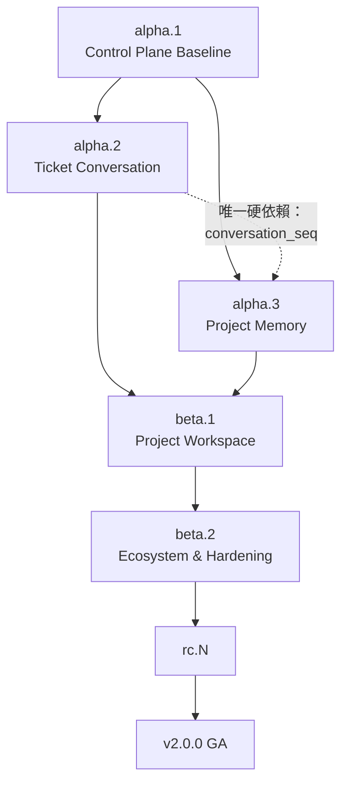

# 00 — 版本定案與 Roadmap

## 1. `research/02/` 的成果定為 `v2.0.0-alpha.1`

### 1.1 為什麼是 `alpha.1` 而不是 `v2.0.0`

截至 2026-08-16，`v2` 分支 HEAD 為
`f91d9c45b7cd89d7861ee54af60999f70bb67d57`，最後一筆變更是 Legacy phase V2.5（RQ）
的十個 gate、一節安全審查與 release note。相對 `master` 為 **ahead 60、behind 6**。

已完成的能力：Project 與 workspace binding、Epic／Story／Task、六欄看板、
Agent Runner 自主認領、run lease／log／retry、runner tag × required labels、
機密下放、四種交付模式、驗證與證據、Done Gate、需求釐清與任務拆解。

**足以構成一個可重現的早期基線；不足以稱為穩定 `v2.0.0`。** 三個具體理由：

1. **對外承諾不成立。** `v2` 與 `master` 已 diverged 且未 reconcile；把一個未整併分支
   的頂端命名為 GA，等於承諾一條還不存在的 upgrade path。
2. **產品操作模型尚未定案。** 體驗重設提案第 2 節列出的六個落差（資訊架構、流程模型、
   操作模型、介面層級、Human–Agent 對話契約、專案知識連續性）全部未關閉。GA 之後改 IA
   是破壞性變更；alpha 階段改則是預期行為。
3. **對話契約有已知缺口。** `task_messages` 存在，但沒有單調序號、沒有 idempotency key、
   `--since` 用時間戳分頁。這不是 UI 缺陷，是**執行控制平面的正確性缺口**（見 [`02`](./02-phase-c1-ticket-conversation.md) §1）。

### 1.2 為什麼不叫 `v2-01`、`v2.5` 或 `v2.0.0-preview`

| 候選 | 問題 |
|---|---|
| `v2-01`、`v2-xx` | 不是 SemVer，工具鏈（`git describe`、套件管理、Railway artifact）無法排序 |
| `v2.5` | repo 內部已用 `V2.5` 指 RQ capability phase。同一個字串同時是「第六期」和「第五個小版本」，第一個踩到的人是三個月後的自己 |
| `v2.0.0-preview` | SemVer 允許，但 `preview` 沒有遞增語意。下一個要叫什麼？`preview2` 不是 prerelease 排序上的正確後繼 |
| **`v2.0.0-alpha.1`** | ✅ 標準 prerelease；`alpha.1 < alpha.2 < beta.1 < rc.1 < 2.0.0` 由 SemVer 定義，不必人記 |

### 1.3 這份規劃不建立 tag

**只有 §6 的 freeze checklist 全綠後，才由人在上述 exact commit 建立 immutable、annotated tag。**
commit 一改就改成 `alpha.2`（或把已規劃的 `alpha.2` 順移），**不移動 `alpha.1`**。
一個會移動的 tag 不是版本，是書籤。

## 2. 三層版本名稱

同時存在三種「版本」，各答一個不同的問題。混用是目前文件最常見的歧義來源。

| 層級 | 例 | 答什麼問題 | 誰在用 |
|---|---|---|---|
| **Product release** | `v2.0.0-alpha.2` | 「我裝的是哪一版？能不能回滾到哪一版？」 | 使用者、部署、GitHub Release |
| **Capability milestone** | `V2-C1`、`V2-K1`、`V2-P1` | 「這一批工作在做什麼？」 | roadmap、ticket 分組、跨團隊溝通 |
| **Component version** | contract `1.13.0`、`agentd` `0.12.0`、migration `0039` | 「這個節點跟這個 Central 相容嗎？」 | 升級診斷、相容性矩陣 |

三條規則：

1. **Product release 只在 §3 的表上出現。** 任何文件寫 `V2.6` 都是錯的。
2. **Capability milestone 不進版本字串。** `V2-C1` 是 GitHub milestone 名稱，不是 tag。
3. **Component version 各自遞增，與 product release 無關。** `alpha.2` 可能完全不動 contract
   （見 [`01`](./01-architecture-decisions.md) D44），那是正常的。

## 3. V2.0 release train

| Product tag | Milestone | 內容 | 承諾層級 |
|---|---|---|---|
| `v2.0.0-alpha.1` | **V2-A1** Control Plane Baseline | 現有 Project／Task／Runner／Delivery／Verification／RQ 基線 | exact snapshot；可內部試用，**不承諾 UX 穩定** |
| `v2.0.0-alpha.2` | **V2-C1** Ticket Conversation | conversation seq、question 表、answer＋resume transaction、continuation turn、CLI cursor | **Ticket 內多輪需求釐清可用**，不進 Terminal |
| `v2.0.0-alpha.3` | **V2-K1** Project Memory | knowledge sources／chunks／links、lexical hybrid search、citations、Context Builder | **Agent 可取得 Project-scoped cited context** |
| `v2.0.0-beta.1` | **V2-P1** Collaborative Project Workspace | View 讀模型、Board／Backlog／Drawer／My Work，並整合 C1＋K1 | **核心流程 feature-complete**；schema 尚可調整 |
| `v2.0.0-beta.2` | **V2-E1** Ecosystem and Hardening | PR／MR／Release sync、reconciliation、a11y、效能、遷移演練 | 擴大團隊試用；**API／schema 開始收斂** |
| `v2.0.0-beta.N` | **Discovery slots** | 真實試用發現的 blocker；每版只接受已裁決 scope | 容納未知需求，**不預先虛構功能** |
| `v2.0.0-rc.1` | **V2-RC** Production Candidate | security review、upgrade／rollback、compatibility、known limitations | 無已知 release blocker；**只修 bug** |
| `v2.0.0-rc.N` | RC fixes | 僅 blocker／regression／security fix | **不加新產品能力** |
| `v2.0.0` | **V2 GA** | 穩定 V2 release | 正式 upgrade path 與支援基線 |

**與體驗重設提案 §24.4 的一處差異：** 提案把 `beta.1` 描述為「本次討論的完整產品定版」。
本規劃把 **provider（GitHub／GitLab）的 PR／MR／Release 同步整段移到 `beta.2`**，
理由是它是本輪唯一新增**對外網路副作用**的工作（見 [`01`](./01-architecture-decisions.md) D46），
與 `beta.1` 其餘全部 Central＋前端的工作風險等級不同，混在同一個 tag 會讓
「beta.1 出事了」無法快速定位在哪一半。

## 4. 里程碑依賴



**C1 與 K1 之間只有一條硬依賴**：K1 要把 conversation 與 accepted decision 收成
knowledge source，需要一個穩定的 source version key，而那個 key 就是 C1 的
`conversation_seq`。所以順序是：

- `CV-03`（migration：seq／questions／turns）**必須**先於 `KN-04`（conversation ingestion）。
- 其餘 K1 的工作（`KN-01`–`KN-03`、`KN-05`–`KN-07`）與 C1 完全獨立，可同時開工。

反向的軟依賴一條：`KN-08`（Context Builder）產出的 context pack 要餵給 C1 的
continuation turn。**這條刻意設計成軟依賴**——C1 的 turn 在沒有 Context Builder 時
使用既有情境包，K1 上線後才升級。否則兩個里程碑會互鎖。

## 5. Rolling-horizon roadmap

### Horizon 0 — Baseline freeze（現在）

固定 `alpha.1`，見 §6。**不強迫先整併 `master`**；但 RC 前必須完成 reconciliation。

### Horizon 1 — Market loop（已承諾）

`alpha.2` → `alpha.3` → `beta.1`。成功判準只有一個主旅程：

> 一句模糊需求在 Ticket 裡經多輪對話變成 accepted spec；Agent 引用 Project knowledge 開工；
> 成果、PR 與驗證回到同一張 Ticket；人類完成決策。**全程不進 Terminal、不重貼背景。**

這條旅程是 [`10`](./10-verification-and-exit.md) §5 的 E2E-J1，也是 `beta.1` 唯一不可降級的出口條件。

### Horizon 2 — Trust and scale（方向已知、scope 待 discovery）

- Provider ingestion：GitHub／GitLab PR、MR、Release、webhook reconciliation（`beta.2`）
- Notification／inbox、多人同時對話、conflict recovery
- 大 Project 的 indexing、retention、cost、queue、rebuild 與 observability
- **向量檢索**（D40 於 2026-08-16 裁決 `alpha.3` 不做；日後重啟需獨立 ADR），連同 embedding provider 的 egress、成本與金鑰治理
- Enterprise security／SSO／tenant controls **只有在真實需求成立時**才進 `beta.N`

### Horizon 3 — GA convergence

API／contract freeze window、migration upgrade／downgrade／restore rehearsal、
V1 compatibility 與 `master` reconciliation、security／privacy／a11y／load sign-off、
文件／安裝／onboarding／operator runbook／support matrix。

### Horizon 4 — Post-GA V2.x（主題預留，不承諾日期）

| 候選 release | 主題 | 進入條件 |
|---|---|---|
| `v2.1.0` | Team collaboration／notifications／review workflow | beta 使用證明協作是主要瓶頸 |
| `v2.2.0` | Knowledge intelligence／conflict detection | Project Knowledge precision 與 isolation 已穩定 |
| `v2.3.0` | Enterprise governance／policy／retention | 有明確 enterprise design partner |
| `v2.4.0` | Scale／multi-region／large repository operations | 現有容量門檻被真實 workload 觸發 |
| `v2.x.0` | 未知 capability slot | discovery evidence ＋ ADR ＋ 人類 scope approval |

**這些是容量槽，不是待辦清單。** 每一項未知需求先進 Discovery，通過市場價值、
安全邊界、相容性與維護成本審查後才取得版本號。

## 6. `alpha.1` freeze checklist

| ☐ | 事項 | 通過標準 |
|---|---|---|
| ☐ | 確認 tag target 仍是 `f91d9c45…` | `git rev-parse v2` 相符；不符則改版號，**不移動舊 tag** |
| ☐ | 在乾淨環境重跑 gates 與測試 | RQ 十個 gate、Central、daemon、frontend 三組測試全綠，**保存環境／版本／輸出** |
| ☐ | 補齊 CI 可觀測性 | HEAD 目前沒有 GitHub combined status。若 workflow 未涵蓋，保存手動驗證證據並開 issue |
| ☐ | 產生 component manifest | Central commit `f91d9c4`、`agentd` `0.12.0`、contract `1.13.0`、migration head `0039`、RBAC 24 動作 |
| ☐ | 驗證 fresh install、upgrade、downgrade／rollback | `deploy/compose` 與 Railway 兩條路徑各一次 |
| ☐ | 驗證 feature flag 全關 = V1 行為 | `CLIORA_PROJECTS_ENABLED=false` 時畫面、API、protocol 與 V1 一致 |
| ☐ | 列出 known limitations | Legacy V2.5 的四項 ＋ 本規劃 [`01`](./01-architecture-decisions.md) §2 確認的 conversation／knowledge 六項缺口 |
| ☐ | 標明 diverged 狀態 | release note 明寫 ahead 60／behind 6，**alpha tag 不等於可合併** |
| ☐ | 人工 security／release sign-off | 具名、附日期，記在 release note |
| ☐ | 建立 annotated tag 與 GitHub pre-release | `git tag -a v2.0.0-alpha.1 f91d9c4`，勾選 pre-release |

## 7. 每個 prerelease 的必要產物

```text
Release note              這一版做了什麼、對誰有意義
Known limitations         已知還不能做什麼——空的清單需要解釋，不是好消息
Compatibility manifest    Central / daemon / contract / migration 四個版本號
Migration / rollback note 升級做了什麼、怎麼退回去、退回去會失去什麼
Security delta            新的信任邊界、新的憑證、新的對外連線、新的資料保留面
Test / gate evidence      跑了什麼、在哪跑的、輸出存在哪
Feature flag matrix       每個旗標開關組合下的預期行為
Data retention delta      這一版新增了哪些會長期存在的資料
Manual sign-off record    誰在什麼時候批准了什麼
```

版本不是「功能做完的暱稱」，而是**一個可重現、可驗證、可回滾的產品邊界**。
任何新發現若改變 conversation、knowledge authority、Agent 權限或成果出口，
都必須進下一個 prerelease，**不得修改已定版 tag**。

## 8. 合併規則不變

`v2` → `dev` **一律由人工確認**。出口條件全綠只是取得**提案資格**，不是核准。
任何自動化——CI、agent、排程——都不得執行這個合併。

發版到 `master` 時**不帶 V2**：從 V2 系列之前切 `release/*` 分支，不用 `dev` 當 head。
