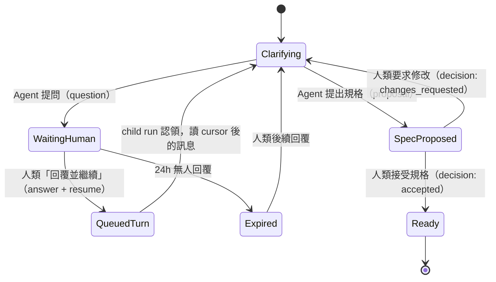
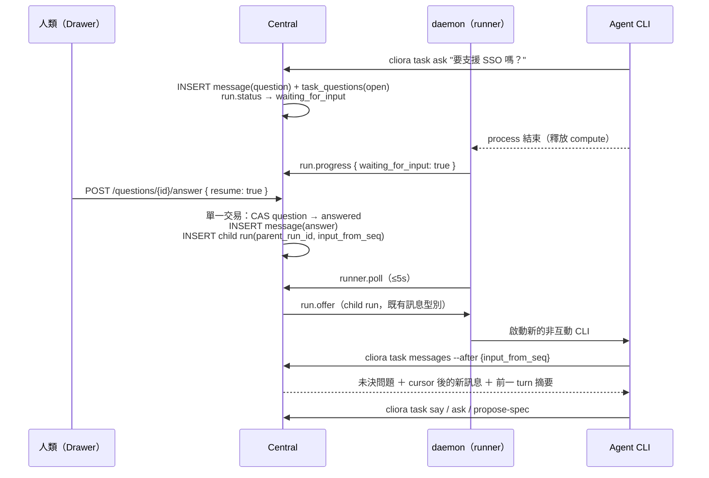

# 02 — `alpha.2` / V2-C1：Ticket-native Agent Conversation

> **執行計畫在 [`plan/23/`](../../plan/23/README.md)。** 那裡讀的是程式碼，
> 已經在五處比本文更精確（欄位數 12→14、`awaiting_input` 的推導、
> 分支繼承、continuation 要重跑 refusal、daemon 節點半邊零 diff）。
> **兩者不一致時以 `plan/23/` 為準。**

> **ticket 前綴 `CV-`。前置條件：`alpha.1` freeze checklist 完成。**
> 可與 [`03`](./03-phase-k1-project-knowledge.md) 的 `KN-01`–`KN-03`、`KN-05`–`KN-07` 並行。
> **`CV-03` 必須早於 `KN-04`。**

## 1. 這一期真正的形狀

Legacy phase V2.5 已經把「Agent 在卡片上提問、人在卡片上回答」做出來了。
所以很容易以為這一期只是 UI 包裝。核對程式碼之後，**不是**：

```text
                          現在（alpha.1）                     這一期之後
 訊息分頁            `--since <timestamp>`               `--after <seq>`，單調、無洞
 重送                 產生第二則一模一樣的訊息              idempotency key，回原結果
 「回覆」的語意        POST /messages，kind='answer'         明確關聯 question，且原子地建立續跑
 續跑                 沒有。run 掛著等，或結束後就沒了       child run，parent_run_id 串起來
 等待中的 run          佔住 lease 與 compute 最長 24 小時     可以安全結束，釋放資源
 daemon 重啟          等待中的對話狀態不明                   從 DB 恢復，cursor 補拉
 一般留言             和回答走同一條路                       comment 不改 run 狀態，語意分離
```

**這一期唯一的新風險是傳遞語意的，不是機制的。** 沒有新的對外副作用、
沒有新的憑證、沒有新的執行能力，[D44](./01-architecture-decisions.md) 若採納連 contract 都不動。
會出事的方式只有兩種：**同一個 answer 讓 Agent 跑了兩次**，
或**一句普通留言被當成核准**。這一期的閘門幾乎全部長成這兩個形狀。

## 2. 需求釐清生命週期



**這個狀態機不取代 Task lifecycle，它是 readiness 的子流程。**
只有具權限的人類能把規格標為 accepted；Agent 只能提 `proposal`。
`Expired` 沿用既有的 24 小時行為（卡片進 blocked），但**新增一條**：
過期不刪除 question，人類事後回覆仍可續跑。

## 3. 訊息型別與語意

`task_messages.kind` 目前是 `{message, question, answer, event}`。
擴充為六種，並且**每一種都明確回答「會不會續跑」與「構不構成核准」**：

| kind | 用途 | 續跑 | 核准 | 誰能寫 |
|---|---|---:|---:|---|
| `comment` | 一般補充、討論（原 `message` 改名，保留舊值相容） | 否 | 否 | human ＋ runner |
| `question` | 提出待回答問題 | 依 target | 否 | human ＋ runner |
| `answer` | 回覆指定 question | **是**（若該 question 正在等人類且 `resume=true`） | 否 | human ＋ runner |
| `proposal` | Agent 提出規格、拆解或方案 | 否，進人工檢視 | 否 | **runner only** |
| `decision` | 人類接受／拒絕 proposal | 依 decision | **僅對該 decision 有效** | **human only** |
| `system` | claim、resume、failure、delivery 等事件（原 `event`） | 否 | 否 | **系統 only** |

三條不可協商的規則：

1. **`decision` 由 runner 寫入 → `403 AGENT_CANNOT_DECIDE` ＋ audit。**
   這與既有「run token scope 永不含 `task.approve`」是同一條紅線的延伸。
2. **送出任意留言 ≠ resume。** UI 在等待狀態提供兩個明確、視覺上不同的動作：
   - **留言**：保存 `comment`，不改 run 狀態。
   - **回覆並繼續**：建立 `answer`、關閉 open question、建立 continuation turn。
3. **`decision` 不等於核准。** 正式核准（gate、Done Gate、delivery approve）
   仍走既有的 human-only endpoint，`decision` 只影響 spec proposal 的接受與否。

## 4. Runtime：Conversation Supervisor

不把 Agent Run 改成長時間 PTY，也不把人類文字塞進任意 CLI 的 stdin。
流程（依 [D39](./01-architecture-decisions.md)，continuation = child run）：



Child run 的情境包包含四段（`CV-09`）：

```text
1 初始情境包摘要      卡片欄位、流程、repo、交付模式——與第一次 run 相同
2 完整未決問題        不論多舊，全部帶上
3 cursor 後的新訊息   input_from_seq .. input_to_seq
4 前一 turn 摘要      上一個 run 的 summary（不是 log）
```

**`ask --wait` 不做。** 它需要一個 process 存活到人類回覆為止，
最長 24 小時，且 daemon 重啟就斷。既有的 `ask`（不等待、印出提示）保留不變。

## 5. 資料模型

完整 DDL 在 [`08`](./08-data-model-and-contract.md) §2。摘要：

```text
tasks                 ＋ conversation_seq        int   NOT NULL DEFAULT 0
                      ＋ open_question_count     int   NOT NULL DEFAULT 0   （投影，看板用）
                      ＋ waiting_for_actor       text  NULL                 （投影：human|agent|null）

task_messages         ＋ conversation_seq        int   NOT NULL
                      ＋ reply_to_message_id     uuid  NULL
                      ＋ question_id             uuid  NULL
                      ＋ idempotency_key         text  NULL
                      ＋ turn_run_id             uuid  NULL
                      UNIQUE (task_id, conversation_seq)
                      UNIQUE (task_id, idempotency_key) WHERE idempotency_key IS NOT NULL

task_questions        id, task_id, run_id, asked_message_id,
                      state ∈ {open, answered, cancelled, expired},
                      answered_message_id, created_at, answered_at

task_runs             ＋ parent_run_id           uuid  NULL  FK → task_runs.id
                      ＋ turn_seq                int   NOT NULL DEFAULT 1
                      ＋ input_from_seq          int   NULL
                      ＋ input_to_seq            int   NULL

conversation_consumers  task_id, consumer_type, consumer_id,
                        last_delivered_seq, last_acked_seq, updated_at
```

**`task_runs` 的三個 FK 讓自己成環（`parent_run_id`）**——這在這個 repo 不是新事，
`0038`／`0039` 已經有先例；`ON DELETE SET NULL` 加上「刪除 run 只發生在 retention sweep」
兩件事一起讓它安全。

## 6. API

```text
GET  /api/tasks/{id}/messages?after_seq=&limit=            人類讀
POST /api/tasks/{id}/messages                              人類寫（comment/question/decision）
GET  /api/tasks/{id}/questions?state=open
POST /api/tasks/{id}/questions/{qid}/answer                answer ＋ 可選 resume（單一交易）
~~POST /api/tasks/{id}/conversation/resume~~                 **實作時取消**（見下）

GET  /api/runs/{id}/conversation/input?after_seq=          run token：讀本 run 的 turn input
POST /api/runs/{id}/conversation/ack                       run token：推進 last_acked_seq
POST /api/runs/{id}/messages                               run token：以 runner actor 發言（既有端點擴充）
```

> **`conversation/resume` 於 `plan/23` 實作時取消（2026-08-16）。** 一個沒有 answer
> 的續跑，要餵給新 turn 的 input 範圍是空的——它會啟動一輪讀不到任何新東西的執行。
> 真正需要的動作是「重新派工」，而那個端點已經存在。

新增的穩定 machine code：

```text
QUESTION_ALREADY_ANSWERED     重複回答同一問題
QUESTION_NOT_OPEN             回答 cancelled／expired 的問題
RUN_NOT_WAITING_FOR_INPUT     對非等待中的 run 要求 resume
CONVERSATION_CURSOR_AHEAD     cursor 大於目前 seq（用戶端狀態壞了）
MESSAGE_IDEMPOTENCY_CONFLICT  同 key 不同內容
TURN_ALREADY_QUEUED           該 question 已經建立過 continuation
MESSAGE_TOO_LARGE             超過 body 上限
AGENT_CANNOT_DECIDE           run token 嘗試寫 decision
```

**冪等語意**：同一個 `idempotency_key` 帶**相同內容**重送 → 回 `200` ＋ 原訊息（不是 201）；
帶**不同內容** → `409 MESSAGE_IDEMPOTENCY_CONFLICT`。

## 7. CLI

```text
cliora task messages --after <seq> [--json]      取代 --since（--since 保留一版，標 deprecated）
cliora task wait --after <seq> --timeout <sec>   長輪詢，回新訊息或逾時（exit 0 / 4）
cliora task say --reply-to <message_id> <text>
cliora task ask <question>                       行為不變
cliora task propose-spec <file|->                寫 kind='proposal'
```

`cliora task wait` 是**給 Agent 在同一個 turn 內短暫等待**用的（例如剛問完一個小澄清），
上限建議 120 秒。**它不是 continuation 機制**——超過就結束 process，讓 child run 接手。
這個上限寫在 CLI 而不是只寫在文件裡。

## 8. Tickets

| ID | 工作 | 交付物 | 來源 |
|---|---|---|---|
| `CV-00` | 修正 `plan/19/README.md` 的過期狀態句；產出 `alpha.1` known limitations 六條 | 文件 diff | 新增（[`01`](./01-architecture-decisions.md) §1.1、§2） |
| `CV-01` | **ADR 0035**：Ticket／Conversation／Run／Turn 邊界 | lifecycle、failure、continuation=child run 的裁決全文 | PX-C01 |
| `CV-02` | **ADR 0036 ＋ 0037**：傳遞語意、權限與 actor 邊界 | cursor、idempotency、at-least-once、run token 邊界 | PX-C02（改：不動 contract，見 D44） |
| `CV-03` | **Migration**：seq／questions／run turn 欄位／consumers | additive schema、索引、backfill、rollback 腳本 | PX-C03 |
| `CV-04` | Conversation query 與冪等 mutation API | cursor 分頁、reply-to、actor、kind、六個 machine code | PX-C04 |
| `CV-05` | **Answer ＋ resume 原子交易** | question CAS、continuation enqueue、409 路徑 | PX-C05 |
| `CV-06` | Cursor catch-up 與 consumer 追蹤 | `last_delivered_seq`／`last_acked_seq`、重連補拉 | PX-C06（改：無 WSS 通知） |
| `CV-07` | Child run：`parent_run_id`、turn 排隊、`waiting_for_input` 釋放 | run 生命週期擴充、租約行為、重啟恢復 | PX-C07 |
| `CV-08` | CLI bridge：`messages --after`／`wait`／`say --reply-to`／`propose-spec` | Go 測試、`--since` deprecation | PX-C08 |
| `CV-09` | Context pack v2：初始摘要＋未決問題＋delta＋前 turn 摘要 | 情境包組裝、大小上限、redaction | PX-C09 |
| `CV-10` | Conversation UI：訊息串、question card、composer | reply、草稿、delivery state、actor 樣式 | PX-C10 |
| `CV-11` | Spec proposal ／人工接受流程 | proposal diff、changes requested、human-only readiness | PX-C11 |
| `CV-12` | 安全、E2E、chaos 與 observability | RBAC、redaction、去重、斷線、metrics | PX-C12 |
| `CV-13` | 卡片投影：`open_question_count`／`waiting_for_actor`／`conversation_last_seq` | 供 `beta.1` 的 work-items 使用，本期先寫入不顯示 | 新增 |

### 四個里程碑

| # | 名稱 | ticket | 完成時可以說什麼 |
|---|---|---|---|
| **C0** | Durable Thread | `CV-00`–`CV-04` | 人與 Agent 可靠地讀寫同一條 thread，重送不產生重複 |
| **C1** | Answer and Resume | `CV-05`–`CV-09` | 一個 answer 必定形成、且只形成一個新的 Agent input |
| **C2** | Product UX | `CV-10`–`CV-11`、`CV-13` | 多輪釐清完全在 Ticket 內完成 |
| **C3** | Hardening | `CV-12` | 斷線、重送、權限與敏感資料測試通過 |

## 9. 出口條件

| ☐ | 條件 | 怎麼證明 |
|---|---|---|
| ☐ | 人類 answer 讓 supervisor 在 **P95 < 10 秒**內開始新 turn | 量測 50 次 answer → child run `claimed_at` |
| ☐ | 每則 answer **至多**建立一個 continuation turn | 併發測試：同一 question 兩個請求 → 一個 201、一個 409 |
| ☐ | retry 不產生重複 Agent 回覆 | 同 idempotency key 重送 10 次 → 1 則訊息、1 個 turn |
| ☐ | Agent process 結束或 daemon 重啟後，conversation 可從 DB 恢復 | chaos 測試：等待中 kill daemon，重啟後回答仍被讀到 |
| ☐ | `comment` 不誤 resume | 送 20 則 comment → run 狀態不變、無新 turn |
| ☐ | `answer` 不誤 approve | answer 後 `gates` 與 readiness 不變 |
| ☐ | Agent `proposal` 不改正式 readiness | proposal 後卡片仍非 ready，需人類 decision |
| ☐ | run token 不能寫 `decision`、不能跨 task 讀寫、不能指定 actor | 三個負面測試各一 |
| ☐ | Viewer 不可發言 | 負面測試 |
| ☐ | 三輪釐清 ＋ spec proposal ＋ 要求修改 ＋ 接受可在同一 Drawer 完成 | E2E-J1 的前半段 |
| ☐ | 清除某卡全部 run log 後，conversation／question／proposal 仍完整 | 刪 log → 重讀 conversation |
| ☐ | 不使用 Terminal、PTY、tmux 或 raw log 作為 conversation 依賴 | 程式碼審查 ＋ `grep` gate |
| ☐ | Secret value 不出現在 message、error、telemetry | redaction 測試，沿用既有 runner redaction 的 fixture |
| ☐ | contract 未變更（若 D44 採建議） | `contracts/` 無 diff；`agentd` 0.12.0 未升級節點跑完整 E2E |

## 10. 未量測項

| # | 項目 | 為什麼現在不量 |
|---|---|---|
| 1 | 真實對話的平均輪數與放棄率 | 需要真實使用者，`beta.1` 才有 |
| 2 | 多人同時回答同一 question 的實際頻率 | 目前是單人部署；併發正確性有測試，頻率無資料 |
| 3 | `wait` 的 120 秒上限是否合適 | 需要真實 Agent 行為資料 |
| 4 | poll 5 秒是否需要調短 | 先量 P95，若 >10 秒再考慮 D44 的通知路徑 |
