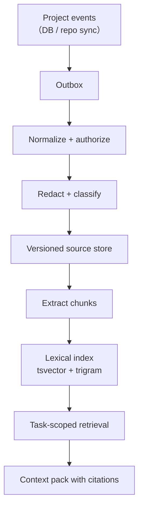

# 03 — `alpha.3` / V2-K1：Project Knowledge Hub

> **ticket 前綴 `KN-`。前置條件：`alpha.1`；`KN-04` 需要 `CV-03` 已完成。**
> `KN-01`–`KN-03`、`KN-05`–`KN-07` 可與 [`02`](./02-phase-c1-ticket-conversation.md) 並行。
> **provider（PR／MR／Release）同步不在本期**，見 [D46](./01-architecture-decisions.md)。

## 1. 這一期不是什麼

先寫「不是什麼」，因為這個題目最容易做歪：

| 不是 | 為什麼寫在這裡 |
|---|---|
| 不是 Wiki | 沒有人要維護第二套文件。內容**自動來自已經存在的事實** |
| 不是「把全部文字丟進 vector database」 | [D40](./01-architecture-decisions.md)**已裁決**（2026-08-16）：`alpha.3` **不含向量檢索** |
| 不是把所有內容塞進 prompt | Context Builder 有 budget、有優先序、有 omitted reason |
| 不是跨 Project 的組織知識庫 | 跨 Project 相似度搜尋**預設禁止**，未來要做需獨立 ADR |
| 不是讓 Agent 自動改 Project instruction | Agent 產出永遠是 `generated`，永遠不進 instruction layer |

**是什麼**：每個 Project 一層**可追溯的記憶**——自動收集已授權來源，
保留 provenance／版本／時效／信任層級，以受控 retrieval 提供給 Agent，並附引用。

Ticket 是「局部工作記憶」，Knowledge Hub 是「跨 Ticket 長期記憶」。

## 2. 來源（`alpha.3` 範圍）

| Source family | 內容 | 預設 authority | 收集方式 | 本期 |
|---|---|---|---|---|
| Project policy | charter、process、accepted spec、人工決策 | `authoritative`／`accepted` | DB event | ✅ |
| Ticket | title、description、fields、dependencies | `discussion` | DB event | ✅ |
| Conversation | message、question、answer、accepted proposal | `discussion`／`accepted` | DB event（依 `conversation_seq`） | ✅ |
| Agent execution | turn summary、proposal | `generated` | run completion | ✅ |
| Verification／Evidence | verification report、evidence item | `verified` | DB event | ✅ |
| Artifact | 產物 metadata ＋ 可索引的文字型產物 | `verified`／`generated` | DB event | ✅ |
| Git repository | tracked 文件、README、docs、symbol map | `canonical at commit` | **既有 repo 憑證的增量同步** | ✅ |
| Activity | actor、state transition、approval metadata | `platform fact` | DB event | ✅ |
| PR／MR | title、description、review、diff summary、merge state | `reviewed`／`canonical` | provider webhook／API | ❌ `beta.2` |
| Release | tag、release note、artifact metadata | `released` | provider webhook／API | ❌ `beta.2` |
| External docs | 已連結的設計、規格、runbook | source-dependent | connector | ❌ 延後 |

**Raw run log 預設不進長期語意索引。** 它是有保留期的診斷資料、噪音高、
且較可能含敏感內容。只索引：經 redaction 的 run summary、明確 evidence、
以及**人類選定**的 log excerpt。

## 3. Authority levels

十級，定義與寫入規則見 [D45](./01-architecture-decisions.md)。檢索排序**不只看相似度**：

```text
score = lexical_relevance
      × authority_weight(authority)
      × freshness_decay(occurred_at, source_type)
      + graph_boost(same_epic, dependency, linked_pr, supersedes)
      − penalty(superseded, retracted)
```

`superseded` 與 `retracted` **不是降權，是排除**：預設 retrieval 完全不回傳它們，
只有明確帶 `include_history=true` 的歷史查詢才看得到。

## 4. Ingestion pipeline



四條不可協商的性質：

1. **每個 ingest job 冪等**，唯一鍵 `(project_id, source_type, source_external_id, source_version)`，
   寫入用 `INSERT … ON CONFLICT DO UPDATE WHERE excluded.source_updated_at > current`
   ——**不是**「先查再決定要不要寫」（[`01`](./01-architecture-decisions.md) §1.9，從 kintra 移植的模式；
   後者在兩個 worker 同時處理同一資源時會雙寫）。
2. **Outbox 是事件的真實來源**，不是記憶體佇列。Central 重啟不遺失待處理事件。
3. **失敗有 dead-letter 與可觀測的 age。** `KN-12` 的 metric 之一是「最舊的失敗 job 幾歲」。
4. **來源被刪除、權限變更或 force-push 時，相關 chunk 必須可撤銷或重建。**
   這是測試項，不是註解（`KN-12`）。

排程 reconciliation 是**正確性路徑**；事件是**新鮮度路徑**。兩者都要有。

## 5. 資料模型

完整 DDL 在 [`08`](./08-data-model-and-contract.md) §3。摘要：

```text
knowledge_sources
  id, project_id, source_type, source_external_id, source_uri,
  source_version, authority, visibility, checksum, title,
  authored_by_type, authored_by_id, occurred_at, ingested_at,
  supersedes_source_id, active, deleted_at
  UNIQUE (project_id, source_type, source_external_id, source_version)

knowledge_chunks
  id, source_id, project_id, chunk_key, content, content_hash,
  token_count, embedding_ref(NULL, 預留), search_document(tsvector),
  valid_from, valid_to
  INDEX GIN(search_document), INDEX GIN(content gin_trgm_ops)

knowledge_links
  from_source_id, relation, to_source_id
  relation ∈ {supersedes, derived_from, references, verifies, delivers, blocks}

knowledge_jobs
  id, project_id, source_type, external_id, state, attempts,
  last_error, dead_lettered_at, created_at, updated_at

task_knowledge_pins
  task_id, source_id, mode ∈ {pin, exclude}, created_by, created_at

context_packs
  id, run_id, task_id, project_id, built_at,
  source_manifest(JSONB), budget_json, omitted_json
```

**`knowledge_facts` 不做。** 提案 §10B.5 自己說它「不是必要的第一版依賴」，
而它需要一個抽取器、一個信心模型與一個人工審查流程——三個都是獨立題目。
`alpha.3` 交付 versioned sources ＋ lexical hybrid ＋ citations，這是可驗證的最小完整體。

**`project_id` 出現在 `knowledge_chunks` 上是刻意的反正規化。**
它可以從 `source_id` join 出來，但 isolation 測試要能對**每一張表**單獨斷言
「這個 project 的查詢不會碰到那個 project 的列」，多一個欄位換一個更短的證明。

## 6. Retrieval 與 Context Builder

Agent 每個 turn 開始時，Context Builder 依五層組裝：

| 層 | 內容 | budget 優先序 | 進 instruction layer？ |
|---|---|---:|---|
| **1 Always** | Project charter、目前 process、security／delivery policy、accepted conventions | **最高，永不裁切** | ✅ 只有這一層 |
| **2 Ticket** | 卡片欄位、**完整未決問題**、accepted decisions、最近 conversation delta、父 Epic／Story | 次高 | ❌ |
| **3 Linked** | dependsOn、related tickets、明確連結的 artifact／文件 | 中 | ❌ |
| **4 Retrieved** | 依 task query 搜出的 top-N，authority／freshness rerank | **最先被裁切** | ❌ |
| **5 Execution** | current commit、branch、runner capabilities、上一 turn 摘要 | 高 | ❌ |

每段內容帶 citation：`source_id`、標題、來源類型、commit／version、時間、authority。
Agent 的回覆與 proposal **應能引用**這些 source；UI 點引用可回到 Ticket message、
文件版本、artifact 或 repo path。

超過 budget 時的順序寫死在程式碼裡並有測試：

```text
先砍 Retrieved（層 4）→ 再壓縮舊 conversation（層 2 的一部分）
→ Execution 摘要（層 5）→ 永不砍 Always（層 1）與未決問題
```

**摘要本身是 `generated` source，不覆蓋原文。**

Context pack response 帶 `source_manifest`、`budget_breakdown` 與 `omitted_reasons`
——為了除錯與稽核，也為了 `KN-12` 的出口條件「manifest 可說明用了哪些來源」。

## 7. 搜尋

`alpha.3` 的 hybrid = **lexical hybrid**（[D40](./01-architecture-decisions.md)，2026-08-16 已裁決）：

| 通道 | 用什麼 | 擅長 |
|---|---|---|
| Full-text | `tsvector`，title 權重 A／body 權重 B（模式移植自 kintra `search/repository.py`） | 一般語句 |
| Trigram | `pg_trgm`（PostgreSQL contrib，**`postgres:16-alpine` 內建**） | `CV-05`、function name、commit SHA、error code、typo |
| Graph boost | `knowledge_links` ＋ 同 Epic／dependency | 「跟這張卡有關的東西」 |
| Rerank | authority × freshness × source proximity | 讓 accepted 勝過 generated |

> **`to_tsvector` 是 STABLE 不是 IMMUTABLE**，PostgreSQL 會拒絕把它放進 GENERATED 欄位。
> 在 Python 端算，不用觸發器——否則「索引怎麼算出來的」會分裂成 Python 與 PL/pgSQL 兩處。
> 這個坑 kintra 已經踩過並記在程式碼註解裡，這裡直接沿用結論。

`embedding_ref` 欄位留著、`KnowledgeRetriever` 介面預留第二個 candidate source，
但本期沒有實作。**架構不擋，這一版不做。**

## 8. Knowledge UI

Project 新增 `Knowledge` 頁：

- **Search**：查詢結果必附 citation，顯示 authority 徽章與版本。
- **Sources**：Tickets／Conversation／Decisions／Artifacts／Repo 的同步狀態與筆數。
- **Decisions**：accepted、superseded、conflicting 三欄。
- **Recently learned**：最近 ingest／更新的來源。
- **Source health**：last sync、job lag、failed jobs、dead letter age、stale branch。
- **操作**：連結到 Ticket、標為正式決策、排除來源、重新同步、比較版本。

Task Drawer 另加 **Related knowledge** 區塊：列出這張 Ticket **目前會提供給 Agent 的
top sources**，人類可 pin／exclude。

> 這一塊是提案裡最重要卻最容易被砍掉的功能。理由：
> **retrieval 若是不可見的黑盒，「Agent 為什麼這樣做」就永遠無法回答。**
> 它同時是 debug 工具與信任機制。

`Ask Project`（自然語言問答）**不在本期**——它需要一次 LLM 呼叫，
而 Central 目前不呼叫任何 LLM。列入 Horizon 2。

## 9. 安全

| # | 規則 | 可測形式 |
|---|---|---|
| 1 | Project authorization 在 **retrieval boundary**，不在 UI 過濾後 | 無權 token 查詢 → 0 結果且 **count 也是 0**（不揭露存在） |
| 2 | run token 只能查詢其 task 所屬 Project | 跨 project 查詢 → 403 |
| 3 | secret value、credential、未允許附件、敏感檔不進 index | ingestion 前 redaction，沿用既有 runner redaction fixture |
| 4 | 來源文字一律是 **data**，不因內含「忽略規則」就成為指令 | `KN-12` 的 prompt injection 測試（[D47](./01-architecture-decisions.md)） |
| 5 | 只有 accepted Project policy 進 instruction layer | context pack 結構斷言 |
| 6 | context pack 保存 source IDs 與版本，不永久複製完整敏感內容 | `context_packs.source_manifest` 只有 ID ＋ metadata |
| 7 | Project 刪除、source unlink、權限撤銷、retention 到期 → cascade tombstone | 刪除後查詢／citation／cache 全部落空 |
| 8 | 跨 Project 相似度搜尋**預設禁止** | 每一層查詢帶 `project_id`；isolation 測試涵蓋 search、count、citation、context pack、cache |
| 9 | `.gitignore` 之外再提供 `.clioraignore` 與 Project exclude rules | 排除規則測試 |
| 10 | 大型 repo 只索引 docs／config／symbol map／變更範圍 | 不預設索引 vendor／generated／binary |

## 10. Tickets

| ID | 工作 | 交付物 | 來源 |
|---|---|---|---|
| `KN-01` | **ADR 0038**：source、authority、provenance、project isolation、per-project opt-in | 十級 authority、刪除、supersede、D40 的裁決全文 | PX-K01 |
| `KN-02` | **Migration**：sources／chunks／links／jobs／pins／context_packs ＋ `projects.knowledge_*` | additive schema、GIN 索引、`CREATE EXTENSION pg_trgm`、rollback | PX-K02 |
| `KN-03` | Event outbox 與冪等 ingestion worker | retry、dead-letter、reconciliation 排程 | PX-K03 |
| `KN-04` | Ticket／conversation／decision ingestion | versioned sources、redaction、citation anchor | PX-K04（依賴 `CV-03`） |
| `KN-05` | Artifact／verification／evidence ingestion | immutable source link、authority mapping | PX-K05 |
| `KN-06` | Repository docs／symbol sync | commit 版本、exclude 規則、增量索引 | PX-K06 |
| `KN-07` | Lexical hybrid search | tsvector ＋ trigram ＋ graph boost ＋ authority rerank | PX-K07（改：無向量） |
| `KN-08` | **ADR 0039 ＋ Context Builder** | 五層、budget policy、instruction／evidence 分層 | PX-K08 |
| `KN-09` | Agent citation contract ＋ CLI | `cliora knowledge search`／`cite`、引用格式、missing source 行為 | PX-K09 |
| `KN-10` | Knowledge UI ／ source health ／ context preview | search、sources、versions、pin／exclude | PX-K10 |
| `KN-11` | Task Drawer 的 Related knowledge 區塊 | top sources、pin／exclude、為什麼被選中 | PX-K10 拆出 |
| `KN-12` | 安全、品質評估與維運 | ACL、prompt injection、刪除 cascade、freshness、relevance eval、metrics | PX-K12 |

`PX-K11`（provider sync）→ 移到 [`12`](./12-migration-and-rollout.md) 的 `HD-01`–`HD-03`。

### 三個里程碑

| # | 名稱 | ticket | 完成時可以說什麼 |
|---|---|---|---|
| **K0** | Versioned Memory | `KN-01`–`KN-06` | 專案事實有來源、有版本、有權威層級地存下來了 |
| **K1** | Cited Retrieval | `KN-07`–`KN-09` | Agent 拿得到相關且可引用的 context |
| **K2** | Visible and Safe | `KN-10`–`KN-12` | 人看得到 Agent 會讀什麼，且證明得了它讀不到不該讀的 |

## 11. 出口條件

| ☐ | 條件 | 怎麼證明 |
|---|---|---|
| ☐ | 新 Ticket message、accepted decision、artifact 在 **P95 < 10 秒**內進入 search | 量測 ingest freshness |
| ☐ | citation 可回到原來源 | 每種 source_type 各點一次 |
| ☐ | Agent turn 的 context manifest 說得出用了哪些來源、版本、authority 與 budget | 讀 `context_packs.source_manifest` |
| ☐ | 更新／刪除／supersede 之後，舊內容不再進預設 retrieval | 三個情境各一測試 |
| ☐ | 精確 ref（`CV-05`）、symbol、commit SHA 與一般語句都找得到 | 固定查詢集，人工判定 relevance |
| ☐ | 未核准 Agent proposal 不以 authoritative instruction 提供給其他 Agent | context pack 結構斷言 |
| ☐ | repo 文件中的 prompt injection 不會提升為 instruction | 注入 fixture 測試 |
| ☐ | 任何查詢、count、citation 與 cache 無跨 Project 洩漏 | isolation 測試套組（≥8 條） |
| ☐ | `knowledge_enabled=false` 的 Project：不 ingest、search 回 404 | 兩個測試 |
| ☐ | Project 刪除後 chunks／index／cache 全部消失 | cascade 測試 |
| ☐ | knowledge search P95 < 1s、context pack build P95 < 2s（index warm） | 效能量測，資料量見 [`10`](./10-verification-and-exit.md) §6 |
| ☐ | Central 未新增任何對外連線 | `pyproject.toml` 無新依賴；egress 審查 |

## 12. 未量測項

| # | 項目 | 為什麼現在不量 |
|---|---|---|
| 1 | 沒有向量檢索的召回率損失 | D40 已裁決不做，所以這不是「還沒決定」而是「已知的取捨」。`KN-12` 的 relevance eval **建立基準值**，日後若重啟向量，那組數字就是對照組 |
| 2 | 大型 monorepo（>50k 檔）的索引時間與體積 | 手上沒有這種 repo。`KN-06` 只在中型 repo 上量 |
| 3 | chunk 大小與重疊的最佳值 | 先用固定值（建議 800 token／100 重疊），列入可調參數 |
| 4 | 十級 authority 是否過細 | 需要真實使用。若 `beta.1` 發現只用到四級，就合併 |
