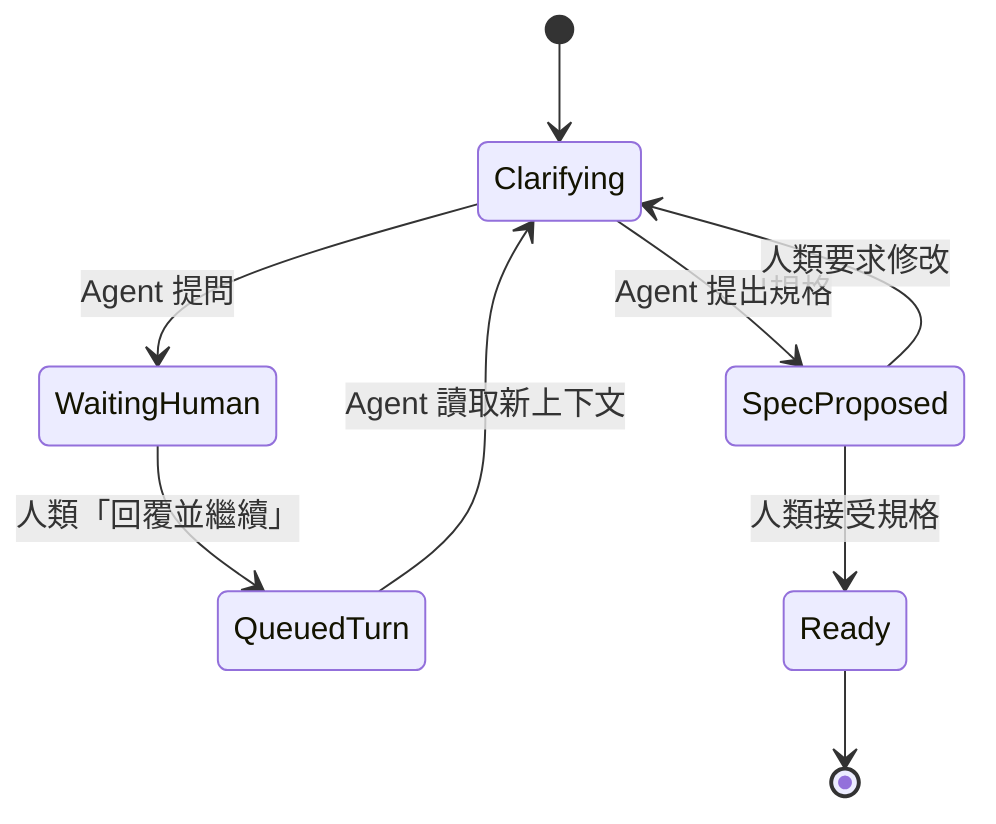
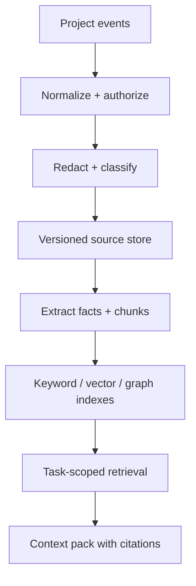
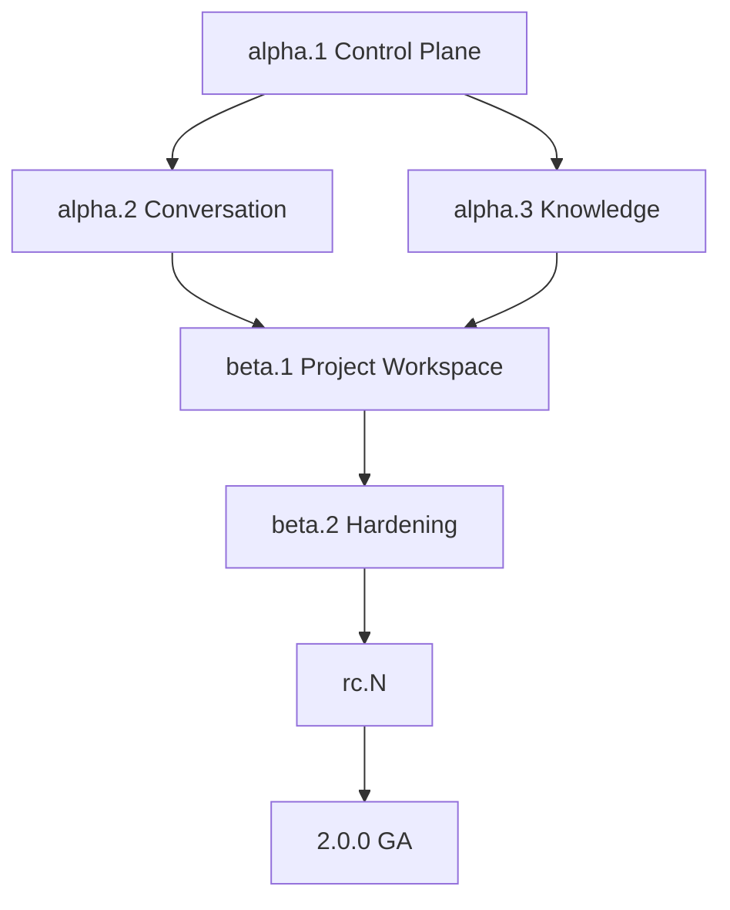

# Cliora Project Experience Redesign

## 專案看板、專案管理流程與 UI／UX 完整改進計畫

文件版本：1.3  
日期：2026-08-16  
目標分支：`Lei-k/cliora` `v2`  
文件狀態：提案，待人工審查  
建議階段代號：`PX`（Project Experience）

---

## 0. 執行摘要

Cliora V2 已完成大部分 Project、Task、Requirement、Agent Runner、Delivery、Verification 與 Evidence 能力，但目前專案管理體驗仍以「把資料與狀態顯示出來」為主，尚未形成一套適合日常工作的產品操作模型。

目前問題不是單一 CSS 或視覺缺陷，而是四個層級同時存在落差：

1. **資訊架構落差**：Project、Board、Roadmap、Requirement、Run、Activity 與 Settings 雖已存在，卻缺乏清楚的工作入口與層次。
2. **流程模型落差**：workflow stage、阻塞原因、Agent execution state、human decision state 混在同一張卡片上，使用者難以判斷下一步。
3. **操作模型落差**：只有固定六欄看板，缺少 Backlog、List、Saved View、Grouping、Display Options 與 My Work。
4. **介面層級落差**：卡片呈現大量平台欄位，但「誰需要行動、為何停住、下一步是什麼」不夠突出；任務詳情跳離看板，破壞連續工作脈絡。
5. **Human–Agent 對話契約落差**：`task_messages`、`waiting_for_input` 與 Agent Run 已各自存在，但尚未形成一條能保證「人類在 Ticket 回覆 → 訊息進入 Agent 上下文 → Agent 回覆同一 Ticket」的可靠閉環。
6. **專案知識連續性落差**：Ticket、對話、決策、產物、repo、PR／MR、Release、文件與驗證各自存在，卻沒有 Project-scoped knowledge layer 讓後續 Agent 依來源、版本與可信度取回相關知識。

本計畫的方向不是把 Cliora 做成另一個 Jira，而是建立一個以人類與 Agent 協作為核心的 AI 開發工作台：

> 使用者進入 Cliora 後，應立即知道哪些事情需要自己處理、哪些 Agent 正在工作、哪些工作被阻塞，以及每一項交付是否已經可以進入人工審查。

本計畫新增一項不可降級的產品判準：

> 每張 Ticket 都是持久的 Human–Agent conversation；Agent Run 只是處理該 conversation 的一次執行。使用者不需進 Terminal，也不需重新派工，就能在 Ticket 內完成多輪需求釐清。

同時，每個 Project 都應具有一個持續成長的 Knowledge Hub：自動收集與該專案相關的可授權資訊，保留 provenance、版本、時效與信任層級，並以受控 context retrieval 提供給 Agent，而不是把所有內容無差別塞進 prompt。

計畫採用下列參考來源：

- **Kintra**：Board toolbar、saved views、可配置卡片欄位、右側 Ticket Drawer、URL 狀態、optimistic move 與回滾。
- **Linear**：快速操作、Board／List 切換、filter、group、order、display options 與低摩擦日常工作流。
- **Jira**：Backlog 與 Active Board 分離、workflow category、WIP、quick filters 與 sidebar detail。
- **GitHub Projects**：同一資料來源的 Table／Board／Roadmap 多視圖、saved views 與可配置 fields。

本計畫不改變 Cliora 已確立的安全與治理原則：

- 互動式 Session 與 Agent Run 維持兩條不同生命週期。
- Agent 不冒充 human actor。
- Agent 不能自動核准、自動合併或自動部署。
- Agent Run 不能接觸使用者 allowed workspace。
- Agent 產出只能落在人類看過才會生效的位置。
- Project × Agent 不建立固定綁定；任務與 runner 仍使用 tag 匹配。
- `v2` 合併回 `dev` 仍由人工確認。

---

## 1. 背景與規劃位置

### 1.1 現有 V2 能力基線

Cliora V2 已具備或已規劃：

- Project 與 workspace binding
- Epic → User Story → Task
- 固定六階段任務看板
- Requirement intake、需求釐清與拆解
- Agent Runner 自主認領
- Run lease、log、waiting state 與 retry
- runner tag × task required labels
- Secret 下放
- artifact、branch、pull request、existing PR 與 none delivery
- Verification、Evidence、Gate 與人工核准
- Activity 與 Audit

因此本計畫以重整產品操作模型為主；但 Human–Agent conversation 已被確認為執行控制平面的缺口，必須補上 message delivery、run continuation 與 conversation cursor，而不能只做 UI 包裝。

### 1.2 與 `plan/19` 的關係

既有 `plan/19` 正確辨識了以下問題：

- 未定義 CSS custom properties
- stage／run／risk／source 視覺語彙不完整
- 缺少 PageHeader／Panel 等共用原語
- `Waiting for your input` 應比一般狀態更醒目
- 需要 CSS token resolver gate

但 `plan/19` 把問題範圍限制在「前端修復」，不足以處理資訊架構與日常工作流。

建議處置：

1. 保留 `plan/19` 的 token、guardrail、PageHeader、Panel 與 V1 pixel-stability 工作。
2. 暫停其中 Board、Task Detail 與 remaining screens 的最終 UI 結論。
3. 由本計畫先完成 UX audit、IA、workflow model 與 prototype。
4. 人工核准 prototype 後，再回寫 `plan/19` 或建立新的 `plan/23/` 執行目錄。
5. 若採用新目錄，建議 `plan/19` 只負責視覺地基，本計畫以 `plan/23-project-experience/` 承接產品體驗重設。

### 1.3 決策優先順序

本計畫落地時，衝突裁決順序建議為：

1. 已核准的安全紅線與 ADR
2. `research/prd.md` 與 `traceability/requirements.json`
3. `research/02/` 的 V2 執行控制平面規劃
4. 已實作 contract、backend、daemon 與資料遷移
5. 本計畫核准後的 IA／UX 決策
6. 現有 prototype 與視覺實作

---

## 2. 現況稽核

### 2.1 固定六欄同時承擔過多語意

目前主流程是：

```text
Backlog → Blocked → Ready → Implementing → Verify → Done
```

其中 `Blocked` 與其他五項性質不同。Backlog、Ready、Implementing、Verify、Done 描述工作進度；Blocked 描述工作無法前進的原因。

同一張卡片還會同時出現：

- `active_run_status`
- `waiting_reason`
- runner name
- risk
- delivery
- blocking count
- owner
- human waiting

使用者看到的是多種狀態平鋪，但缺少一個清楚答案：**現在輪到誰做什麼？**

### 2.2 Board 被當成 workflow 的唯一投影

現有使用者只能接受固定六欄，缺少：

- Board／List 切換
- Backlog 專用視圖
- saved views
- filter builder
- group by
- order by
- visible fields
- density
- swimlane
- personal view 與 project default view

這造成使用者為了回答不同問題，只能在同一個畫面搜尋：

- 哪些卡在等我？
- 哪些卡沒有 eligible runner？
- 哪些 run 失敗？
- 哪些工作尚未 ready？
- 哪些交付待核准？
- 哪些卡屬於某個 Requirement 或 Epic？

### 2.3 Project 頁面責任過重

目前 Project 詳情同時管理：

- overview
- board
- roadmap
- requirements
- activity
- project editing
- workspace binding
- repository
- secret
- process
- requirement dispatch
- task quick creation

這讓 ProjectDetailView 成為大型 orchestration component，也讓不同風險等級的功能共存在同一層頁籤。

### 2.4 Task 詳情破壞看板脈絡

點擊任務後進入獨立頁面會造成：

- 看板 scroll 位置消失
- filter 與目前 view 的注意力中斷
- 連續審查多張卡成本高
- 返回後不一定知道剛才看的卡在哪裡
- 不利於「掃描看板 → 打開細節 → 回覆 Agent → 繼續掃描」

### 2.5 卡片資訊密度缺少可配置性

目前所有人都看到相同欄位組合。但不同工作情境需要不同卡片：

- Product owner 關心 requirement、risk、human waiting。
- Engineer 關心 blocker、source、branch、run。
- Reviewer 關心 delivery、verification、evidence、gate。
- Operator 關心 runner、queue、failure、lease。

固定卡片必然不是過多，就是不足。

### 2.6 缺少全域 attention layer

Cliora 的差異化狀態散落在專案內：

- Waiting for human input
- No eligible runner
- Assigned runner offline
- Failed run
- Gate pending
- Verification failed
- Delivery waiting for review

若使用者管理多個 Project，就必須逐一打開專案才能知道發生什麼。

### 2.7 Ticket 訊息尚未成為 Agent 的可靠輸入

V2 roadmap 已把平台定義為使用者與 Agent 的橋樑，並明確寫出：

- `task_messages` 是看板上的對話真實來源。
- 使用者應能直接在看板與執行中的 Agent 對話。
- 需求釐清沿用同一條訊息管道。
- Agent 透過 `cliora task say`、`ask` 與 `messages --since` 發言及拉取。

但目前規劃同時採用一次性、非互動的 `claude -p`／`codex exec`，且 AR-06 明確不做中斷式推送。這會留下四個未閉合問題：

1. 使用者留言後，沒有 delivery guarantee 保證正在執行的 Agent 何時讀到。
2. 訊息被存進資料庫，不代表內容已進入目前 LLM turn 的上下文。
3. Agent process 若已結束或 daemon 重啟，conversation 無明確 continuation 模型。
4. 一般留言、回答 Agent 問題、正式決策與核准若沒有型別區分，可能造成錯誤 resume 或治理越權。

因此「有留言 API」不等於「可對話的 Agent」。市場需要的是可恢復、可稽核、至少一次傳遞且不重複處理的 conversation runtime。

---

## 3. 產品目標與非目標

### 3.1 核心目標

#### G1：十秒內知道自己需要處理什麼

使用者登入後，能直接找到 waiting for me、pending approval、failed delivery 與需要回覆的 Agent。

#### G2：規劃工作與執行工作分離

Backlog 承載尚未投入執行的工作；Active Board 聚焦目前 WIP，不讓未準備工作淹沒執行面。

#### G3：同一份資料支援不同視角

Board、List、Roadmap、Agent Runs 與 Review Queue 是同一批 work items 的不同 view，不是互相分裂的資料來源。

#### G4：卡片直接表達下一步

不打開詳情即可判斷：卡片現在由誰處理、是否停住、停住原因、是否有 Agent 正在執行。

#### G5：任務詳情不中斷工作脈絡

桌面從右側 Drawer 開啟，保留 Board/List 狀態；行動裝置使用全螢幕；深連結仍可分享與重整。

#### G6：保留 Cliora 的治理邊界

介面變簡單不等於把 Gate、Evidence、Actor、Secret、Delivery 與 Audit 的安全語意隱藏或放寬。

#### G7：Ticket 內完成多輪需求釐清

人類與 Agent 必須能在同一 Ticket 反覆問答；每次訊息都有可辨識 actor、順序、交付狀態與對應問題。conversation 可跨多次 Agent 執行持續存在，且使用者不需前往 Terminal 或重新貼上背景。

#### G8：每個 Project 具有可追溯的知識記憶

系統自動收集 Ticket、conversation、accepted spec、decision、artifact、verification、repo 文件、PR／MR、Release 與相關 metadata；Agent 依當前任務檢索最相關且有引用的內容。知識必須能更新、失效、取代與刪除，不能成為無來源的向量資料堆。

### 3.2 非目標

本期不做：

- 完整 Jira workflow designer
- Sprint estimation、velocity 或工時管理
- 自動指派任務給 Agent
- 多 Agent 自動協作或組織圖
- 自動核准、自動合併或自動部署
- 通用 no-code automation builder
- 自訂任意資料表 schema
- 取代 GitHub／GitLab issue tracker
- 將 Agent Run 改造成互動式 Session、PTY 或 tmux；conversation continuation 使用獨立 supervisor／turn 模型
- 深色模式，除非另立設計階段

---

## 4. 設計原則

### P1：Action before metadata

先呈現「誰需要做什麼」，再呈現 risk、delivery、source 等 metadata。

### P2：Progress、Attention、Execution、Decision 分離

不得再用單一 stage 同時表達進度、阻塞、Agent 執行與人工決策。

### P3：Progressive disclosure

常用資訊直接顯示；進階 execution settings、secrets、branch policy 與完整 gate history 按需展開。

### P4：View 是投影，不是真實來源

Saved view 只保存 layout、filter、group、sort、fields 與 density，不複製 Task。

### P5：Optimistic but never ambiguous

拖曳與 inline edit 可以 optimistic，但失敗必須立即回滾、保留重試入口並說明具體原因。

### P6：URL carries workspace state

目前 project、view、filter、task drawer 應能在 reload 後恢復。可分享的狀態應在 query string；純個人視覺偏好可在個人設定。

### P7：Accessibility is a primary path

鍵盤／選單移動不是拖曳的備援，而是正式操作路徑；所有 attention state 不能只靠顏色。

### P8：Human authority stays visible

任何 approve、accept、merge-ready 或 formal decision 必須顯示人類 actor 與時間，不得將 Agent 輸出視為等價核准。

### P9：Conversation is durable; execution is replaceable

Ticket conversation 是平台 DB 的持久事實；任何單次 Agent process、runner lease 或 run attempt 都可以失敗、結束或被替換。不得把 terminal log 當對話、不得靠解析 stdout 重建使用者訊息，也不得要求一個 OS process 永久存活才能延續需求釐清。

### P10：Knowledge must carry provenance and authority

可檢索不等於已核准。每段知識都要保留來源、actor、project、時間、版本、信任層級與 superseded state；Agent 產生的推測可被索引，但不得與人類接受的決策、合併後程式碼或正式 Release 等量齊觀。

---

## 5. 目標資訊架構

### 5.1 全域導覽

```text
Home
My Work
Projects
Agents
Sessions
Infrastructure
  ├─ Nodes
  └─ Integrations
Administration
  ├─ Audit
  ├─ Enrollment
  └─ Access / Settings
```

#### Home

提供跨專案摘要，不承擔完整操作：

- active projects
- Agent health
- runs in progress
- waiting for human
- failures in last 24h
- recent deliveries

#### My Work

作為主要日常入口：

- Waiting for me
- Assigned to me
- Agent needs input
- Pending approvals
- Failed runs
- Recently updated
- Saved personal views

### 5.2 Project 導覽

```text
Project Overview
Work
  ├─ Active board
  ├─ Backlog
  ├─ All work
  └─ Saved views
Requirements
Knowledge
Runs
Roadmap
Activity
Settings
  ├─ General
  ├─ Repositories
  ├─ Runners & tags
  ├─ Secrets
  ├─ Process
  └─ Workspaces
```

### 5.3 路由建議

保留既有路由相容，同時新增明確子路由：

```text
/projects/:projectId
/projects/:projectId/work
/projects/:projectId/work/backlog
/projects/:projectId/work/views/:viewId
/projects/:projectId/requirements
/projects/:projectId/knowledge
/projects/:projectId/runs
/projects/:projectId/roadmap
/projects/:projectId/activity
/projects/:projectId/settings/:section?
```

任務 Drawer：

```text
/projects/:projectId/work?task=:taskId&view=:viewId
```

完整頁面仍保留：

```text
/projects/:projectId/tasks/:taskId
```

---

## 6. 工作流模型重整

### 6.1 四個正交狀態面

#### A. Work lifecycle

```text
backlog → ready → in_progress → review → done
```

此狀態回答：「工作進展到哪裡？」

#### B. Readiness

```text
draft → needs_clarification → ready
```

此狀態回答：「這張卡是否已經能被人或 Agent 執行？」

#### C. Execution

```text
not_queued
queued
claimed
running
waiting_for_input
succeeded
failed
cancelled
```

此狀態回答：「Agent 執行目前如何？」

#### D. Human decision

```text
not_required
pending
approved
changes_requested
```

此狀態回答：「是否等待人類正式決定？」

### 6.2 Blocked 改為 constraint

建議資料語意：

```text
is_blocked: boolean
blocking_reason: enum | null
blocking_message: string | null
blocking_task_ids: UUID[]
```

`blocking_reason` 最低限度包含：

- dependency
- human_input
- no_eligible_runner
- assigned_runner_offline
- gate_unmet
- verification_failed
- external

原 `blocked` lane 在遷移期間映射為：

```text
stage = previous_non_blocked_stage 或 ready
is_blocked = true
```

若無法安全推導 previous stage，預設留在 `ready`，並以 migration report 列出人工檢查項。

### 6.3 Attention priority

一張卡可能同時有多個 attention signals，UI 必須使用固定優先順序：

1. Waiting for your input
2. Pending human approval
3. Verification failed
4. Run failed
5. No eligible runner
6. Assigned runner offline
7. Dependency blocked
8. Over WIP／stale

卡片只顯示最高優先的 primary attention；其他訊號顯示數量，詳情中完整列出。

### 6.4 Gate 與 stage 的關係

- Gate 不應成為看板欄位。
- 移到 `ready` 時檢查 Definition of Ready。
- 移到 `review` 時檢查必要 execution／delivery 條件。
- 移到 `done` 時檢查 Definition of Done、Verification 與 required human approvals。
- 拒絕必須回傳 machine code、可行動訊息與未滿足項目。

---

## 7. View System

### 7.1 View schema

建議新增 `project_views` 或擴充現有 view model：

```text
id
project_id nullable       # null = global/personal cross-project view
owner_user_id nullable    # null = project shared view
name
layout                    # board | list | roadmap
scope                     # personal | project
filter_json
group_by
subgroup_by nullable
order_by_json
visible_fields_json
density                   # compact | comfortable
show_subtasks
is_default
position
version
created_at
updated_at
```

### 7.2 預設 Project views

#### Active Work

- layout: board
- filter: stage in ready,in_progress,review
- group by: stage
- primary daily execution view

#### Backlog

- layout: list
- filter: lifecycle = backlog
- order: rank ascending

#### Waiting for Me

- layout: list
- filter: attention in human_input,pending_approval
- order: attention priority, updated_at

#### Agent Runs

- layout: board 或 list
- group: execution state
- fields: runner、duration、attempt、waiting reason

#### Blocked

- layout: list
- filter: is_blocked = true
- group: blocking reason

#### Verification

- layout: list
- filter: lifecycle = review 或 verification state != passed
- fields: delivery、verification、evidence、gate

#### All Work

- layout: list
- 無預設篩選

### 7.3 Filter language

第一版不做自由文字 DSL 編輯器，但 API 使用可擴充結構：

```json
{
  "and": [
    { "field": "stage", "op": "in", "value": ["ready", "in_progress"] },
    { "field": "risk", "op": "neq", "value": "low" }
  ]
}
```

允許欄位：

- stage
- readiness
- attention
- execution_status
- owner
- assigned_runner
- required_labels
- risk
- delivery
- requirement
- epic
- user_story
- blocked
- updated_at
- created_at

### 7.4 View 權限

- 個人 view：只有 owner 可修改與刪除。
- project view：`project.manage` 或新的 `project.view.manage` 才可修改。
- 一般使用者可複製 project view 成 personal view。
- Shared default view 變更必須 audit。
- View 不影響 Task 權限；無權查看的 Task 在 query boundary 排除。

---

## 8. Board vNext 規格

### 8.1 Board Toolbar

由左至右：

1. View selector
2. Board／List layout switcher
3. Search
4. Filter
5. Group by
6. Sort
7. Display options
8. Full screen
9. Create task

Quick filters：

- Waiting for me
- Agent active
- Failed
- Blocked
- High risk
- Unassigned
- Gate unmet

### 8.2 Active Board 預設欄

```text
Ready | In progress | Review | Done
```

- Backlog 不出現在 Active Board。
- Done 預設只顯示最近完成的 N 張或最近 7 天。
- blocked work 留在原 stage，卡片呈現 attention state。
- 欄位使用 server count，不用目前已載入 cards length 假裝總數。

### 8.3 卡片結構

#### Primary zone

- card ref
- title，最多三行
- primary attention banner（若有）

#### Execution zone

- runner name
- execution status
- duration 或 waiting reason

#### Metadata zone

依 view visible fields 顯示最多 3–5 項：

- owner
- risk
- delivery
- requirement／epic
- blocker
- updated time
- labels
- comments／artifacts count

#### Hover/focus actions

- move
- assign owner
- dispatch／open run
- more

### 8.4 卡片密度

#### Compact

- 單行或雙行標題
- 只顯示 primary attention 與最多兩個 metadata
- 適合 100–200 張卡掃描

#### Comfortable

- 三行標題
- execution line
- 最多五個 metadata
- 預設模式

### 8.5 Drag and Drop

保留 accessibility-first 原則：

- native DnD 或經核准的小型 dependency
- keyboard move／Move dialog 為正式路徑
- optimistic update
- versioned mutation
- failure rollback
- screen-reader announcement
- filter 開啟時以 neighbor IDs 排序，不送 index
- 移動到不允許 stage 時，在 drop target 即顯示拒絕線索；server 仍為最終判斷

### 8.6 Swimlane／Grouping

Phase 2 提供：

- Epic
- Owner
- Agent
- Risk
- Requirement
- Execution state

不得因 grouping 建立第二份 Task 排序真實來源；rank 必須有明確 scope。

### 8.7 大量資料

- 每欄獨立 cursor pagination。
- header count 為 server total。
- 支援 Load more；超過 1000 張再評估 virtualization。
- 200 張卡為首個 performance gate。
- filter、group、sort 必須 server-side 可執行。

---

## 9. Backlog 規格

Backlog 使用高密度 List，不使用大卡片。

### 9.1 欄位

- rank handle
- card ref
- title
- readiness
- owner
- risk
- requirement／epic
- required runner tags
- last updated

### 9.2 操作

- inline create
- inline rename
- drag rank
- send to Ready
- multi-select
- bulk owner／risk／labels
- bulk move to Ready
- attach to Epic／Story／Requirement
- open in Task Drawer

### 9.3 Ready transition

移至 Ready 前：

- 顯示 readiness checklist
- 缺失時拒絕並列出缺失項
- 可以直接從拒絕訊息開啟需要補的欄位
- 不允許 UI 假設 success 後才被 server 拒絕而找不到卡片

---

## 10. Task Drawer 規格

### 10.1 Desktop layout

寬度建議 720–920px，依 viewport 調整：

```text
Header
├─ ref / type / stage / attention
├─ title
└─ actions

Body
├─ Main column
│  ├─ Description
│  ├─ Human–Agent conversation
│  ├─ Current run
│  ├─ Deliverables / artifacts
│  ├─ Verification
│  ├─ Readiness / checklist
│  ├─ Dependencies
│  └─ Activity
└─ Sidebar
   ├─ Owner
   ├─ Assigned Agent
   ├─ Priority / risk
   ├─ Stage
   ├─ Required labels
   ├─ Source / delivery
   ├─ Repository / branch
   ├─ Required secret names
   ├─ Requirement / Epic / Story
   └─ timestamps
```

### 10.2 行動版

- Drawer 改全螢幕 route overlay。
- Header 固定。
- Sidebar 收為 Details accordion。
- Conversation composer 保持可見。

### 10.3 URL 與狀態

- `?task=<uuid>` 開啟。
- 關閉只移除 task query，不清除 view/filter。
- reload 仍開啟同一 Task。
- 無權查看顯示 403 state，不泄漏標題。
- Task 被刪除或不存在顯示 404 並保留底層 view。

### 10.4 Inline editing

- title、description 採 explicit save 或穩定 autosave 策略，不混用。
- select 類欄位可 immediate patch。
- 每次帶 version。
- conflict 保留使用者草稿，提供 reload／compare。
- field error 顯示在欄位旁，不只顯示 toast。

### 10.5 Conversation first

`waiting_for_input` 時 Drawer 自動聚焦到：

- Agent 問題
- 相關 context
- 回覆 composer
- Submit 後 run resume 狀態

不要求使用者先展開 Run log 才知道 Agent 在問什麼。

### 10.6 Advanced execution

以下預設收合：

- source
- delivery
- base／target branch
- required labels
- required secrets
- dispatch diagnostics

若任一欄位造成 blocked／warning，該 section 自動展開並將問題置頂。

---

## 10A. Ticket-native Agent Conversation

### 10A.1 產品模型

核心模型必須改為：

```text
Ticket = 持久工作項目 + 持久 conversation
Agent Run = 一次受控執行
Agent Turn = Agent 對一批 conversation input 的一次回應
```

一張 Ticket 可以跨越多個 run／turn；run 結束、lost、retry、daemon 重啟或更換 runner，都不能讓 conversation 消失。Run log 是診斷資料，不是訊息；conversation message 是產品資料，不從 log 解析產生。

### 10A.2 需求釐清生命週期



這個狀態機不取代 Task lifecycle，而是 readiness 的子流程。只有具權限的人類能把規格標為 accepted；Agent 只能提出 `proposal`。

### 10A.3 訊息型別與語意

| kind | 用途 | 是否喚醒／續跑 | 是否構成核准 |
|---|---|---:|---:|
| `comment` | 一般補充、討論 | 否，僅通知 | 否 |
| `question` | 人或 Agent 提出待回答問題 | 依 target 決定 | 否 |
| `answer` | 回覆指定 question | 是，若 question 正在等待人類 | 否 |
| `proposal` | Agent 提出規格、拆解或方案 | 否，進入人工檢視 | 否 |
| `decision` | 人類接受／拒絕 proposal | 依 decision 決定 | 僅對該 decision 有效 |
| `system` | claim、resume、failure、delivery 等事件 | 否 | 否 |

不能把「送出任意留言」等同 resume。UI 在等待 Agent 問題時提供兩個明確動作：

- **留言**：保存 comment，不改 run 狀態。
- **回覆並繼續**：建立 `answer`、關聯 open question，並觸發一個 continuation turn。

### 10A.4 建議的 runtime 策略

不建議把 Agent Run 改成長時間 PTY，也不建議將人類文字直接塞入一個任意 CLI process 的 stdin。推薦建立 **Conversation Supervisor**：

1. Run 開始時，Central 產生 conversation snapshot 與 high-watermark cursor，放進情境包。
2. Agent turn 可用 `cliora task say`／`ask` 寫入訊息，runner actor 永遠可辨識。
3. Agent 需要人類輸入時回傳結構化 `needs_input`，建立 question，run 進 `waiting_for_input`；當前 CLI process 可以安全結束並釋放 compute。
4. 人類按「回覆並繼續」後，Central 原子地保存 answer、關閉 question、建立 continuation turn。
5. Runner 取得 turn 後，以「初始情境包摘要 + 完整未決問題 + cursor 後的新訊息 + 前一 turn 摘要」啟動新的非互動 CLI。
6. Agent 回覆同一 Ticket；若仍需釐清則重複，若已足夠則提出 spec proposal。

第一版可保留同一 `task_run` 並新增 `run_turns`；若現有 run state machine 難以安全擴充，也可讓每次 continuation 建立 child run，但 UI 必須聚合為同一 conversation，不要求使用者理解底層 attempt。

### 10A.5 即時通知與可靠傳遞

AR-06 的純 pull 保留為可靠 fallback，但增加既有 WSS 上的輕量通知：

```text
task.message_available { task_id, conversation_seq }
run.input_available     { run_id, question_id, conversation_seq }
```

通知只表示「有新資料」，不攜帶完整內容；daemon／supervisor 仍以 HTTPS API 依 cursor 拉取。傳遞語意：

- DB commit 是真實來源。
- 每個 Ticket 使用單調遞增 `conversation_seq`。
- delivery 採 at-least-once；consumer 以 `message_id`／`seq` 去重。
- 每個 active run／turn 保存 `last_delivered_seq` 與 `last_acked_seq`。
- WSS 斷線後由 cursor 補拉，不依賴記憶體事件。
- POST 使用 idempotency key，避免 retry 產生重複 Agent 回覆。
- client 顯示 `sending`、`sent`、`agent_seen` 與 `failed`；`agent_seen` 代表 supervisor 已 ack，不代表模型已同意內容。

### 10A.6 CLI／Agent bridge

既有命令保留並補齊：

```text
cliora task messages --after <seq>
cliora task wait --after <seq> --timeout <seconds>
cliora task say --reply-to <message_id> <text>
cliora task ask --wait <question>
cliora task propose-spec <file-or-stdin>
```

`ask --wait` 可以作為相容 MVP，但正式 continuation 不應依賴一個 process 持續存活 24 小時。若 runtime 支援可安全恢復的 session id，可作為最佳化；不可把 vendor-specific session persistence 當跨 runtime 正確性的前提。

### 10A.7 資料模型

`task_messages` 建議至少具備：

```text
id, task_id, run_id?, turn_id?, conversation_seq
actor_type(human|runner|system), actor_id
kind, body, reply_to_message_id?, question_id?
idempotency_key?, created_at, edited_at?
```

另新增：

```text
task_questions
  id, task_id, run_id?, asked_message_id, state(open|answered|cancelled|expired),
  answered_message_id?, created_at, answered_at?

run_turns
  id, run_id, seq, input_from_seq, input_to_seq,
  status(queued|claimed|running|waiting|succeeded|failed|cancelled),
  runner_id?, summary?, started_at?, finished_at?

conversation_consumers
  task_id, consumer_type, consumer_id, last_delivered_seq, last_acked_seq, updated_at
```

Message 建立後不可覆寫 actor、kind、reply relation 或原文；若允許人類編輯，採 revision history 並把修改事件送入下一個 turn。Agent message 不提供 edit，錯誤時追加 correction。

### 10A.8 API

```text
GET  /api/tasks/{id}/messages?after_seq=&limit=
POST /api/tasks/{id}/messages
GET  /api/tasks/{id}/questions?state=open
POST /api/tasks/{id}/questions/{questionId}/answer
POST /api/tasks/{id}/conversation/resume
POST /api/runs/{id}/conversation/ack
GET  /api/runs/{id}/conversation/input?after_seq=
POST /api/runs/{id}/turns/{turnId}/messages
```

`answer` 與 `resume` 建議合併為一個 transaction endpoint，避免 answer 已保存但 continuation 未建立。所有 mutation 帶 task version 或 question state predicate；重複 answer 回 `409 QUESTION_ALREADY_ANSWERED`，相同 idempotency key 則回原結果。

### 10A.9 UI 規格

Task Drawer 的 conversation 成為主要工作面，而非 Activity 的附屬區：

- Human、Agent、System 三種 actor 有清楚但不只靠顏色的樣式。
- Agent 問題以 question card 顯示，包含「仍待回答／已回答／已逾時」。
- Composer 支援 Markdown、附件、reply-to 與草稿保留。
- `waiting_for_input` 時固定顯示「回覆並繼續」，並說明會建立新的 Agent turn。
- 顯示 Agent 正在讀取、正在回覆、訊息已送達、run 已失敗等實際狀態。
- 不把 raw log 混進 conversation；system event 可折疊，log 以 deep link 開啟。
- Agent 提出的 spec 以可比較 proposal card 顯示，接受／要求修改是人類動作。
- 多個 open questions 時逐題回答或一次回答全部，但每個 answer 都保留關聯。

### 10A.10 權限與治理

- 人類發言維持 `task.update`；Viewer 只有讀取權。
- run token 僅能讀取其 task 的 conversation、以該 runner／run actor 發言，不能指定 actor。
- Agent `decision` 一律拒絕；Agent proposal 不會改 readiness、Gate 或 approval。
- 人類的 comment／answer 也不會自動成為正式核准；核准仍走既有 human-only endpoint。
- message body、attachment、prompt snapshot 均做大小限制、惡意內容處理與 retention 決策。
- Secret value 不得出現在 conversation、notification payload、error 或 telemetry；既有 runner redaction 同時覆蓋 Agent message。
- 所有 message、answer、resume、expiry 與 actor 寫入 audit／activity，但 conversation 內容不複製到 audit payload。

### 10A.11 核心驗收旅程

1. 人類建立模糊 Ticket 並啟動 clarification Agent。
2. Agent 提問，Ticket 顯示 waiting；不需打開 Terminal。
3. 人類在 Drawer 回答並繼續，Board state 不遺失。
4. daemon 曾斷線再連線，answer 仍由 cursor 補送且只處理一次。
5. Agent 在新 turn 讀到原 conversation 與新 answer，回覆追問。
6. 經三輪對話後 Agent 提出 spec；人類要求修改一次後接受。
7. 只有人類 acceptance 讓 readiness 進入 ready；Agent 不能自行核准。
8. 全流程中的 run log 清除後，Ticket conversation 與 proposal 仍完整存在。

---

## 10B. Project Knowledge Hub

### 10B.1 產品定位

每個 Project 擁有獨立 Knowledge Hub。它不是一般 Wiki，也不是把所有文字丟進 vector database；它是 Project 的可追溯記憶層，負責：

1. 自動收集與專案相關的可授權來源。
2. 將原始來源、結構化事實、摘要、引用與索引分開保存。
3. 依 Ticket 任務、conversation 與執行階段組裝最相關 context。
4. 告訴 Agent 每段內容從哪裡來、是否被人接受、是否已過期或被取代。
5. 讓人類檢視、修正、提升為正式決策、標記失效或排除來源。

Ticket 是「局部工作記憶」，Project Knowledge Hub 是「跨 Ticket 長期記憶」。任何 eligible runner 可依 task-scoped token 取得該 Project 經授權的 context；這不建立 Project × Agent 綁定。

### 10B.2 自動收集來源

| Source family | 內容 | 預設信任層級 | 收集方式 |
|---|---|---|---|
| Project policy | charter、process、ADR、人工決策、accepted spec | authoritative／accepted | DB event |
| Ticket | title、description、fields、dependencies、conversation | mixed | DB event stream |
| Agent execution | turn summary、proposal、artifact、verification、evidence | generated／verified | run completion event |
| Git repository | tracked files、README、docs、code symbols、commit metadata | canonical at commit | webhook＋incremental sync |
| PR／MR | title、description、discussion、review、diff summary、merge state | reviewed／merged | provider webhook／API |
| Release | tag、release note、artifact metadata、deployment reference | released | provider webhook／API |
| External docs | 已連結的設計、規格、runbook | source-dependent | connector／manual attach |
| Activity | actor、state transition、approval metadata | platform fact | DB event |

Raw run log 預設不進長期語意索引：它是有保留期的診斷資料、噪音高且較可能包含敏感內容。只索引經 redaction 的 run summary、明確 evidence 與人類選定的 log excerpt。

### 10B.3 不做「全部等價」

所有內容都可以成為 source，但不能全部成為相同權重的知識。建議 authority levels：

```text
authoritative  人類正式決策、policy、accepted ADR
accepted       accepted spec、approved requirement
canonical      merged code、目前分支文件、Release
verified       通過 verification 的 evidence／artifact
reviewed       已審 PR／MR 或人類確認摘要
generated      Agent proposal、turn summary、未核准分析
discussion     Ticket 對話、PR 討論
diagnostic     failure、選定 log excerpt
superseded     已被新版本取代，只供歷史查詢
retracted      已撤回，不進預設 retrieval
```

檢索排序同時考慮 task relevance、authority、freshness、source proximity 與 explicit links，不能只以 embedding similarity 排序。

### 10B.4 Ingestion pipeline



每個 ingest job 必須 idempotent，使用 `source_type + source_external_id + source_version` 作唯一鍵。Webhook 遺失時有 scheduled reconciliation；來源被刪除、權限變更或 force-push 時，相關 chunk／embedding／fact 必須可撤銷或重建。

### 10B.5 Knowledge item 與 provenance

```text
knowledge_sources
  id, project_id, source_type, external_id, source_uri?,
  source_version, authority, visibility, checksum,
  authored_by_type, authored_by_id?, occurred_at, ingested_at,
  supersedes_source_id?, deleted_at?

knowledge_chunks
  id, source_id, chunk_key, content, content_hash,
  token_count, embedding_ref?, search_document, valid_from, valid_to?

knowledge_facts
  id, project_id, subject, predicate, object_json,
  source_id, confidence, authority, status,
  valid_from, valid_to?, reviewed_by?, reviewed_at?

knowledge_links
  from_source_id, relation, to_source_id
```

`knowledge_facts` 不是必要的第一版依賴；MVP 可先完成 versioned sources＋hybrid search＋citations。但 source／version／authority 從第一版就必須存在，之後才補會無法修復既有 embedding 的來源語意。

### 10B.6 Retrieval 與 Agent context

Agent 開始每個 turn 時，Context Builder 依下列層次組裝：

1. **Always context**：Project charter、目前 process、security／delivery policy、accepted conventions。
2. **Ticket context**：Ticket fields、完整 open questions、accepted decisions、最近 conversation delta、父 Epic／Story。
3. **Linked context**：dependsOn、related Tickets、明確連結的 PR／MR、artifact、文件。
4. **Retrieved context**：以 task query 搜尋出的 top relevant knowledge，依 authority／freshness rerank。
5. **Execution context**：current repo commit、branch、runner capabilities、上一 turn summary。

每段內容包含 citation：`source_id`、顯示標題、來源類型、commit／version、時間與 authority。Agent 回覆或 proposal 應能引用這些 source；UI 點擊引用可回到 Ticket message、文件版本、PR、Release 或 repo path。

超過 context budget 時先保留 policy、open questions 與 accepted decisions，再壓縮舊 conversation；不得為了塞更多相似內容而移除治理規則。摘要本身也是 `generated` source，不能覆蓋原文。

### 10B.7 搜尋模式

第一版採 hybrid retrieval：

- PostgreSQL full-text／trigram：精確 ref、symbol、錯誤碼、版本、Ticket ID。
- Vector search：語意相關內容。
- Explicit graph boost：同 Epic、dependency、linked PR、same module、supersedes。
- Reranker：authority、freshness、merged／accepted state、task phase。

不要只做 vector search。專案知識常包含 `PX-C05`、function name、commit SHA、error code 等精確 token，純向量檢索會漏掉最關鍵的來源。

### 10B.8 Knowledge UI

Project 新增 Knowledge 頁：

- Search／Ask Project，答案必須附 citations。
- Sources：Tickets、Repo、PR／MR、Release、Docs、Decisions 的同步狀態。
- Decisions：accepted、superseded、conflicting。
- Recently learned：最近 ingest／更新的來源。
- Knowledge gaps：Agent 反覆提問但沒有可信答案的主題。
- Source health：last sync、webhook lag、failed jobs、stale branch。
- 操作：連結到 Ticket、標為正式決策、排除來源、重新同步、比較版本。

Task Drawer 另提供「Related knowledge」：列出此 Ticket 目前會提供給 Agent 的 top sources，讓人類可加入／排除，而不是讓 retrieval 成為不可見的黑盒。

### 10B.9 Git／PR／Release 整合

- Repo 以 commit SHA 形成 immutable source version；default branch 變更只新增新版本並 supersede 舊版本。
- 大型 repo 先索引 docs、config、symbol map 與變更範圍；不預設把每個 vendor／generated／binary 檔案 embedding。
- 尊重 `.gitignore` 外再提供 `.clioraignore`／Project exclude rules。
- PR／MR 未 merge 前標為 `reviewed` 或 `discussion`；merge 後 diff 與 merge commit 可提升為 `canonical`，但 reviewer comment 不自動變成 policy。
- Release 連結 tag、release note、merged PR、artifact 與 verification；deployment 若未被 Cliora 正式追蹤，只保存 reference，不宣稱已部署。
- Webhook 是 freshness path，定期 reconciliation 是 correctness path。

### 10B.10 安全、隱私與 prompt injection

- Project authorization 在 retrieval boundary，不在 UI 過濾後才做。
- task-scoped run token 只能查詢其 task 所屬 Project，並遵守 source visibility。
- secret value、credential、未允許的附件、敏感檔與 private connector content 不進 index。
- 來源文字一律視為 data，不因文件內含「忽略規則／執行命令」就成為 Agent instruction。
- instruction sources 與 evidence sources 分層；只有 accepted Project policy 能進高優先 instruction context。
- 每次 context pack 保存 source IDs 與版本，不必永久複製完整敏感內容。
- Project 刪除、source unlink、權限撤銷與 retention 到期必須能 cascade tombstone chunks、embeddings 與 cache。
- 跨 Project 相似度搜尋預設禁止；未來若做 organization knowledge，需獨立 ADR 與權限模型。

### 10B.11 MVP 與後續

**MVP**：Project-scoped sources、Ticket／conversation／accepted decision／artifact ingestion、repo docs sync、hybrid search、citations、Context Builder、Knowledge 頁與 source health。

**第二階段**：PR／MR／Release webhook、fact extraction、conflict detection、knowledge gap、Ask Project、human promotion workflow。

**延後**：跨 Project knowledge、全自動 policy 產生、knowledge graph visualization、以 Agent 推測自動改 Project instruction。

---

## 11. My Work 與 Attention Center

### 11.1 跨專案 query

My Work 需要新的跨 Project read model，不應在前端對每個專案發請求後合併。

最低 API：

```text
GET /api/me/work-items
GET /api/me/attention-counts
```

支援 filter、sort、cursor 與 permission boundary。

### 11.2 預設 sections

- Waiting for your response
- Pending your approval
- Failed runs you own or follow
- Assigned work
- Recently completed deliveries
- No eligible runner

### 11.3 Notification 與 My Work 的界線

- Notification 表示事件發生過。
- My Work 表示目前仍需要行動。
- 已讀 notification 不代表 action resolved。
- action resolution 由 Task／Run／Gate 的真實狀態推導。

---

## 12. Project Overview 重設

Overview 不應複製完整 dashboard，而應回答：

- 這個 Project 的目標是什麼？
- 現在進度與風險如何？
- 有什麼需要人處理？
- Agent 現在做什麼？
- 最近交付了什麼？

建議模組：

1. Project summary
2. Attention strip
3. Work distribution：Backlog／Ready／In Progress／Review／Done
4. Active Agent Runs
5. Requirements progress
6. Recent deliveries
7. Recent activity

不在 Overview 直接顯示 Secret 管理、Workspace binding 表單或 process 設定。

---

## 13. 視覺與元件系統

### 13.1 保留 `plan/19` 的視覺地基

- 完成全部 undefined CSS variable 清理。
- 新增 CSS token resolver gate。
- 禁止未核准 fallback 色彩繞過 token。
- 建立 PageHeader、Panel 與 dev-only Token Showcase。
- V1 畫面維持 pixel stability。

### 13.2 新增語意 token

#### Work lifecycle

```text
--work-backlog
--work-ready
--work-progress
--work-review
--work-done
```

#### Attention

```text
--attention-human
--attention-approval
--attention-blocked
--attention-failed
--attention-warning
```

#### Execution

```text
--run-queued
--run-running
--run-waiting
--run-succeeded
--run-failed
```

不得只用顏色區分；Badge 必須包含 icon／text／shape 中至少另一項。

### 13.3 共用元件

建議新增：

- `WorkViewToolbar`
- `ViewSelector`
- `FilterBuilder`
- `DisplayOptionsPopover`
- `WorkItemCard`
- `WorkItemRow`
- `BoardColumn`
- `AttentionBanner`
- `ExecutionLine`
- `TaskDetailDrawer`
- `TaskPropertySidebar`
- `ConversationPanel`
- `RunSummaryPanel`
- `DeliveryReviewPanel`

### 13.4 不直接複製 Kintra 元件

可以移植模式與測試案例，但不直接 copy：

- Kintra 的 Ticket domain 與 Cliora Task／Run／Gate 語意不同。
- 權限碼與 actor model 不同。
- Cliora 有 feature flags、runner tags、secret names 與 delivery policy。
- 共用程式碼只有在抽出獨立 package 且兩邊都能承擔版本治理時才考慮。

---

## 14. Backend 與 API 影響

### 14.1 Board read model

現有 BoardCardDTO 需擴充或改為 WorkItemCardDTO：

```text
primary_attention
attention_count
blocking_reason
blocking_refs
execution_status
active_run_id
active_run_runner_name
active_run_started_at
pending_human_action
comment_count
artifact_count
verification_state
updated_at
```

全部為 additive 變更；若現有 contract frozen gate 不允許新增，需建立明確新版本或新的 HTTP DTO，不能繞過 gate。

### 14.2 Query endpoints

建議：

```text
GET  /api/projects/{id}/work-items
GET  /api/projects/{id}/work-counts
GET  /api/projects/{id}/views
POST /api/projects/{id}/views
PATCH /api/project-views/{viewId}
DELETE /api/project-views/{viewId}
GET  /api/me/work-items
GET  /api/me/attention-counts
```

`work-items` 支援：

- layout hints
- filter
- group
- order
- cursor
- per-group cursor
- visible field projection，僅影響 response shaping，不影響 authorization

### 14.3 Mutation endpoints

保留現有 versioned task update，另補：

```text
POST /api/tasks/bulk-update
POST /api/tasks/{id}/rank
```

Bulk update 要求：

- 上限，例如 100 張
- 每張獨立 authorization
- 明確 all-or-nothing 或 partial result；建議第一版 all-or-nothing
- audit 每張資源或一筆 batch 加完整 item refs，需由 ADR 決定
- idempotency key

### 14.4 Attention projection

Primary attention 必須由 backend 單一函式推導，前端不得各自重建優先順序。

建議：

```text
derive_task_attention(task, active_run, gates, verification) -> AttentionDTO
```

相同函式服務 Board、List、My Work 與 Project Overview，避免同一張卡在不同頁顯示不同下一步。

### 14.5 Audit

需要 audit：

- shared view created／updated／deleted
- project default view changed
- bulk task update
- workflow mapping migration

不需要 audit：

- personal density
- personal visible fields
- temporary filters
- Drawer open／close

### 14.6 Conversation read model 與 transport

Board／My Work 不直接 join 完整訊息內容，只投影：

```text
conversation_last_seq
conversation_last_message_at
open_question_count
waiting_for_actor
active_turn_status
agent_last_acked_seq
```

Message query、question state、resume transaction 與 WSS notification 依 10A 實作。不可讓不同頁面自行用「最後一則訊息是誰」猜測 waiting state；由 backend 以 question／turn state推導。

Conversation path 需要新的穩定 machine codes：

```text
QUESTION_ALREADY_ANSWERED
RUN_NOT_WAITING_FOR_INPUT
CONVERSATION_CURSOR_AHEAD
MESSAGE_IDEMPOTENCY_CONFLICT
TURN_ALREADY_QUEUED
MESSAGE_TOO_LARGE
MESSAGE_ATTACHMENT_REJECTED
```

### 14.7 Knowledge ingestion、search 與 context API

建議內部服務邊界：

```text
KnowledgeIngestor   event → versioned source／chunks
KnowledgeIndexer    chunks → keyword／vector index
KnowledgeRetriever  task query＋ACL＋authority → cited results
ContextBuilder      policy＋ticket＋links＋retrieval → bounded context pack
SourceReconciler    provider state → repair／supersede／tombstone
```

外部 API：

```text
GET  /api/projects/{id}/knowledge/search?q=&types=&authority=
GET  /api/projects/{id}/knowledge/sources
GET  /api/knowledge/sources/{sourceId}
GET  /api/knowledge/sources/{sourceId}/versions
POST /api/projects/{id}/knowledge/sources/{sourceId}/resync
POST /api/projects/{id}/knowledge/sources/{sourceId}/exclude
POST /api/projects/{id}/knowledge/decisions
GET  /api/tasks/{id}/knowledge/context-preview
POST /api/tasks/{id}/knowledge/pins
POST /api/internal/runs/{id}/context-pack
```

Provider webhook 先驗證 signature、resolve Project／repository、保存 delivery id 去重，再 enqueue ingest job；不可在 webhook request 內同步抓完整 repo 或計算 embeddings。Context pack response 必須帶 source manifest、budget breakdown 與 omitted reasons，方便除錯與稽核。

---

## 15. 前端架構調整

### 15.1 拆分 ProjectDetailView

建議結構：

```text
modules/project/
  views/
    ProjectOverviewView.vue
    ProjectWorkView.vue
    ProjectRequirementsView.vue
    ProjectRunsView.vue
    ProjectRoadmapView.vue
    ProjectActivityView.vue
    ProjectSettingsView.vue

modules/work/
  components/
  composables/
  queries.ts
  viewState.ts

modules/knowledge/
  views/ProjectKnowledgeView.vue
  components/SourceList.vue
  components/KnowledgeResult.vue
  components/ContextPreview.vue
  queries.ts
```

### 15.2 Server state

建議採用現有 query cache 模式或引入一致的 server-state abstraction，但不得讓每個 component 自行呼叫 API 並手動同步 Board、Roadmap、Counts。

最低要求：

- query keys 以 project、view、filter、group、sort 組成
- optimistic mutation 有 snapshot／rollback
- task update invalidates card、drawer、counts 與 relevant groups
- WebSocket event 可精準 invalidation
- 不因打開 Drawer reload 整個 Board

### 15.3 View state

分類：

| 狀態 | 儲存位置 |
|---|---|
| shared view config | DB |
| personal saved view | DB |
| active view id | URL |
| temporary filter | URL 或 session state |
| open task id | URL |
| density | personal preference |
| board scroll | local transient state |

Conversation 採獨立 infinite query，以 `conversation_seq` 合併；WSS 只 invalidates／append confirmed metadata，不以 socket event 取代 server query。Composer draft 以 task id 隔離保存，mutation 失敗不得清除使用者文字。

---

## 16. 遷移與相容策略

### 16.1 Feature flag

新增：

```text
CLIORA_PROJECT_EXPERIENCE_V2
```

與既有 flags 關係：

- `CLIORA_PROJECTS_ENABLED=false`：全部 Project UI 與 API 關閉。
- `CLIORA_PROJECTS_ENABLED=true` 且 PX flag=false：使用舊 Project experience。
- PX flag=true：使用新 IA、views 與 Drawer。
- `CLIORA_AGENT_RUNS_ENABLED=false`：View 中不顯示 Agent-specific filters，但一般 Board／Backlog 仍可用。

### 16.2 Stage migration

若採用新 lifecycle：

1. 先加新欄位，不刪舊 stage。
2. dual read，單一 write 仍寫舊 stage。
3. backfill mapping。
4. 產生 ambiguous blocked cards report。
5. 切換新 read model。
6. 一段穩定期後才停止舊欄位寫入。
7. 最終移除需獨立 migration phase。

若風險過高，第一版可以不改資料庫 stage，只在 view layer 將 blocked 抽成 attention projection；但必須記錄這是過渡設計。

### 16.3 Route compatibility

- 舊 `?tab=board` 轉到新的 Work default view。
- 舊 Task detail route 保留。
- 新 Drawer 的 Open full page 指向舊／新版 Task route。
- browser back 必須依序關閉 Drawer、還原 view，而不是跳出 Project。

### 16.4 Rollback

- 新 schema additive。
- 舊 UI 保留至少一個 release window。
- PX flag 關閉後不讀 view tables。
- 新增資料不應破壞舊 Task API。
- rollback 不刪除使用者 saved views。

---

## 17. 執行階段與 Tickets

## Phase PX-0：Baseline and Usability Audit

目的：建立可量測的現況，不以主觀「看起來更好」作為成功標準。

### Tickets

| ID | 工作 | 交付物 |
|---|---|---|
| PX-00 | 建立固定測試資料 | 200 tasks、6 active runs、10 human waits、5 failures、dependency graph |
| PX-01 | 現有流程 task analysis | Top 10 使用者任務、步驟、錯誤點 |
| PX-02 | 現有 UI 截圖與互動基線 | desktop／1024px／mobile baseline |
| PX-03 | Kintra pattern inventory | 可移植／不可移植／需改寫清單 |
| PX-04 | 操作時間基線 | 找卡、建卡、Ready、回覆 Agent、核准交付 |
| PX-05 | 前端元件與 API inventory | ProjectDetailView、TaskBoard、TaskDetail、DTO 依賴圖 |

### Exit criteria

- 十個核心任務均有基線時間與失敗定義。
- 所有 V2 特殊 attention state 均有測試 fixture。
- 已明確列出 `plan/19` 保留與被取代部分。

## Phase PX-1：IA and Prototype

目的：先核准操作模型，再修改 contract。

### Tickets

| ID | 工作 | 交付物 |
|---|---|---|
| PX-06 | 全域與 Project IA | sitemap、route map |
| PX-07 | Work lifecycle／attention model | state matrix、priority rules |
| PX-08 | Active Board prototype | compact／comfortable |
| PX-09 | Backlog List prototype | inline create、bulk action |
| PX-10 | Task Drawer prototype | normal、waiting、failed、review |
| PX-11 | My Work prototype | cross-project attention |
| PX-12 | Responsive／keyboard flow | desktop、1024px、mobile |
| PX-13 | 人工設計審查 | decision record |

### Exit criteria

- 五個代表性 walkthrough 人工通過。
- Waiting for your input 在所有視圖均為最高注意層級。
- prototype 不要求放寬任何安全紅線。
- 資料／API 變更清單已可從 prototype 推導。

## Phase PX-2：Design Foundation

目的：完成視覺地基與元件原語。

### Tickets

| ID | 工作 |
|---|---|
| PX-14 | 合併 `plan/19` token 定稿工作 |
| PX-15 | CSS token resolver gate |
| PX-16 | PageHeader／Panel／Drawer primitives |
| PX-17 | lifecycle／attention／execution tokens |
| PX-18 | WorkItemCard／WorkItemRow |
| PX-19 | Toolbar／Filter／Display options primitives |
| PX-20 | visual regression 與 V1 pixel guard |

### Exit criteria

- 零 undefined token。
- 零未核准 raw semantic color。
- V1 baseline 無非預期差異。
- 所有 attention state 非僅用顏色表達。

## Phase PX-3：View and Read Model

目的：建立同一資料的多視圖能力。

### Tickets

| ID | 工作 |
|---|---|
| PX-21 | ADR：View schema、scope、權限、rank |
| PX-22 | migration：project_views／personal views |
| PX-23 | filter validation 與 query compiler |
| PX-24 | attention projection single source |
| PX-25 | work-items／counts API |
| PX-26 | view CRUD API |
| PX-27 | frontend query cache 與 URL view state |
| PX-28 | contract、RBAC、audit tests |

### Exit criteria

- Board/List 使用同一 query model。
- attention 在 Board、List、My Work 結果一致。
- 無權資源不會因 count、group 或 filter 泄漏。
- 200 張卡 query 通過 performance budget。

## Phase PX-4：Board and Backlog

### Tickets

| ID | 工作 |
|---|---|
| PX-29 | Active Board 四欄預設 view |
| PX-30 | Backlog List |
| PX-31 | search、filter、quick filters |
| PX-32 | group、sort、display fields、density |
| PX-33 | saved personal／project views |
| PX-34 | optimistic move、rollback、retry |
| PX-35 | keyboard move、screen-reader announcement |
| PX-36 | per-column pagination／server counts |
| PX-37 | full-screen board與 state restore |

### Exit criteria

- Backlog 與 Active Work 清楚分離。
- filter、scroll、view 在開關 Task 後保留。
- 所有 move refusal 都回滾並提供可行動原因。
- keyboard 可完成建卡、開卡、移動與篩選。

## Phase PX-C：Ticket-native Agent Conversation

目的：先補齊 Human–Agent conversation runtime，再把它包進 Task Drawer。此 phase 是 PX-5、PX-6 與需求釐清市場驗收的 blocker；可與 PX-4 的純 Board 工作並行，但不得延後到 UI 完成後才補。

### Tickets

| ID | 工作 | 交付物 |
|---|---|---|
| PX-C01 | ADR：Ticket／Conversation／Run／Turn 邊界 | lifecycle、failure、retention、runtime-neutral 決策 |
| PX-C02 | Contract：message notification／input available／ack | schema、valid／invalid fixtures、minor bump |
| PX-C03 | Migration：message seq／questions／run turns／consumers | additive schema、索引、rollback |
| PX-C04 | Conversation query 與 idempotent mutation API | cursor pagination、reply-to、actor、kind |
| PX-C05 | Answer＋resume 原子 transaction | question CAS、continuation enqueue、machine codes |
| PX-C06 | WSS notification＋pull fallback | reconnect、high-watermark、at-least-once delivery |
| PX-C07 | Daemon Conversation Supervisor | turn start／stop／resume、lease、restart recovery |
| PX-C08 | CLI bridge | messages／wait／say／ask／propose-spec |
| PX-C09 | Context pack v2 | snapshot、delta messages、open questions、previous summary |
| PX-C10 | Conversation UI／composer／question cards | reply、attachments、draft、delivery state |
| PX-C11 | Spec proposal／human accept flow | proposal diff、changes requested、human-only readiness |
| PX-C12 | Security、E2E、chaos 與 observability | RBAC、redaction、duplicate、disconnect、metrics |

### 建議拆成四個里程碑

1. **C0 Durable Thread**：PX-C01–C04；人與 Agent 可可靠讀寫同一 thread。
2. **C1 Answer and Resume**：PX-C05–C09；回答一定能形成新的 Agent input。
3. **C2 Product UX**：PX-C10–C11；多輪釐清完全在 Ticket 內完成。
4. **C3 Hardening**：PX-C12；斷線、重送、權限與敏感資料測試通過。

### Exit criteria

- 人類在 Ticket 送出的 answer 於正常連線下 2 秒內讓 active supervisor 得知；斷線重連後仍可補拉。
- 每則 answer 至多建立一個 continuation turn；retry 不會產生重複 Agent 回覆。
- Agent process 結束或 daemon 重啟後，conversation 可從 DB 恢復。
- comment 不會誤 resume；answer 不會誤 approve；Agent proposal 不會改正式 readiness。
- 三輪需求釐清、spec proposal、人工要求修改與人工接受可在同一 Drawer 完成。
- 不使用 Terminal、PTY、tmux 或 raw log 作為 conversation dependency。

## Phase PX-K：Project Knowledge Hub

目的：把分散在 Ticket、對話、成果與 repo provider 的專案資訊，變成可追溯、可授權、可更新且能進入 Agent context 的長期記憶。PX-K01–K07 可與 PX-C 並行；PX-K08–K12 接入 conversation turn。

### Tickets

| ID | 工作 | 交付物 |
|---|---|---|
| PX-K01 | ADR：source、authority、provenance、retention | 信任層級、刪除、supersede、instruction boundary |
| PX-K02 | Migration：sources／chunks／links／jobs | additive schema、索引、project isolation |
| PX-K03 | Event outbox 與 idempotent ingestion worker | retry、dead-letter、reconciliation |
| PX-K04 | Ticket／conversation／decision ingestion | versioned sources、redaction、citations |
| PX-K05 | Artifact／verification／evidence ingestion | immutable source links、authority mapping |
| PX-K06 | Repository docs／symbol sync | commit versions、exclude rules、incremental index |
| PX-K07 | Hybrid search | full-text＋vector＋graph boost＋authority rerank |
| PX-K08 | Context Builder／budget policy | always／ticket／linked／retrieved／execution layers |
| PX-K09 | Agent citation contract | source manifest、引用格式、missing source behavior |
| PX-K10 | Knowledge UI／source health／context preview | search、sources、versions、pins／excludes |
| PX-K11 | PR／MR／Release provider sync | webhook signature、delivery dedupe、reconciliation |
| PX-K12 | Security、quality eval 與 operations | ACL、prompt injection、deletion、freshness、relevance eval |

### Exit criteria

- 新 Ticket message、accepted decision 與 artifact 在目標 freshness 內進入 Project search，且 citation 可回原來源。
- Agent turn 的 context manifest 可說明用了哪些來源、版本、authority 與 token budget。
- 更新／刪除／supersede source 後，舊內容不再進預設 retrieval。
- 精確 Ticket ref、symbol、commit SHA 與語意問題都能由 hybrid search 找到。
- 未核准 Agent proposal 不會以 authoritative instruction 提供給其他 Agent。
- repo 文件中的 prompt injection 不會提升為 system／Project instruction。
- 任何查詢、count、citation 與 cache 均無跨 Project 資訊泄漏。

## Phase PX-5：Task Drawer

### Tickets

| ID | 工作 |
|---|---|
| PX-38 | URL-driven Drawer shell |
| PX-39 | Main＋Sidebar task layout |
| PX-40 | inline editing 與 conflict recovery |
| PX-41 | 整合 PX-C 的 conversation-first waiting／resume flow |
| PX-42 | run summary／log deep link |
| PX-43 | artifact／delivery review |
| PX-44 | verification／gate／human actor presentation |
| PX-45 | dependency／activity panels |
| PX-46 | mobile fullscreen detail |

### Exit criteria

- reload 可回到同一 Task。
- 關閉 Drawer 不丟失 view state。
- Waiting flow 不必打開 Terminal 或 raw log。
- Agent 的多輪問答、訊息狀態與 open questions 在同一 Drawer 可見。
- human approval 永遠顯示 human actor 與時間。

## Phase PX-6：My Work and Project Overview

### Tickets

| ID | 工作 |
|---|---|
| PX-47 | cross-project My Work read model |
| PX-48 | attention counts API |
| PX-49 | My Work views |
| PX-50 | Project Overview attention strip |
| PX-51 | Active runs／recent delivery modules |
| PX-52 | stale／failure visibility |

### Exit criteria

- 使用者不進入各 Project 即可找到所有 human-required actions。
- Notification read state 不影響 My Work 真實 action state。
- counts 與 detail query 權限一致。

## Phase PX-7：Migration, Verification and Rollout

### Tickets

| ID | 工作 |
|---|---|
| PX-53 | feature flag 與 old/new routing |
| PX-54 | stage／blocked compatibility projection |
| PX-55 | visual regression suite |
| PX-56 | E2E core journeys |
| PX-57 | accessibility audit |
| PX-58 | performance／load tests |
| PX-59 | migration rehearsal／rollback drill |
| PX-60 | release note、known limitations、人工合併提案 |

---

## 18. 測試計畫

### 18.1 Unit tests

- attention priority derivation
- filter validation
- group/order parsing
- stage → attention mapping
- view permission
- card visible fields
- URL state serialization
- optimistic rollback reducer
- conversation sequence／cursor merge
- question state transition
- message kind → resume policy
- idempotency key conflict
- knowledge authority／freshness rerank
- source supersede／tombstone projection
- context budget priority

### 18.2 Backend integration

- resource-level authorization under filter/group/count
- personal vs project view ownership
- shared default view audit
- cursor pagination per group
- bulk update transaction behavior
- stale version conflict
- My Work cross-project isolation
- answer＋question close＋turn enqueue atomicity
- WSS disconnect 後 cursor catch-up
- duplicate notification／POST retry 去重
- runner token 只能讀寫自己的 task／run actor
- Agent proposal／answer 不能進 human decision path
- ingest delivery／job retry idempotency
- source deletion cascade 到 chunks／index／cache
- Project ACL 套用於 search、citation、context pack 與 counts
- commit version／PR merge／Release authority transition

### 18.3 Frontend component

- card variants for every attention state
- compact／comfortable
- Drawer open／reload／close
- field conflict draft preservation
- filter state persistence
- move failure rollback
- server count vs loaded card count
- conversation infinite scroll／new-message merge
- composer draft 在 network failure 後保留
- question card open／answered／expired variants
- comment 與「回覆並繼續」不可混淆
- knowledge result citation／authority／version presentation
- context preview pin／exclude／budget disclosure

### 18.4 E2E journeys

1. Backlog 建卡 → 補 readiness → 移到 Ready。
2. Ready 卡被 Agent 認領 → Running → Waiting for input。
3. 使用者從 My Work 打開 Drawer → 回答指定 question 並繼續 → continuation turn 讀到 answer。
4. Agent 再追問兩輪 → 提出 spec → 人類要求修改 → Agent 更新 → 人類接受 → Ready。
5. answer commit 後 daemon 斷線／重啟 → 補拉且只建立一個 turn。
6. 使用者只送 comment → Agent 收到通知但 run 不被誤 resume。
7. Run failure → 顯示原因 → retry，conversation 保留。
8. Delivery 產生 → verification → human approval → Done。
9. No eligible runner → 顯示缺少 tag → 修正 required labels。
10. Board filter → 開 Task → close → filter／scroll 不變。
11. 兩個使用者同時回答同一 question → 一個成功、一個收到可恢復 conflict。
12. Agent 嘗試送 decision／approval → server 拒絕並記 audit。
13. 新 accepted decision／repo doc／merged PR 進 Knowledge → 新 Agent turn 可引用。
14. repo 文件被更新或刪除 → 舊 chunk 不再被 retrieval 命中。
15. repo 文件內含 prompt injection → 僅作 data，不提升為 instruction。
16. 使用無權 Project token 搜尋 knowledge／開 citation → 全部拒絕且無 count 泄漏。
17. feature flag off → 舊 Project UI 可用。
18. Projects flag off → V1 行為維持。

### 18.5 Accessibility

- WCAG 2.2 AA 目標
- 全鍵盤操作
- focus trap／restore
- Drawer aria label
- status announcement
- DnD keyboard equivalent
- 色彩對比
- reduced motion
- 200% zoom

### 18.6 Performance budgets

| 項目 | 目標 |
|---|---:|
| 200 張卡初次資料回應 P95 | < 1s（內部受控環境） |
| Board 首次可互動 | < 2s |
| 打開已快取 Task Drawer | < 150ms 感知回應 |
| filter apply | < 300ms 感知回應 |
| optimistic move | < 100ms 畫面回應 |
| My Work counts | < 500ms P95 |
| Ticket message commit P95 | < 500ms |
| message commit → connected supervisor notified P95 | < 2s |
| conversation reopen（最近 50 則）P95 | < 500ms |
| Ticket／decision ingest freshness P95 | < 10s |
| provider webhook ingest freshness P95 | < 60s |
| knowledge search P95 | < 1s |
| context pack build P95（index warm） | < 2s |

門檻需在 PX-0 量測後依真實環境校正，變更必須留紀錄。

---

## 19. 成功指標

### 19.1 Task success metrics

| 使用者任務 | 目標 |
|---|---:|
| 找到 Waiting for me 卡片 | 10 秒內 |
| 判斷卡片沒有被 Runner 認領的原因 | 15 秒內 |
| Backlog 建卡並送到 Ready | 30 秒內，不含內容撰寫 |
| 從 Board 開卡、回覆、返回 | 不丟失任何 Board state |
| 回答 Agent 並繼續 | 一個 Drawer、一次明確動作 |
| 完成三輪需求釐清 | 不進 Terminal、不重貼既有背景 |
| 找到失敗 Run 並 retry | 20 秒內 |
| 判斷交付能否核准 | 一個 Drawer 內完成 |

### 19.2 Product metrics

- Waiting for input 的 median response time
- Human answer → next Agent reply latency
- clarification turns per Ticket
- clarification abandonment rate
- spec proposal → human acceptance rate
- duplicate continuation／duplicate Agent reply rate（目標 0）
- cited Agent answer rate
- citation precision／source-open rate
- retrieval relevance eval score
- stale／superseded source retrieval rate（目標 0）
- context 中 authoritative／accepted source 覆蓋率
- knowledge ingest lag／failed job age
- No eligible runner 的 median resolution time
- Backlog → Ready lead time
- Ready → Claimed time
- Review → Done time
- Run failure retry rate
- Drawer open → action completion rate
- Saved view adoption
- 每週 My Work 使用率

這些指標只記 metadata，不保存 terminal bytes、secret value 或敏感 prompt 內容。

---

## 20. 風險與緩解

### R1：範圍膨脹成通用 PM 系統

緩解：所有功能必須直接改善 AI 開發控制平面的核心任務；Sprint、工時、複雜 automation 延後。

### R2：View flexibility 稀釋治理流程

緩解：View 可改呈現，不可改 Gate、RBAC、Agent eligibility 或 delivery policy。

### R3：Blocked migration 失去原 stage

緩解：先 projection、後 migration；產出 ambiguous report；不猜測無法證明的 previous stage。

### R4：ProjectDetailView 拆分造成回歸

緩解：route compatibility、visual baseline、feature flag、逐頁切換。

### R5：過多 server-side filter 組合造成效能問題

緩解：allowlist fields／operators、query budget、必要索引、固定 pagination。

### R6：My Work 造成跨專案資訊泄漏

緩解：resource authorization 在 query boundary，counts 與 items 使用同一 predicate，加入 inference tests。

### R7：UI 簡化隱藏安全資訊

緩解：progressive disclosure 不等於刪除；任何阻擋 execution／approval 的設定自動展開並置頂。

### R8：直接搬 Kintra 造成 domain mismatch

緩解：只移植 pattern 與 acceptance tests，重新定義 Cliora DTO、RBAC 與 Agent-specific behavior。

### R9：把 DB 留言誤認為模型已讀取

緩解：分離 `sent`、`agent_seen` 與 Agent reply；conversation cursor、ack、turn input range 都可查，不用模糊的「已讀」動畫掩蓋 delivery gap。

### R10：用長時間 process 假裝對話連續

緩解：Conversation Supervisor 以 durable turn continuation 為正確性路徑；`ask --wait` 只作相容 MVP，daemon restart 後仍能從 DB 恢復。

### R11：一般留言誤觸 resume 或 approval

緩解：message kind、question id 與明確「回覆並繼續」動作；comment、answer、decision、approval 使用不同 endpoint／authorization。

### R12：重送造成 Agent 重複工作或重複回覆

緩解：單調 sequence、idempotency key、question CAS 與每個 consumer cursor；所有 reconnect／retry 走 at-least-once ＋ 去重測試。

### R13：conversation 成為敏感資料長期儲存面

緩解：限制大小與附件型別、runner 端與 Central 端 redaction、明確 retention／export／delete policy；audit 只記 metadata，不複製 message body。

### R14：Knowledge Hub 變成無來源的向量資料沼澤

緩解：source／version／authority／validity 是第一版必要欄位；hybrid search、citations、supersede／tombstone 與 context manifest 都是出口條件，不接受只有 embeddings 的 MVP。

### R15：過期或未核准內容誤導 Agent

緩解：authority＋freshness rerank；accepted／canonical 優先，generated／discussion 明確降權；source 更新後舊版本退出預設 retrieval，Agent 回覆必須能引用。

### R16：repo 文件中的 prompt injection 變成高權限 instruction

緩解：source text 永遠先視為 data；只有 accepted Project policy 可進 instruction layer，Context Builder 在結構與 rendering 上分隔 instruction／evidence。

### R17：自動同步造成跨 Project 或已撤權內容泄漏

緩解：ingest、index、search、citation、cache、context pack 每一層都帶 project_id 與 visibility；刪除／撤權有 cascade tombstone 測試與 reconciliation。

---

## 21. 全期出口條件

本計畫只有在以下條件全部滿足後，才取得合併提案資格：

1. 使用者可從 My Work 在 10 秒內找到等待自己處理的卡片。
2. Backlog 與 Active Board 已分離。
3. Board／List 使用同一資料來源與 attention projection。
4. Saved personal／project views 權限正確。
5. Task Drawer URL 可重整、分享與返回。
6. 開關 Drawer 不丟失 view、filter 與 scroll。
7. 所有 optimistic mutation 失敗都會回滾。
8. 所有移動拒絕提供 machine code 與可行動訊息。
9. Human approval 仍要求 human actor，且 UI 顯示 actor 與時間。
10. Agent token 仍不可進入 human approval path。
11. Secret value 不出現在 API、UI、log 或 error。
12. Agent Run 與 interactive Session 邊界未改變。
13. V1 terminal、session、workspace 與 file flows 通過回歸。
14. PX feature flag 關閉可回到舊 UI。
15. Projects flag 關閉時 V1 行為不變。
16. 200 張卡 performance gate 通過。
17. Keyboard 可完成核心任務。
18. 零 undefined CSS tokens。
19. 視覺回歸與 accessibility audit 通過。
20. migration rehearsal 與 rollback drill 完成。
21. release note 列出 known limitations。
22. `v2` → `dev` 仍由人工明確核准，任何自動化不得合併。
23. Ticket 內可完成至少三輪 Human–Agent 需求釐清，不進 Terminal。
24. 人類 answer 在斷線／重啟後仍會被 Agent continuation 讀取，且只處理一次。
25. comment 不誤 resume、answer 不誤 approve、Agent proposal 不改 human decision。
26. Run log 清除或 run attempt 被替換後，conversation、question 與 spec proposal 仍可用。
27. Viewer 不可發言；run token 不能跨 Task 讀寫，也不能冒充 human actor。
28. 每個 Agent context pack 都有可查 source manifest、版本、authority 與 budget。
29. Ticket、accepted decision、artifact 與 repo 文件能進 Project search，結果可點回來源。
30. superseded／deleted／unauthorized source 不再進預設 retrieval、citation 或 cache。
31. 未核准 Agent proposal 與 repo prompt injection 不會成為 authoritative instruction。
32. Project Knowledge 查詢與 counts 通過跨 Project isolation tests。

---

## 22. 建議的第一個決策包

在開始實作前，先裁決以下八項：

### D-PX-01：是否正式將 Backlog 從 Active Board 分離

建議：採納。

### D-PX-02：是否將 Blocked 從固定 lane 改為 attention／constraint

建議：採納，但第一版先 projection，資料 migration 後置。

### D-PX-03：是否採用 Kintra 式 URL-driven Task Drawer

建議：採納；完整頁面保留。

### D-PX-04：是否引入 personal／project saved views

建議：採納；第一版限 allowlisted filters，不做自由 DSL。

### D-PX-05：是否新增 My Work 作為跨專案 attention layer

建議：採納；這是 Cliora 差異化的核心，而不是一般 PM 附加功能。

### D-PX-06：`plan/19` 如何處置

建議：保留 token／guardrail／foundation，Board 與 Task Detail UI 改由本計畫重新定稿。

### D-PX-07：是否將 Ticket-native Agent Conversation 提升為市場 blocker

建議：採納，而且優先級高於 Task Drawer 的視覺完成度。正式模型採「Ticket 是持久 conversation；Run／Turn 是可替換 execution」，AR-06 的純 pull 降為 fallback，增加 durable cursor、answer＋resume transaction 與 Conversation Supervisor。

### D-PX-08：是否建立 Project Knowledge Hub 作為 Agent context 的正式來源

建議：採納。第一版即要求 project isolation、provenance、authority、version、hybrid retrieval、citations 與 Context Builder；不接受將所有資料無差別 embedding 後直接塞進 prompt。

---

## 23. 最終產品判準

完成後，Cliora 的專案管理體驗應具備以下特徵：

- 像 Linear 一樣快速聚焦與切換視圖。
- 像 Jira 一樣把 Backlog 與進行中工作分清楚，但不承擔 Jira 的管理複雜度。
- 像 GitHub Projects 一樣用同一份資料支援 Board、List 與 Roadmap。
- 像 Kintra 一樣保留看板脈絡、以 Drawer 操作 Ticket，並提供可配置卡片與穩定 optimistic interaction。
- 比上述產品更清楚地呈現 Agent 是否正在工作、為何等待、需要哪位人類做什麼、交付是否已可審查。
- 讓使用者直接在 Ticket 與 Agent 多輪釐清，訊息可恢復、可稽核，run／runner 更換不會中斷對話。
- 讓每個 Project 持續累積有來源、有版本、有可信層級的知識，並讓 Agent 以 citations 取用。

Cliora 的核心差異化不應是「也有一個看板」，而應是：

> 它能把持久對話、需求、任務、Agent 執行、等待人類輸入、交付、驗證與正式核准，組織成一個人類真正能管理的 AI 開發工作流。

---

## 24. V2 Release Versioning 與大型 Roadmap

### 24.1 現況判定

截至 2026-08-16，`v2` branch HEAD 為 `f91d9c45b7cd89d7861ee54af60999f70bb67d57`，最後一筆變更是 V2.5 requirement clarification／decomposition 的 gates、安全審查與 release note。相較 `master`，`v2` 為 diverged：ahead 60、behind 6。HEAD 沒有 GitHub combined status 記錄；repo release note 宣告的本地驗證為 12 個 RQ gates、1727 backend tests、Go tests 與 662 frontend tests，但正式定版前仍需在 freeze commit 上重跑並保存結果。

這代表目前成果已足以建立**早期可追溯基線**，但不適合命名為穩定 `v2.0.0`。

### 24.2 正式版本決定

建議將目前 repo 成果定為：

```text
Milestone: V2-A1 — Control Plane Baseline
Git tag:   v2.0.0-alpha.1
Commit:    f91d9c45b7cd89d7861ee54af60999f70bb67d57
Status:    early preview / internal evaluation
```

不建議使用 `v2-01`、`v2-xx` 或直接 `v2.5`：前兩者缺少標準 prerelease 語意；`v2.5` 已被 repo 內部拿來表示 capability phase，會讓人誤以為是對外 SemVer 2.5。`v2.0.0-alpha.1` 能清楚表達「V2 的第一個可重現早期快照」。

**這份計畫不直接建立 tag。** 只有 freeze checklist 全綠後，才由人類在上述 exact commit 建立 immutable、annotated tag。若 commit 改變，就必須改為 `alpha.2`，不得移動 `alpha.1`。

### 24.3 三層版本名稱，避免互相衝突

| 層級 | 範例 | 用途 |
|---|---|---|
| Product release | `v2.0.0-alpha.1` | 使用者、部署、GitHub Release、回滾基準 |
| Capability milestone | `V2-A1`、`V2-C1`、`V2-K1` | Roadmap／Project view／跨團隊溝通 |
| Component version | daemon `0.12.0`、contract `1.13.0`、migration `0039` | 相容性與升級診斷 |

既有研究文件中的 `V2.0–V2.5` 從此視為**歷史 implementation phases**，不再用作新的產品 release number。新文件引用時寫成「Legacy phase V2.5（RQ）」；新 roadmap tickets 使用 PX／C／K milestone，不繼續造 `V2.6` 來混用。

### 24.4 V2.0 release train

| Product tag | Milestone | 內容 | 承諾層級 |
|---|---|---|---|
| `v2.0.0-alpha.1` | **V2-A1 Control Plane Baseline** | 現有 Project、Task、Runner、Delivery、Verification、Requirement／Decomposition 基線 | exact snapshot；可內部試用，不承諾 UX 穩定 |
| `v2.0.0-alpha.2` | **V2-C1 Ticket Conversation** | Durable conversation、question、answer＋resume、run turns、Conversation Supervisor | Ticket 內多輪需求釐清可用 |
| `v2.0.0-alpha.3` | **V2-K1 Project Memory** | Knowledge sources、hybrid search、citations、Context Builder、repo docs | Agent 可取得 Project-scoped cited context |
| `v2.0.0-beta.1` | **V2-P1 Collaborative Project Workspace** | Board／Backlog／Views／Drawer／My Work 與 C1＋K1 整合 | 本次討論的完整產品定版；核心流程 feature-complete |
| `v2.0.0-beta.2` | **V2-E1 Ecosystem and Hardening** | PR／MR／Release sync、provider reconciliation、a11y、performance、migration rehearsal | 擴大團隊試用；schema／API 開始收斂 |
| `v2.0.0-beta.N` | **Discovery slots** | 真實試用發現的市場 blocker；每版只接受已裁決 scope | 容納目前未知需求，不預先虛構功能 |
| `v2.0.0-rc.1` | **V2-RC Production Candidate** | security review、upgrade／rollback、compatibility、known limitations | 無已知 release blocker；只修 bug |
| `v2.0.0-rc.N` | **RC fixes** | 僅 blocker／regression／security fix | 不加新產品能力 |
| `v2.0.0` | **V2 General Availability** | 穩定 V2 release | 正式 upgrade path 與支援基線 |

因此，「目前 repo 成果」定在 `alpha.1`；「目前這輪討論的 Board＋Ticket conversation＋Project Knowledge」整體產品目標定在 `beta.1`，Conversation 與 Knowledge 各自有 `alpha.2`／`alpha.3` 可獨立驗證，不必等整個新 UI 完成才第一次整合。

### 24.5 Roadmap 依賴



Conversation 與 Knowledge 可以平行實作，但有明確接點：每個 continuation turn 由 Context Builder 取得 Project knowledge；每個 conversation decision／accepted spec 反向成為 Knowledge source。

### 24.6 Rolling-horizon 大 Roadmap

#### Horizon 0 — Baseline freeze（現在）

- 固定 `alpha.1` exact commit、compatibility manifest 與 known limitations。
- 重跑 gates／tests，保存環境、版本與結果。
- 記錄 `v2` ahead 60／behind 6；alpha snapshot 不強迫先整併 master，但 RC 前必須完成 reconciliation。
- 建立 GitHub milestone／release note；標示 pre-release，不宣稱 production ready。

#### Horizon 1 — Market loop（已承諾）

- `alpha.2`：Ticket-native Agent Conversation。
- `alpha.3`：Project Knowledge Hub MVP。
- `beta.1`：Board、Backlog、Task Drawer、My Work 與上述兩者整合。

成功判準只有一個主旅程：模糊需求在 Ticket 經多輪對話變成 accepted spec，Agent 引用 Project knowledge 開工，成果／PR／驗證回到同一 Ticket，人類完成決策。

#### Horizon 2 — Trust and scale（方向已知、scope 待 discovery）

- Provider ingestion：GitHub／GitLab PR、MR、Release、webhook reconciliation。
- Notification／inbox、多人同時對話、conflict recovery。
- 大 Project 的 indexing、retention、cost、queue、rebuild 與 observability。
- Enterprise security／SSO／tenant controls 只有在真實需求成立時進 beta.N；不預先塞進 beta.1。

#### Horizon 3 — GA convergence

- API／contract freeze window。
- Migration upgrade／downgrade／restore rehearsal。
- V1 compatibility 與 `master` reconciliation。
- Security／privacy／a11y／load sign-off。
- 文件、安裝、onboarding、operator runbook 與 support matrix。

#### Horizon 4 — Post-GA V2.x（主題預留，不承諾日期）

| 候選 release | 主題 | 進入條件 |
|---|---|---|
| `v2.1.0` | Team collaboration／notifications／review workflow | beta usage 證明協作是主要瓶頸 |
| `v2.2.0` | Knowledge intelligence／conflict detection／organization memory | Project Knowledge precision 與 isolation 已穩定 |
| `v2.3.0` | Enterprise governance／policy／retention | 有明確 enterprise design partner |
| `v2.4.0` | Scale／multi-region／large repository operations | 現有容量門檻被真實 workload 觸發 |
| `v2.x.0` | 未知 capability slot | discovery evidence＋ADR＋人類 scope approval |

這些版本只是 capacity slots，不應先填滿功能。每一項未知需求先進 Discovery，通過市場價值、安全邊界、相容性與維護成本審查後才取得版本號。

### 24.7 alpha.1 Freeze checklist

1. 確認 tag target 仍是 `f91d9c45…`；若不是，改版號，不移動舊 tag。
2. 在乾淨環境重跑 repo release note 列出的 12 gates、backend、daemon、frontend tests。
3. GitHub Actions 若沒有 commit status，保存手動驗證證據並補齊 workflow 可觀測性。
4. 產生 component manifest：Central commit、daemon `0.12.0`、contract `1.13.0`、migration head `0039`。
5. 驗證 fresh install、upgrade、downgrade／rollback 與 feature flags。
6. 將四項 V2.5 known limitations及本計畫確認的 conversation／knowledge 缺口列入 GitHub prerelease note。
7. 標明 `v2` 與 `master` diverged；不把 alpha tag 解讀為已可合併或已 reconcile。
8. 人工 security／release sign-off 後建立 annotated tag 與 GitHub pre-release。

### 24.8 每個 prerelease 的必要產物

```text
Release note
Known limitations
Compatibility manifest
Migration / rollback note
Security delta
Test / gate evidence
Feature flag matrix
Data retention delta
Manual sign-off record
```

版本不是「功能做完的暱稱」，而是一個可重現、可驗證、可回滾的產品邊界。任何新發現若改變 conversation、knowledge authority、Agent 權限或成果出口，都必須進下一個 prerelease，不得偷偷修改已定版 tag。
